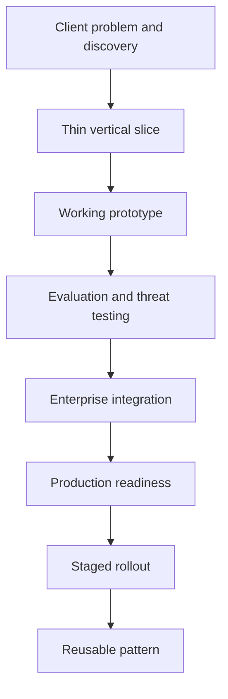
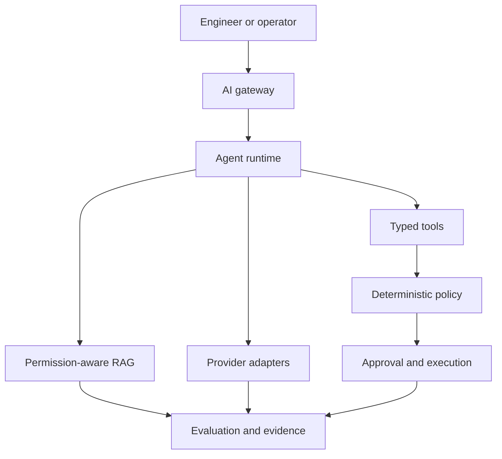

# Enterprise AI-Native Forward-Deployed Engineering Lab

> From an ambiguous client problem toward a secure, evaluated agentic workflow and an evidence-based production-readiness path.

## Lab Purpose

This repository is a hands-on tutorial for designing, building, evaluating, integrating, and progressively releasing an enterprise AI-native agent system.

It is aligned to the capabilities expected of a forward-deployed AI engineer:

- Client discovery under ambiguity
- Thin vertical-slice definition
- Agent architecture and orchestration
- Permission-aware retrieval-augmented generation
- Multi-provider model abstraction
- Typed enterprise tools
- Deterministic policy enforcement
- Human approval
- Evaluation harnesses
- Lifecycle observability
- Cloud-native deployment
- Production-readiness evidence
- Staged autonomy
- Reusable enterprise patterns

The lab begins with the business workflow—not a model or agent framework.

## Flagship Client Scenario

A regulated enterprise has a fragmented incident-management process.

Engineers currently:

- Search operational runbooks manually
- Correlate alerts, tickets, deployments, and logs
- Produce inconsistent diagnoses
- Update incident tickets manually
- Escalate sensitive remediation through informal channels
- Lack unified evidence explaining recommendations and decisions

The client initially asks:

> “Can you build an AI agent that automatically resolves incidents?”

The lab treats this statement as an input to discovery—not as an approved technical design.

## Initial Thin Vertical Slice

The first working release will:

1. Accept a structured incident request.
2. Validate the user and request context.
3. Retrieve authorized runbook evidence.
4. Produce a citation-backed diagnosis.
5. Recommend—but not execute—a remediation.
6. Capture the complete request trace.
7. Return a validated response with limitations.

The initial release will not:

- Modify production infrastructure
- Use unrestricted shell access
- Hold a privileged master credential
- Restart databases or services
- Modify firewall rules
- Execute an action without deterministic authorization
- Treat the LLM or orchestrator as the authorization authority

## Delivery Lifecycle



## Target Architecture



## Responsibility Boundaries

| Component | Primary responsibility | Must not become |
|---|---|---|
| Identity provider | Authenticate the user | Agent workflow engine |
| AI gateway | Validate request context and control entry | Enterprise authorization authority |
| Agent runtime | Coordinate state, steps, retries, and approvals | Self-authorizing agent |
| RAG service | Retrieve permission-appropriate evidence | Unrestricted database access |
| Model provider | Generate, classify, extract, and propose | Policy decision maker |
| Tool layer | Expose narrow enterprise capabilities | General shell or infrastructure access |
| Policy engine | Return allow, deny, or approval-required | Prompt-based suggestion |
| Approval service | Record trusted approval decisions | Informal chat confirmation |
| Evaluation | Measure quality and release readiness | Runtime-monitoring substitute |
| Observability | Reconstruct runtime behavior | Evaluation substitute |

## Core Engineering Principle

The model may reason and recommend.

The platform must validate, authorize, execute, and record.

## Tutorial Method

Every phase follows the same learning pattern:

```text
Concept
→ Why it matters
→ Architecture
→ Guided implementation
→ Commands
→ Expected output
→ Failure exercise
→ Tests
→ Evidence
→ Interview explanation
```

The repository is both:

1. A runnable engineering lab
2. A pull-and-read interview study guide

## Lab Phases

| Phase | Tutorial module | Primary outcome |
|---:|---|---|
| 0 | JD decomposition and orientation | Requirement-to-evidence map |
| 1 | Client discovery | Current-state workflow and risk boundaries |
| 2 | Thin vertical slice | Controlled initial scope |
| 3 | Cloud-native foundation | FastAPI service architecture |
| 4 | Agent runtime | Explicit state and execution graph |
| 5 | Production-quality RAG | Permission-aware cited retrieval |
| 6 | Provider abstraction | Normalized multi-provider interface |
| 7 | Typed tools | Validated least-privilege capabilities |
| 8 | Policy routing | Deterministic authorization |
| 9 | Human approval | Trusted consequential-action approval |
| 10 | Evaluation | Layered agent-quality test harness |
| 11 | Observability | End-to-end trace and evidence |
| 12 | Enterprise integration | Ticket, log, identity, and event adapters |
| 13 | Cloud-native deployment | Docker, Kubernetes, Helm, and Terraform |
| 14 | Production readiness | Auditable release-evidence package |
| 15 | Staged rollout | Controlled increase in autonomy |
| 16 | Reusable patterns | Enterprise implementation playbook |
| 17 | Domain adaptation | Healthcare, finance, and retail variants |

## Progressive Autonomy

| Stage | Permitted capability |
|---:|---|
| 0 | Offline evaluation only |
| 1 | Shadow processing |
| 2 | Read-only employee pilot |
| 3 | Recommendation mode |
| 4 | Low-risk ticket updates |
| 5 | Approval-gated simulated remediation |
| 6 | Limited controlled production action |

Autonomy increases only when evaluation, security, and operational evidence justify promotion.

## Planned Technology Stack

### Application and APIs

- Python
- FastAPI
- Pydantic
- REST/OpenAPI
- PostgreSQL
- Redis

### Agent and AI Components

- Explicit state-machine orchestration
- Optional LangGraph adapter after state-machine validation
- Retrieval-augmented generation
- OpenAI, Anthropic, and Google provider adapters
- Deterministic mock provider for local testing
- Structured outputs
- Typed tools

### Security and Governance

- Identity-aware request context
- RBAC and ABAC policy inputs
- Deterministic policy decisions
- Least-privilege tool identities
- Human approval
- Idempotency and replay protection
- Audit evidence

### Evaluation and Operations

- pytest
- Golden datasets
- Retrieval and grounding evaluation
- Tool and policy tests
- Adversarial testing
- Structured logging
- Correlation and trace IDs
- Metrics
- Release evidence

### Deployment

- Docker Compose
- Kubernetes
- Helm
- Terraform
- CI/CD
- Optional serverless and event-driven patterns

These technologies are planned unless a later phase records implementation evidence.

## Repository Structure

```text
enterprise-ai-native-forward-deployed-engineering-lab/
├── README.md
├── docs/
│   ├── governance/
│   ├── jd-map/
│   ├── roadmap/
│   ├── scenario/
│   ├── discovery/
│   ├── architecture/
│   ├── security/
│   ├── evaluation/
│   ├── operations/
│   └── interview-guide/
├── services/
│   ├── gateway/
│   ├── runtime/
│   ├── retrieval/
│   ├── providers/
│   ├── tools/
│   ├── policy/
│   ├── approval/
│   ├── evaluation/
│   └── evidence/
├── domain-packs/
│   ├── healthcare/
│   ├── finance/
│   └── retail/
├── tests/
│   ├── unit/
│   ├── contract/
│   ├── integration/
│   ├── evaluation/
│   ├── adversarial/
│   └── performance/
├── deploy/
│   ├── docker/
│   ├── kubernetes/
│   ├── helm/
│   ├── terraform/
│   └── ci/
├── patterns/
├── diagrams/
└── evidence/
```

Directories are introduced only when their authorized phase begins. Empty directories do not prove implementation.

## Phase 0 Documentation

| Document | Purpose |
|---|---|
| `docs/jd-map/ACCENTURE_AI_NATIVE_JD_REQUIREMENT_MAP.md` | Maps 36 JD capabilities to phases, tests, and evidence |
| `docs/roadmap/LEARNING_ROADMAP_AND_PHASE_GATES.md` | Defines Phase 0–17 order and gates |
| `docs/scenario/CLIENT_SCENARIO_AND_SYSTEM_BOUNDARY.md` | Defines the client problem, vertical slice, and trust boundaries |
| `docs/governance/CLAIM_EVIDENCE_AND_AUTHORITY_RULES.md` | Prevents capability, maturity, and authority inflation |

## Definition of Done

The lab is complete when a learner can:

1. Clone the repository.
2. Understand the client problem before selecting technology.
3. Follow every tutorial phase.
4. Run the implemented system locally.
5. Inspect the architecture diagrams.
6. Execute normal, failure, authorization, and adversarial tests.
7. Trace one request from gateway through response validation.
8. Review retrieval, policy, approval, and tool evidence.
9. Generate a production-readiness report.
10. Explain every target capability through a working artifact.

## Current Status

| Item | Status |
|---|---|
| Repository initialized | Complete |
| Phase 0: JD-aligned tutorial foundation | Complete |
| Phase 1: Client discovery package | Complete |
| Phase 2: Thin vertical slice | Complete |
| Phase 3: Cloud-native prototype foundation | Complete |
| Executable contracts | 7 of 7 implemented and tested |
| Local test suite | 762 passing |
| Local quality gates | Passed |
| Dependency locks | Implemented and hash-validated |
| Dockerfile and Compose definitions | Implemented and tested in CI |
| Local Docker execution | Blocked by Docker–WSL integration |
| CI container execution | Passed |
| CI quality execution | Passed |
| Phase 3 CI run | 29706949782 |
| Phase 3 evidence commit | f94d90b3b03b70cb5102945e0dc32d3badef15c2 |
| Phase 3 overall | Complete |
| Phase 4: Deterministic runtime and orchestration | Complete |
| Phase 4 CI run | 29724059742 |
| Phase 4 evidence commit | d65a465c57707aac1a144f69b40c2856e5f3d40e |
| Phase 4 quality execution | Passed |
| Phase 4 container execution | Passed |
| Phase 5 overall | In progress |
| Phase 5A permission-aware RAG design | Complete |
| Phase 5A evidence commit | 5b7907bf1bf8aa96c163d034baf183de3e600587 |
| Phase 5A CI run | [29768908988](https://github.com/S3curethecloud/enterprise-ai-native-forward-deployed-engineering-lab/actions/runs/29768908988) |
| Phase 5B typed retrieval contracts | Complete |
| Phase 5B implementation commit | efd62671b27e725d2936a2c7ae3a1a0d24b06ca6 |
| Phase 5B CI run | [29780263857](https://github.com/S3curethecloud/enterprise-ai-native-forward-deployed-engineering-lab/actions/runs/29780263857) |
| Phase 5B contract tests | 37 passing |
| Phase 5C synthetic corpus and deterministic keyword retrieval | Complete |
| Phase 5C implementation commit | 8cee3d71676440824b700c62359c162a98cb2b8e |
| Phase 5C CI run | [29795504565](https://github.com/S3curethecloud/enterprise-ai-native-forward-deployed-engineering-lab/actions/runs/29795504565) |
| Phase 5C corpus tests | 23 passing |
| Phase 5C keyword tests | 16 passing |
| Phase 5C retrieval tests | 76 passing |
| Phase 5D tenant, service, and classification filtering | Complete |
| Phase 5D implementation commit | f3e654da813f4b5bbfd42d5b5cdbc9e14980d1ae |
| Phase 5D implementation CI run | [29805548139](https://github.com/S3curethecloud/enterprise-ai-native-forward-deployed-engineering-lab/actions/runs/29805548139) |
| Phase 5D closure commit | bdc235b7936186baedeec1181938f57977150b35 |
| Phase 5D closure CI run | [29807419438](https://github.com/S3curethecloud/enterprise-ai-native-forward-deployed-engineering-lab/actions/runs/29807419438) |
| Phase 5E local deterministic embeddings and vector retrieval | Complete |
| Phase 5E implementation commit | fa02cb90e62c5a1279b1ec7b025d54375fba72f3 |
| Phase 5E CI run | [29810229699](https://github.com/S3curethecloud/enterprise-ai-native-forward-deployed-engineering-lab/actions/runs/29810229699) |
| Phase 5E closure commit | 573b8c196ae46dd272fcb90c6695cbcc6af87bfd |
| Phase 5E closure CI run | [29811114122](https://github.com/S3curethecloud/enterprise-ai-native-forward-deployed-engineering-lab/actions/runs/29811114122) |
| Phase 5E embedding tests | 15 passing |
| Phase 5E vector tests | 23 passing |
| Phase 5E retrieval tests | 124 passing |
| Complete local test suite | 814 passing |
| Phase 5F hybrid retrieval and reranking | Complete |
| Phase 5F implementation commit | ec0dca55d934d2324a514956aadfb3c8daf341bc |
| Phase 5F CI run | [29813776046](https://github.com/S3curethecloud/enterprise-ai-native-forward-deployed-engineering-lab/actions/runs/29813776046) |
| Phase 5F closure commit | 2489a6e54fe5b93484b09b40c5ffd9764075dcee |
| Phase 5F closure CI run | [29815184214](https://github.com/S3curethecloud/enterprise-ai-native-forward-deployed-engineering-lab/actions/runs/29815184214) |
| Phase 5F hybrid pytest cases | 33 passing |
| Phase 5F retrieval tests | 157 passing |
| Complete local test suite | 847 passing |
| Phase 5G context construction and token budgets | Complete |
| Phase 5G implementation commit | 369e05e21b61f6e0961111d9cfff4515ca0e27db |
| Phase 5G CI run | [29817755525](https://github.com/S3curethecloud/enterprise-ai-native-forward-deployed-engineering-lab/actions/runs/29817755525) |
| Phase 5G closure commit | 3851259a94474cab6b4d167b84cca56278e1a3b3 |
| Phase 5G closure CI run | [29818951742](https://github.com/S3curethecloud/enterprise-ai-native-forward-deployed-engineering-lab/actions/runs/29818951742) |
| Phase 5G context pytest cases | 22 passing |
| Phase 5G retrieval tests | 179 passing |
| Complete local test suite | 869 passing |
| Phase 5H prompt-injection and retrieval-contamination controls | Complete |
| Phase 5H implementation commit | 2c1a812bbba005345c3f394011a9b1c3580ce995 |
| Phase 5H CI run | [29820773913](https://github.com/S3curethecloud/enterprise-ai-native-forward-deployed-engineering-lab/actions/runs/29820773913) |
| Phase 5H closure commit | f72e2a5230517597a641e8994cff4a72612bc833 |
| Phase 5H closure CI run | [29822375893](https://github.com/S3curethecloud/enterprise-ai-native-forward-deployed-engineering-lab/actions/runs/29822375893) |
| Phase 5H content-control pytest cases | 26 passing |
| Phase 5H retrieval tests | 205 passing |
| Complete local test suite | 895 passing |
| Phase 5I citation validation and controlled abstention | Complete |
| Phase 5I implementation commit | f4d3c2079535699374e3ff08a1f955f8f26321f9 |
| Phase 5I CI run | [29848371644](https://github.com/S3curethecloud/enterprise-ai-native-forward-deployed-engineering-lab/actions/runs/29848371644) |
| Phase 5I closure commit | 501ee512037943a0960878a296309c5922777e9f |
| Phase 5I closure CI run | [29852373709](https://github.com/S3curethecloud/enterprise-ai-native-forward-deployed-engineering-lab/actions/runs/29852373709) |
| Phase 5I citation-validation pytest cases | 26 passing |
| Phase 5I retrieval tests | 231 passing |
| Complete local test suite | 921 passing |
| Phase 5J retrieval evaluation and lifecycle telemetry | Complete |
| Phase 5J implementation commit | 65befbcc2a5d9a6ac71b90b994c9d60f25ea5cfe |
| Phase 5J CI run | [29865065469](https://github.com/S3curethecloud/enterprise-ai-native-forward-deployed-engineering-lab/actions/runs/29865065469) |
| Phase 5J closure commit | 4d7922863d015131456b053512458b35d16a57e4 |
| Phase 5J closure CI run | [29866079305](https://github.com/S3curethecloud/enterprise-ai-native-forward-deployed-engineering-lab/actions/runs/29866079305) |
| Phase 5J evaluation pytest cases | 33 passing |
| Phase 5J retrieval tests | 264 passing |
| Complete local test suite | 954 passing |
| Phase 5 — Permission-aware RAG | Complete |
| Phase 6A provider-neutral contracts | Complete |
| Phase 6A implementation commit | 68512606235f60a1b8ad7a3e655f597aa1f3788f |
| Phase 6A implementation CI run | [29890345022](https://github.com/S3curethecloud/enterprise-ai-native-forward-deployed-engineering-lab/actions/runs/29890345022) |
| Phase 6A evidence commit | 0314605bdba27a41022c578c2bf424615e1cbee8 |
| Phase 6A evidence CI run | [29891756010](https://github.com/S3curethecloud/enterprise-ai-native-forward-deployed-engineering-lab/actions/runs/29891756010) |
| Phase 6A provider contract pytest cases | 29 passing |
| Phase 6B deterministic local mock provider | Complete |
| Phase 6B implementation commit | b1a6142ad682b8752c0c0a822ed5fc807c08b9b9 |
| Phase 6B implementation CI run | [29896004047](https://github.com/S3curethecloud/enterprise-ai-native-forward-deployed-engineering-lab/actions/runs/29896004047) |
| Phase 6B mock pytest cases | 20 passing |
| Phase 6 provider pytest cases | 49 passing |
| Complete local test suite | 1,003 passing |
| Phase 6 public provider exports | 19 |
| Phase 6 closure commit | 6e4aa1edbb7c5fd160ca020d777052445fb4249b |
| Phase 6 closure CI run | [29900746310](https://github.com/S3curethecloud/enterprise-ai-native-forward-deployed-engineering-lab/actions/runs/29900746310) |
| Phase 7A fail-closed typed tool registry | Implementation verified; closure-commit CI pending |
| Phase 7A implementation commit | 94eef8f1b7da84cd39d6c608250278603a033f97 |
| Phase 7A implementation CI run | [30527591986](https://github.com/S3curethecloud/enterprise-ai-native-forward-deployed-engineering-lab/actions/runs/30527591986) |
| Phase 7A registry pytest cases | 39 passing |
| Complete local test suite | 1,042 passing |
| Phase 7B typed request and result envelopes | Not authorized before Phase 7A closure-commit CI |
| Local vector retrieval | Synthetic and deterministic only |
| Enterprise retrieval | Not authorized |
| External embeddings and managed vector databases | Not authorized |
| Model-provider integration | Not started |
| Enterprise retrieval | Not started |
| Tool execution | Not authorized |
| Production deployment | Not authorized |

## Phase 7A Fail-Closed Tool Registry Closure Evidence

Phase 6 closure commit `6e4aa1edbb7c5fd160ca020d777052445fb4249b` passed exact-commit CI run
[29900746310](https://github.com/S3curethecloud/enterprise-ai-native-forward-deployed-engineering-lab/actions/runs/29900746310),
authorizing the gradual start of Phase 7.

Phase 7A implementation commit `94eef8f1b7da84cd39d6c608250278603a033f97` passed
exact-commit CI run
[30527591986](https://github.com/S3curethecloud/enterprise-ai-native-forward-deployed-engineering-lab/actions/runs/30527591986).

Verified Phase 7A evidence:

- Seven governed, typed tool definitions
- Closed `ToolName` allowlist
- Immutable registry metadata
- Explicit capability, side-effect, risk, idempotency, approval, timeout, and
  authorization metadata
- `execution_enabled=False` for every definition
- `general_shell_access=False` for every definition
- 39 focused Phase 7A registry pytest cases passed
- 1,042 complete repository pytest cases passed
- Ruff linting and formatting passed
- Strict MyPy checking passed
- Dependency integrity passed
- Python quality and contract-tests CI job passed
- Local container build and health-verification CI job passed

Phase 7A is metadata-only. It does not implement a tool request or result
envelope, invocation interface, mock execution, policy-decision evaluation,
approval execution, credential access, network access, filesystem access,
general shell access, MCP server, real enterprise integration, provider call,
infrastructure mutation, cloud deployment, or production authority.

Phase 7A closure remains pending until this documentation-only closure commit
passes exact-commit CI. Phase 7B remains unauthorized until that closure gate
passes.

Tool execution remains unauthorized. Real enterprise integrations remain unauthorized.

## Current Safety Posture

This repository contains an executable local Python and FastAPI prototype foundation.

It currently provides:

- Strict Pydantic contracts
- Bounded contract-validation endpoints
- Controlled validation errors
- Correlation identifiers
- Health and readiness endpoints
- Separate gateway, runtime, and evidence service identities
- Unit, contract, and integration tests
- Hash-locked dependencies
- Container definitions tested through GitHub Actions
- CI-verified image build, isolated service startup, health, readiness, and runtime restrictions

It currently has:

- No external model calls
- No enterprise retrieval
- No provider credentials
- No production data
- No provider-driven or tool-executing agent workflow
- No tool execution
- No infrastructure mutation
- No autonomous remediation
- No cloud deployment
- No production authority

The runtime service now implements bounded deterministic workflow coordination, checkpoints, replay, budgets, stops, and trace evidence. The evidence service remains a health-and-readiness-only identity. Neither service performs provider calls, enterprise retrieval, tool execution, infrastructure mutation, cloud deployment, or production operations.

## Phase 4 Closure Evidence

```text
Phase 4 — Deterministic Runtime and Orchestration
COMPLETE

Evidence:

Implementation commit: d65a465c57707aac1a144f69b40c2856e5f3d40e
GitHub Actions run: 29724059742
CI URL: https://github.com/S3curethecloud/enterprise-ai-native-forward-deployed-engineering-lab/actions/runs/29724059742
Python quality and contract tests: Passed
Local container build and health verification: Passed
CI head SHA matched the implementation commit

Phase 4 completed:

Typed local workflow state
Deterministic state transitions
Step and retry budgets
Explicit stop conditions
Five bounded terminal states
Append-only in-memory checkpoints
Optimistic concurrency
Deterministic replay
CT-07 runtime trace events
Runtime-only FastAPI routes
Runtime and integration tests
Tutorial and gate evidence
Phase 5D Closure Evidence

CLOSURE COMMIT:
bdc235b7936186baedeec1181938f57977150b35

EXACT-COMMIT CI RUN:
29807419438

CI RESULT:
SUCCESS

Phase 5E Verified Implementation Evidence

PHASE 5E CLOSURE COMMIT:
573b8c196ae46dd272fcb90c6695cbcc6af87bfd

PHASE 5F CLOSURE COMMIT:
2489a6e54fe5b93484b09b40c5ffd9764075dcee

PHASE 5F CLOSURE CI RUN:
29815184214

PHASE 5G IMPLEMENTATION COMMIT:
369e05e21b61f6e0961111d9cfff4515ca0e27db

PHASE 5G EXACT-COMMIT CI RUN:
29817755525

CI RESULT:
SUCCESS

VERIFIED CAPABILITY:
Deterministic whole-chunk context construction, versioned item and source
budgets, estimated-token limits, minimum source diversity, exact
candidate-to-corpus lineage resolution, stable ordering, truncation
evidence, citations, and controlled insufficiency.

PHASE 5G CLOSURE COMMIT:
3851259a94474cab6b4d167b84cca56278e1a3b3

PHASE 5G CLOSURE CI RUN:
29818951742

PHASE 5G CLOSURE RESULT:
SUCCESS

PHASE 5H IMPLEMENTATION COMMIT:
2c1a812bbba005345c3f394011a9b1c3580ce995

PHASE 5H EXACT-COMMIT CI RUN:
29820773913

PHASE 5H CI RESULT:
SUCCESS

VERIFIED PHASE 5H CAPABILITY:
Versioned deterministic retrieval-content controls, eight bounded risk
categories, untrusted-evidence labeling, non-echoing pattern metadata,
whole-item quarantine, exact retained-content preservation, and explicit
clean, filtered, or blocked outcomes.

PHASE 5H CLOSURE COMMIT:
f72e2a5230517597a641e8994cff4a72612bc833

PHASE 5H CLOSURE CI RUN:
29822375893

PHASE 5H CLOSURE RESULT:
SUCCESS

PHASE 5I IMPLEMENTATION COMMIT:
f4d3c2079535699374e3ff08a1f955f8f26321f9

PHASE 5I EXACT-COMMIT CI RUN:
29848371644

PHASE 5I CI RESULT:
SUCCESS

VERIFIED PHASE 5I CAPABILITY:
Versioned deterministic citation validation, exact source-document-chunk
resolution, content-hash and complete-content verification, lifecycle and
freshness enforcement, all-or-nothing validated bundles, and explicit
controlled abstention.

PHASE 5I CLOSURE COMMIT:
501ee512037943a0960878a296309c5922777e9f

PHASE 5I CLOSURE CI RUN:
29852373709

PHASE 5I CLOSURE RESULT:
SUCCESS

PHASE 5J IMPLEMENTATION COMMIT:
65befbcc2a5d9a6ac71b90b994c9d60f25ea5cfe

PHASE 5J EXACT-COMMIT CI RUN:
29865065469

PHASE 5J CI RESULT:
SUCCESS

VERIFIED PHASE 5J CAPABILITY:
Versioned deterministic retrieval evaluation, synthetic relevance labels,
precision at K, recall at K, reciprocal rank, citation, freshness, and
abstention correctness, bounded latency and context measurements, explicit
threshold evidence, and content-minimized append-only lifecycle telemetry
with deterministic hash lineage.

PHASE 5 CLOSURE EVIDENCE

Phase 5J closure commit `4d7922863d015131456b053512458b35d16a57e4` passed exact-commit CI run
[29866079305](https://github.com/S3curethecloud/enterprise-ai-native-forward-deployed-engineering-lab/actions/runs/29866079305). Phase 5 permission-aware RAG is closed.

VERIFIED PHASE 6 IMPLEMENTATION

Phase 6A added provider-neutral request, response, capability, usage, and
normalized-error contracts. Its implementation commit
`68512606235f60a1b8ad7a3e655f597aa1f3788f` passed exact-commit CI run
[29890345022](https://github.com/S3curethecloud/enterprise-ai-native-forward-deployed-engineering-lab/actions/runs/29890345022), and evidence commit
`0314605bdba27a41022c578c2bf424615e1cbee8` passed exact-commit CI run
[29891756010](https://github.com/S3curethecloud/enterprise-ai-native-forward-deployed-engineering-lab/actions/runs/29891756010).

Phase 6B added one stateless, deterministic, credential-free, network-free
local mock provider. Implementation commit `b1a6142ad682b8752c0c0a822ed5fc807c08b9b9`
passed exact-commit CI run [29896004047](https://github.com/S3curethecloud/enterprise-ai-native-forward-deployed-engineering-lab/actions/runs/29896004047).

NEXT AUTHORIZED WORK AFTER PHASE 6 CLOSURE-COMMIT CI

PHASE 7 — TYPED ENTERPRISE TOOLS

Phase 7 may begin only after the Phase 6 closure-evidence commit passes
exact-commit CI.

Real provider adapters or calls, provider credentials, enterprise sources,
production data, prompt or model execution, tools, API routes, infrastructure
mutation, cloud deployment, and production deployment remain unauthorized.
```

## Independent Project Notice

This is an independent educational and engineering portfolio project.

It is not:

- An Accenture product
- An Accenture client deliverable
- An official Accenture training resource
- Evidence of external customer production use
