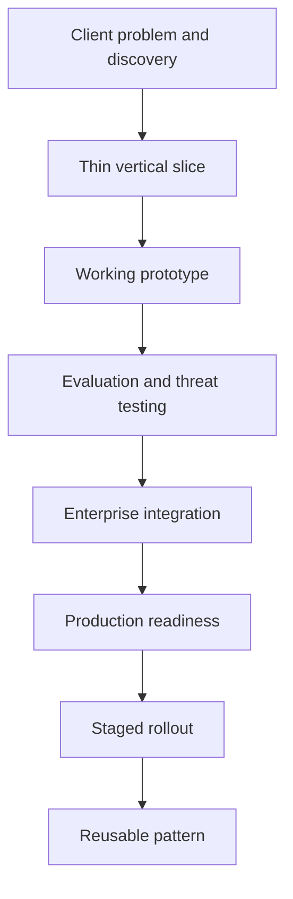
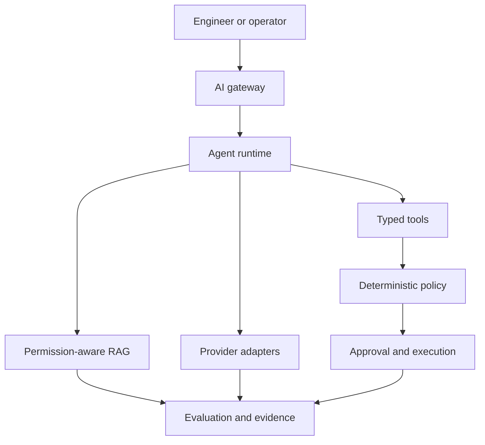

# Enterprise AI-Native Forward-Deployed Engineering Lab

> From an ambiguous client problem to a secure, evaluated, production-ready agentic workflow.

## Lab Purpose

This repository is a hands-on tutorial for designing, building, evaluating, integrating, and progressively releasing an enterprise AI-native agent system.

It is aligned to the capabilities expected of a forward-deployed AI engineer:

- Client discovery under ambiguity
- Thin vertical-slice definition
- Agent architecture and orchestration
- Permission-aware retrieval-augmented generation
- Multi-provider model abstraction
- Typed enterprise tools
- Deterministic policy enforcement
- Human approval
- Evaluation harnesses
- Lifecycle observability
- Cloud-native deployment
- Production-readiness evidence
- Staged autonomy
- Reusable enterprise patterns

The lab begins with the business workflow—not a model or agent framework.

## Flagship Client Scenario

A regulated enterprise has a fragmented incident-management process.

Engineers currently:

- Search operational runbooks manually
- Correlate alerts, tickets, deployments, and logs
- Produce inconsistent diagnoses
- Update incident tickets manually
- Escalate sensitive remediation through informal channels
- Lack unified evidence explaining recommendations and decisions

The client initially asks:

> “Can you build an AI agent that automatically resolves incidents?”

The lab treats this statement as an input to discovery—not as an approved technical design.

## Initial Thin Vertical Slice

The first working release will:

1. Accept a structured incident request.
2. Validate the user and request context.
3. Retrieve authorized runbook evidence.
4. Produce a citation-backed diagnosis.
5. Recommend—but not execute—a remediation.
6. Capture the complete request trace.
7. Return a validated response with limitations.

The initial release will not:

- Modify production infrastructure
- Use unrestricted shell access
- Hold a privileged master credential
- Restart databases or services
- Modify firewall rules
- Execute an action without deterministic authorization
- Treat the LLM or orchestrator as the authorization authority

## Delivery Lifecycle



## Target Architecture



## Responsibility Boundaries

| Component | Primary responsibility | Must not become |
|---|---|---|
| Identity provider | Authenticate the user | Agent workflow engine |
| AI gateway | Validate request context and control entry | Enterprise authorization authority |
| Agent runtime | Coordinate state, steps, retries, and approvals | Self-authorizing agent |
| RAG service | Retrieve permission-appropriate evidence | Unrestricted database access |
| Model provider | Generate, classify, extract, and propose | Policy decision maker |
| Tool layer | Expose narrow enterprise capabilities | General shell or infrastructure access |
| Policy engine | Return allow, deny, or approval-required | Prompt-based suggestion |
| Approval service | Record trusted approval decisions | Informal chat confirmation |
| Evaluation | Measure quality and release readiness | Runtime-monitoring substitute |
| Observability | Reconstruct runtime behavior | Evaluation substitute |

## Core Engineering Principle

The model may reason and recommend.

The platform must validate, authorize, execute, and record.

## Tutorial Method

Every phase follows the same learning pattern:

```text
Concept
→ Why it matters
→ Architecture
→ Guided implementation
→ Commands
→ Expected output
→ Failure exercise
→ Tests
→ Evidence
→ Interview explanation
```

The repository is both:

1. A runnable engineering lab
2. A pull-and-read interview study guide

## Lab Phases

| Phase | Tutorial module | Primary outcome |
|---:|---|---|
| 0 | JD decomposition and orientation | Requirement-to-evidence map |
| 1 | Client discovery | Current-state workflow and risk boundaries |
| 2 | Thin vertical slice | Controlled initial scope |
| 3 | Cloud-native foundation | FastAPI service architecture |
| 4 | Agent runtime | Explicit state and execution graph |
| 5 | Production-quality RAG | Permission-aware cited retrieval |
| 6 | Provider abstraction | Normalized multi-provider interface |
| 7 | Typed tools | Validated least-privilege capabilities |
| 8 | Policy routing | Deterministic authorization |
| 9 | Human approval | Trusted consequential-action approval |
| 10 | Evaluation | Layered agent-quality test harness |
| 11 | Observability | End-to-end trace and evidence |
| 12 | Enterprise integration | Ticket, log, identity, and event adapters |
| 13 | Cloud-native deployment | Docker, Kubernetes, Helm, and Terraform |
| 14 | Production readiness | Auditable release-evidence package |
| 15 | Staged rollout | Controlled increase in autonomy |
| 16 | Reusable patterns | Enterprise implementation playbook |
| 17 | Domain adaptation | Healthcare, finance, and retail variants |

## Progressive Autonomy

| Stage | Permitted capability |
|---:|---|
| 0 | Offline evaluation only |
| 1 | Shadow processing |
| 2 | Read-only employee pilot |
| 3 | Recommendation mode |
| 4 | Low-risk ticket updates |
| 5 | Approval-gated simulated remediation |
| 6 | Limited controlled production action |

Autonomy increases only when evaluation, security, and operational evidence justify promotion.

## Planned Technology Stack

### Application and APIs

- Python
- FastAPI
- Pydantic
- REST/OpenAPI
- PostgreSQL
- Redis

### Agent and AI Components

- Explicit state-machine orchestration
- Optional LangGraph adapter after state-machine validation
- Retrieval-augmented generation
- OpenAI, Anthropic, and Google provider adapters
- Deterministic mock provider for local testing
- Structured outputs
- Typed tools

### Security and Governance

- Identity-aware request context
- RBAC and ABAC policy inputs
- Deterministic policy decisions
- Least-privilege tool identities
- Human approval
- Idempotency and replay protection
- Audit evidence

### Evaluation and Operations

- pytest
- Golden datasets
- Retrieval and grounding evaluation
- Tool and policy tests
- Adversarial testing
- Structured logging
- Correlation and trace IDs
- Metrics
- Release evidence

### Deployment

- Docker Compose
- Kubernetes
- Helm
- Terraform
- CI/CD
- Optional serverless and event-driven patterns

These technologies are planned unless a later phase records implementation evidence.

## Repository Structure

```text
enterprise-ai-native-forward-deployed-engineering-lab/
├── README.md
├── docs/
│   ├── governance/
│   ├── jd-map/
│   ├── roadmap/
│   ├── scenario/
│   ├── discovery/
│   ├── architecture/
│   ├── security/
│   ├── evaluation/
│   ├── operations/
│   └── interview-guide/
├── services/
│   ├── gateway/
│   ├── runtime/
│   ├── retrieval/
│   ├── providers/
│   ├── tools/
│   ├── policy/
│   ├── approval/
│   ├── evaluation/
│   └── evidence/
├── domain-packs/
│   ├── healthcare/
│   ├── finance/
│   └── retail/
├── tests/
│   ├── unit/
│   ├── contract/
│   ├── integration/
│   ├── evaluation/
│   ├── adversarial/
│   └── performance/
├── deploy/
│   ├── docker/
│   ├── kubernetes/
│   ├── helm/
│   ├── terraform/
│   └── ci/
├── patterns/
├── diagrams/
└── evidence/
```

Directories are introduced only when their authorized phase begins. Empty directories do not prove implementation.

## Phase 0 Documentation

| Document | Purpose |
|---|---|
| `docs/jd-map/ACCENTURE_AI_NATIVE_JD_REQUIREMENT_MAP.md` | Maps 36 JD capabilities to phases, tests, and evidence |
| `docs/roadmap/LEARNING_ROADMAP_AND_PHASE_GATES.md` | Defines Phase 0–17 order and gates |
| `docs/scenario/CLIENT_SCENARIO_AND_SYSTEM_BOUNDARY.md` | Defines the client problem, vertical slice, and trust boundaries |
| `docs/governance/CLAIM_EVIDENCE_AND_AUTHORITY_RULES.md` | Prevents capability, maturity, and authority inflation |

## Definition of Done

The lab is complete when a learner can:

1. Clone the repository.
2. Understand the client problem before selecting technology.
3. Follow every tutorial phase.
4. Run the implemented system locally.
5. Inspect the architecture diagrams.
6. Execute normal, failure, authorization, and adversarial tests.
7. Trace one request from gateway through response validation.
8. Review retrieval, policy, approval, and tool evidence.
9. Generate a production-readiness report.
10. Explain every target capability through a working artifact.

## Current Status

| Item | Status |
|---|---|
| Repository initialized | Complete |
| Phase 0: JD-aligned tutorial foundation | Complete |
| Phase 1A: Current-state workflow | Complete |
| Phase 1B: Stakeholder map | Complete |
| Phase 1C: Data-source inventory | Complete |
| Phase 1D: Decision decomposition | Complete |
| Phase 1E: Risk and authority matrix | Complete |
| Phase 1F: Assumption register | Complete |
| Phase 1G: Success measures | Complete |
| Phase 1 discovery package | Complete |
| Phase 2: Thin vertical slice | Next |
| Runtime implementation | Not started |
| Model-provider integration | Not started |
| Tool execution | Not authorized |
| Production deployment | Not started |

## Current Safety Posture

This repository currently contains documentation and tutorial architecture only.

It has:

- No application runtime
- No provider credentials
- No external model calls
- No production data
- No tool execution
- No infrastructure mutation
- No autonomous remediation
- No production authority

## Next Authorized Phase

```text
Phase 2 — Thin Vertical Slice

Phase 2 authorizes requirements, scope, contracts, acceptance criteria, and threat-boundary design for the recommendation-only vertical slice. It does not authorize runtime implementation, external model calls, tool execution, infrastructure mutation, or production deployment.
```

## Independent Project Notice

This is an independent educational and engineering portfolio project.

It is not:

- An Accenture product
- An Accenture client deliverable
- An official Accenture training resource
- Evidence of external customer production use
