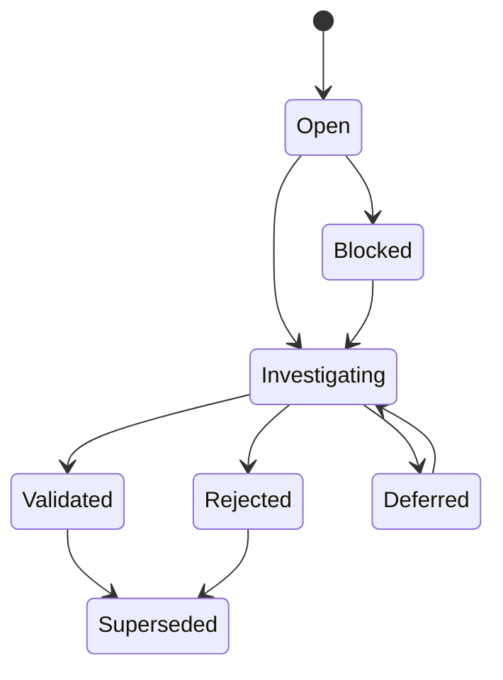

# Assumption Register

## Phase

```text
Phase 1F — Client Discovery Under Ambiguity
```

## Purpose

This tutorial records the assumptions used to shape the simulated incident-assistance workflow before those assumptions become hidden architecture decisions.

The register identifies:

- What is currently assumed
- Why the assumption exists
- What evidence would confirm or reject it
- Who would own the decision
- What happens if the assumption is wrong
- When it must be resolved
- Whether work may proceed before resolution

An assumption is not a fact, requirement, approval, or implementation result.

## Learning Objectives

After completing this tutorial, the learner should be able to:

1. Distinguish facts, assumptions, constraints, dependencies, and decisions.
2. Identify assumptions that materially change architecture.
3. Assign owners and resolution deadlines.
4. Define evidence required to validate an assumption.
5. Prevent unresolved assumptions from becoming implicit requirements.
6. Determine which assumptions block implementation.
7. Explain assumption management during client delivery.
8. Convert validated assumptions into governed decisions.

## Discovery Classification

| Type | Meaning | Example |
|---|---|---|
| Fact | Verified current-state information | Incident service is the system of record |
| Assumption | Belief not yet verified | Runbooks contain sufficient diagnostic guidance |
| Constraint | Boundary that limits options | Production data cannot leave an approved region |
| Dependency | External capability required | Identity claims must be available |
| Decision | Approved selection between alternatives | Begin in recommendation-only mode |
| Open question | Missing information | Who owns the runbook approval process? |
| Risk | Possible harmful outcome | Stale runbook causes incorrect recommendation |

The same statement must not appear as both a verified fact and an unresolved assumption.

## Assumption Status

| Status | Meaning |
|---|---|
| Open | Not yet investigated |
| Investigating | Evidence is being gathered |
| Validated | Evidence supports the assumption |
| Rejected | Evidence disproves the assumption |
| Deferred | Resolution is intentionally delayed |
| Blocked | Progress cannot continue safely |
| Superseded | Replaced by a later decision or assumption |

## Assumption Impact

| Impact | Meaning |
|---|---|
| Low | Minor documentation or implementation adjustment |
| Medium | Material component or workflow adjustment |
| High | Major architecture, security, scope, or delivery change |
| Critical | Work must stop or be fundamentally redesigned |

## Assumption Register

| ID | Assumption | Category | Impact | Status | Resolution owner | Resolve by |
|---|---|---|---|---|---|---|
| ASM-01 | Incident responders are the initial users | User | High | Open | Product owner | Phase 1 |
| ASM-02 | The incident service is the incident system of record | System | High | Open | Incident-process owner | Phase 1 |
| ASM-03 | Service catalog records identify current ownership | Data | Medium | Open | Service-catalog owner | Phase 1 |
| ASM-04 | Approved runbooks contain useful diagnostic evidence | Data | High | Open | Knowledge owner | Phase 1 |
| ASM-05 | Runbooks have document-level permission metadata | Security | Critical | Open | Data and security owners | Before Phase 5 |
| ASM-06 | Source permissions can be represented as trusted filters | Security | Critical | Open | Identity and data owners | Before Phase 5 |
| ASM-07 | Synthetic incidents adequately support initial learning | Tutorial | Medium | Open | Lab owner | Phase 1 |
| ASM-08 | A deterministic mock provider can test initial contracts | Provider | Medium | Open | AI platform owner | Before Phase 3 |
| ASM-09 | Recommendation-only mode provides measurable value | Product | High | Open | Product owner | Before Phase 2 |
| ASM-10 | Initial diagnosis does not require live log access | Scope | High | Open | SRE and product owner | Before Phase 2 |
| ASM-11 | Deployment history provides useful bounded context | Data | Medium | Open | Deployment-service owner | Phase 1 |
| ASM-12 | No state-changing tool is needed for the initial slice | Authority | Critical | Open | Product and risk owners | Before Phase 2 |
| ASM-13 | Users can distinguish recommendation from authorization | Human factors | High | Open | Product and UX owners | Before pilot |
| ASM-14 | Citation-backed output improves responder trust | Product | Medium | Open | Product owner | During evaluation |
| ASM-15 | One correlation ID can propagate across all services | Observability | High | Open | Platform owner | Before Phase 3 |
| ASM-16 | Required evidence can be stored without prohibited content | Data protection | Critical | Open | Security and compliance | Before Phase 3 |
| ASM-17 | Client policy supports model processing of selected data | Provider risk | Critical | Open | Data, legal, and risk owners | Before external provider use |
| ASM-18 | The operating team can support the future runtime | Operations | High | Open | Platform-operations owner | Before Phase 14 |
| ASM-19 | Approval can be bound to exact action parameters | Approval | Critical | Open | Change and approval owners | Before Phase 9 |
| ASM-20 | Tool services can use narrow workload identities | Identity | Critical | Open | Identity and tool owners | Before Phase 7 |
| ASM-21 | Action results can be verified independently | Operations | Critical | Open | Service and monitoring owners | Before Phase 9 |
| ASM-22 | Evaluation cases can represent important failure modes | Evaluation | High | Open | Evaluation and risk owners | Before Phase 10 |
| ASM-23 | Cost can be attributed per successful task | FinOps | Medium | Open | FinOps and platform owners | Before Phase 11 |
| ASM-24 | Rollback can restore the last approved runtime version | Release | Critical | Open | Platform and release owners | Before Phase 14 |
| ASM-25 | Reusable patterns can avoid client-specific assumptions | Knowledge sharing | Medium | Open | Architecture owner | Before Phase 16 |

## Detailed Assumption Analysis

## ASM-01 — Initial User Is the Incident Responder

### Why assumed

The current-state workflow places responders at the center of evidence gathering and diagnosis.

### Evidence required

- User interviews
- Incident-process documentation
- Usage data
- Role and permission review

### If rejected

The vertical slice, interface, access model, and success measures may change.

### Proceed before resolution

Discovery may proceed. Phase 2 scope approval requires resolution.

## ASM-02 — Incident Service Is the System of Record

### Why assumed

The current scenario describes incident creation, status, and closure through one incident platform.

### Evidence required

- Process documentation
- System-owner confirmation
- Integration inventory
- Data-authority review

### If rejected

A different source or federated incident identity may be required.

### Proceed before resolution

Documentation may proceed. Integration design must not.

## ASM-03 — Service Catalog Ownership Is Current

### Why assumed

The workflow requires service and owner identification.

### Evidence required

- Catalog governance process
- Freshness metrics
- Owner confirmation
- Sample record review

### If rejected

A fallback ownership-resolution process is required.

## ASM-04 — Runbooks Provide Useful Diagnostic Evidence

### Why assumed

Runbooks are selected as the primary initial corpus.

### Evidence required

- Runbook sample review
- Incident-to-runbook mapping
- Responder feedback
- Coverage analysis
- Version and approval review

### If rejected

The initial corpus or use case must change.

## ASM-05 — Runbooks Have Permission Metadata

### Why assumed

Permission-aware retrieval requires record-level access attributes.

### Evidence required

- Repository permission model
- Document metadata
- Group mappings
- Permission-change process

### If rejected

Options include:

- Source-level isolation
- Separate indexes
- Permission synchronization
- Retrieval-time authorization service
- Excluding the source

This is a Phase 5 blocker.

## ASM-06 — Permissions Can Become Trusted Filters

### Why assumed

Retrieval must filter evidence before model context.

### Evidence required

- Identity-claim contract
- Source ACL model
- Group lifecycle
- Tenant mapping
- Policy review

### If rejected

The proposed RAG architecture cannot proceed safely without redesign.

## ASM-07 — Synthetic Incidents Support Initial Learning

### Why assumed

The lab must remain independent of customer and production data.

### Evidence required

- Scenario-coverage review
- Failure-case coverage
- Tutorial usability feedback

### If rejected

Improve synthetic data. Do not introduce real customer data by default.

## ASM-08 — Mock Provider Supports Contract Testing

### Why assumed

The initial service should run without external credentials.

### Evidence required

- Provider-interface definition
- Structured response fixtures
- Error and timeout simulation
- Contract-test coverage

### If rejected

A richer local simulator is required. External provider access does not become automatically authorized.

## ASM-09 — Recommendation Mode Provides Value

### Why assumed

The initial slice excludes execution while attempting to improve evidence gathering and diagnosis.

### Evidence required

- User feedback
- Baseline task analysis
- Offline evaluation
- Time-on-task comparison
- Correction rate

### If rejected

Revisit the business problem and vertical slice before increasing autonomy.

## ASM-10 — Live Logs Are Not Required Initially

### Why assumed

Deferring log tools reduces integration, data, and query risk.

### Evidence required

- Historical incident review
- SRE interview
- Runbook and deployment coverage
- Diagnosis-quality comparison

### If rejected

Phase 2 must include a bounded synthetic log-search capability or revise the use case.

## ASM-11 — Deployment History Adds Useful Context

### Evidence required

- Incident correlation examples
- Deployment-data quality
- Service and environment matching
- User feedback

### Important limitation

Temporal correlation does not prove causation.

## ASM-12 — No Mutation Is Needed Initially

### Why assumed

The project aims to prove value with minimal authority.

### Evidence required

- Product-owner agreement
- Responder workflow review
- Success-measure definition
- Risk-owner approval

### If rejected

Do not add mutation automatically. Reassess the initial slice and authority model.

## ASM-13 — Users Understand Recommendation Boundaries

### Evidence required

- Interface testing
- User comprehension test
- Wording review
- Warning and limitation review

### If rejected

Strengthen interaction design, training, and approval boundaries. Do not assume disclaimers alone solve automation bias.

## ASM-14 — Citations Improve Trust

### Evidence required

- User study
- Citation-correctness results
- Source-resolution rate
- Feedback comparison

### If rejected

Investigate whether citations are inaccurate, unusable, excessive, or poorly presented.

## ASM-15 — Correlation ID Propagates End to End

### Evidence required

- Service-contract review
- Event-envelope design
- Trace-context tests
- Error-path tests

### If rejected

Observability and evidence architecture require redesign before distributed implementation.

## ASM-16 — Evidence Storage Can Protect Sensitive Data

### Evidence required

- Evidence schema
- Attribute allowlist
- Redaction rules
- Retention rules
- Access model
- Secret-scanning tests

### If rejected

Reduce stored content, tokenize references, or block the affected workflow.

## ASM-17 — Selected Data May Be Processed by a Provider

### Evidence required

- Classification review
- Provider terms
- Regional requirements
- Retention settings
- Legal approval
- Security approval

### If unresolved

Use only the deterministic mock provider.

## ASM-18 — Operations Can Support the Runtime

### Evidence required

- Named owner
- Support hours
- SLOs
- Alert routing
- Runbooks
- Incident process
- On-call capability
- Cost ownership

### If rejected

Production rollout is blocked.

## ASM-19 — Approval Can Bind Exact Parameters

### Evidence required

- Approval-system capabilities
- Identity validation
- Action hash or binding contract
- Expiration
- Replay tests

### If rejected

Consequential execution remains prohibited.

## ASM-20 — Tools Can Use Narrow Workload Identities

### Evidence required

- Identity-platform capabilities
- Resource-scoped permission design
- Credential lifecycle
- Network restrictions
- Access tests

### If rejected

The tool must be redesigned or excluded.

## ASM-21 — Results Can Be Verified Independently

### Evidence required

- Monitoring source
- Success criteria
- Verification endpoint
- Failure and timeout behavior
- Rollback signal

### If rejected

Automated execution remains prohibited.

## ASM-22 — Evaluation Represents Critical Failures

### Evidence required

- Risk-to-test traceability
- Dataset review
- Adversarial cases
- Coverage report
- Stakeholder review

### If rejected

Release promotion is blocked until coverage improves.

## ASM-23 — Cost Can Be Measured Per Successful Task

### Evidence required

- Token and provider usage
- Infrastructure cost
- Trace-to-cost mapping
- Task-success outcome
- Allocation rules

### If rejected

Use bounded cost estimates and disclose attribution limitations.

## ASM-24 — Rollback Restores Approved State

### Evidence required

- Versioned deployment
- Rollback procedure
- Configuration restoration
- Data compatibility
- Rollback test

### If rejected

Production readiness is blocked.

## ASM-25 — Patterns Can Avoid Client-Specific Assumptions

### Evidence required

- Pattern applicability rules
- A second use case
- Configuration boundaries
- Decision records
- Reuse test

### If rejected

Treat the artifact as a client-specific implementation, not a reusable pattern.

## Assumption Dependency Map

```mermaid
flowchart TD
    A["ASM-01 User"] --> S["Phase 2 scope"]
    B["ASM-04 Runbooks"] --> S
    C["ASM-09 Recommendation value"] --> S
    D["ASM-05 Permission metadata"] --> R["Phase 5 RAG"]
    E["ASM-06 Trusted filters"] --> R
    F["ASM-08 Mock provider"] --> P["Phase 3 prototype"]
    G["ASM-15 Correlation ID"] --> P
    H["ASM-16 Evidence protection"] --> P
    I["ASM-20 Tool identity"] --> T["Phase 7 tools"]
    J["ASM-19 Approval binding"] --> X["Phase 9 execution"]
    K["ASM-21 Verification"] --> X
    L["ASM-22 Evaluation coverage"] --> Q["Phase 14 readiness"]
    M["ASM-24 Rollback"] --> Q
```



## Blocking Assumptions by Phase

| Future phase | Assumptions that must be resolved |
|---:|---|
| Phase 2 — Thin slice | ASM-01, ASM-04, ASM-09, ASM-10, ASM-12 |
| Phase 3 — Prototype | ASM-08, ASM-15, ASM-16 |
| Phase 5 — RAG | ASM-05, ASM-06 |
| Phase 6 — Providers | ASM-17 |
| Phase 7 — Tools | ASM-20 |
| Phase 9 — Approval and execution | ASM-19, ASM-21 |
| Phase 10 — Evaluation | ASM-22 |
| Phase 11 — Observability | ASM-23 |
| Phase 14 — Readiness | ASM-18, ASM-24 |
| Phase 16 — Patterns | ASM-25 |

A future phase may begin only if its blocking assumptions are validated, rejected with redesign, or explicitly deferred by an authorized decision that preserves safety.

## Assumption Resolution Workflow



## Assumption-to-Decision Conversion

When an assumption is validated:

1. Record the supporting evidence.
2. Record who confirmed it.
3. Record the applicable scope and environment.
4. Convert the result into a requirement, constraint, or architecture decision.
5. Update dependent documents.
6. Preserve any limitation.

Validation does not mean the assumption is universally true outside its verified scope.

## Rejected-Assumption Handling

When an assumption is rejected:

1. Stop dependent work if required.
2. Record the contradicting evidence.
3. Identify affected scope, architecture, and tests.
4. Create a replacement assumption or decision.
5. Update risk and roadmap records.
6. Do not preserve the rejected statement as an implied fact.

## Assumption Review Cadence

Review assumptions:

- At the end of discovery
- Before vertical-slice approval
- Before RAG design
- Before provider integration
- Before tool implementation
- Before production-readiness review
- When identity, source, provider, policy, or operating context changes

## Discovery Questions

1. What are we treating as true without evidence?
2. Which assumption changes the architecture most?
3. Which assumption affects authorization?
4. Which assumption affects data access?
5. Which assumption blocks the next phase?
6. Who can validate it?
7. What evidence is sufficient?
8. When must it be resolved?
9. What happens if it is rejected?
10. Can work proceed safely before resolution?
11. Does the assumption apply to every environment?
12. When does a previously validated assumption require review?

## Tutorial Exercise

Select five assumptions and complete:

```text
Assumption
Why believed
Evidence required
Owner
Impact
Resolution deadline
Proceed or block
If validated
If rejected
Affected documents
```

At least one selected assumption must concern:

- Identity
- Data access
- Product value
- Operations
- Evaluation

## Expected Learning Result

The learner should conclude:

- Assumptions are not requirements.
- Architecture built on hidden assumptions is fragile.
- Critical identity, data, approval, verification, and rollback assumptions block later phases.
- Rejected assumptions require redesign rather than silent omission.
- A validated assumption remains scoped to its evidence and environment.
- Discovery is an evidence-gathering activity, not merely a meeting.
- External providers or tools must not be introduced to resolve an unrelated assumption.

## Interview Explanation — 60 Seconds

When requirements are ambiguous, I maintain an explicit assumption register rather than allowing beliefs to become hidden architecture decisions. For each assumption, I record why we believe it, the impact if it is wrong, who can validate it, the evidence required, and the phase by which it must be resolved. In this scenario, assumptions about runbook permissions, provider data handling, workload identities, approval binding, result verification, evaluation coverage, and rollback directly block later implementation phases. If an assumption is rejected, I stop or redesign the dependent work and update the risk and decision records. This makes discovery evidence-driven and prevents the team from building a technically polished system on an unverified operating model.

## Interview Explanation — 30 Seconds

I use an explicit assumption register with an owner, impact, evidence requirement, and resolution deadline. Critical assumptions about identity, data permissions, provider use, tools, approval, verification, and rollback block their dependent phases. If evidence rejects an assumption, we redesign the affected scope instead of allowing it to remain an implicit requirement.

## Current Status

| Item | Status |
|---|---|
| Assumption register | Documented |
| Assumptions validated | 0 of 25 |
| Assumptions rejected | 0 of 25 |
| Real stakeholder evidence | None |
| Runtime implementation | Not started |
| Provider integration | Not started |
| Tool execution | Not authorized |
| Production authority | None |

## Limitations

- All assumptions relate to a simulated client.
- No real stakeholder has validated them.
- No implementation evidence exists.
- Phase dependencies may change after validation.
- An open assumption is not an approved requirement.
- The register does not authorize later phases automatically.

## Phase 1F Completion Gate

Phase 1F passes when:

- All 25 assumptions have category, impact, owner, status, and deadline.
- Each assumption has required evidence or resolution guidance.
- Blocking assumptions are mapped to future phases.
- Validation and rejection workflows are documented.
- Interview explanations are present.
- Limitations are explicit.
- No open assumption is represented as a fact.
- No runtime, provider, tool, or production authority is implied.

## Next Authorized Work

```text
Phase 1G — Success Measures
```

Phase 1G will define business, quality, security, safety, operational, adoption, and cost measures. It will not set unsupported thresholds or implement evaluation.
