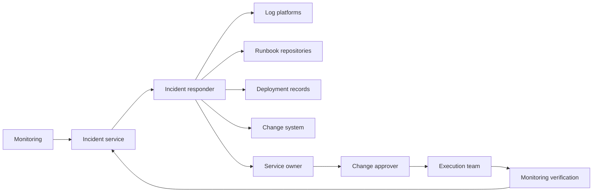
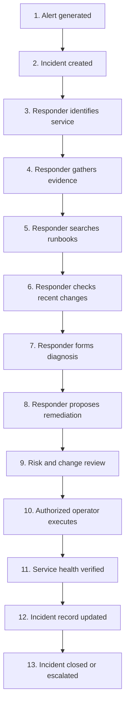

# Current-State Incident Workflow

## Phase

```text
Phase 1A — Client Discovery Under Ambiguity
```

## Purpose

This tutorial identifies how the simulated client investigates and resolves incidents before introducing an AI agent.

The goal is to understand:

- Who performs the work
- Which steps they perform
- Which systems they use
- Which decisions they make
- Where delays and risks occur
- Which evidence is authoritative
- Where human authority must remain
- Which part of the workflow is suitable for an initial AI-assisted slice

This document describes the current state. It does not approve or design the future agent.

## Learning Objectives

After completing this tutorial, the learner should be able to:

1. Explain why agent design begins with workflow discovery.
2. Distinguish an operational task from an operational decision.
3. Identify authoritative systems and evidence.
4. Locate manual handoffs and duplicated effort.
5. Identify consequential actions.
6. Separate deterministic processing from model-assisted reasoning.
7. Select a candidate thin vertical slice without granting execution authority.
8. Explain the discovery process naturally during an interview.

## Client Statement

The simulated client begins with this request:

> “We want an AI agent that can investigate incidents and automatically fix production problems.”

This statement describes a desired technology outcome but does not provide enough information to authorize a solution.

Before selecting a model or framework, discovery must answer:

- What is an incident?
- Which incident types are in scope?
- Who investigates?
- Which systems contain evidence?
- Which evidence is authoritative?
- Which steps are deterministic?
- Which steps require human judgment?
- Which actions can change production?
- Who approves those actions?
- How are results verified?
- What defines successful resolution?
- Who owns the workflow after deployment?

## Workflow-First Principle

The initial discovery sequence is:

```text
Business problem
→ Current workflow
→ Users and stakeholders
→ Decisions
→ Data
→ Risk and authority
→ Success measures
→ Thin vertical slice
→ Technology selection
```

Selecting an LLM, vector database, or agent framework before these questions are answered creates premature technical commitment.

## Current-State System Context



## Current-State Workflow



## Detailed Workflow Walkthrough

| Step | Activity | Primary actor | Systems | Output | Decision or task |
|---:|---|---|---|---|---|
| 1 | Monitoring detects abnormal behavior | Monitoring service | Metrics and alerting | Alert | Deterministic task |
| 2 | Incident record is created | Incident service | Ticket platform | Incident ID | Deterministic task |
| 3 | Affected service and owner are identified | Incident responder | Service catalog | Service context | Mixed task |
| 4 | Logs, alerts, and runtime evidence are collected | Incident responder | Log and monitoring tools | Evidence set | Search task |
| 5 | Relevant runbooks and known errors are located | Incident responder | Knowledge repositories | Guidance set | Search and judgment |
| 6 | Recent deployments and changes are reviewed | Incident responder | Deployment and change systems | Change context | Search and comparison |
| 7 | Evidence is correlated into a likely diagnosis | Incident responder or SRE | Multiple systems | Diagnosis | Human judgment |
| 8 | A remediation action is proposed | Incident responder or SRE | Runbook and ticket | Proposed action | Human judgment |
| 9 | Risk, authority, and change requirements are evaluated | Approver and policy process | Change system | Approval or denial | Authorization |
| 10 | Approved action is executed | Authorized operator | Controlled operational tool | Action result | Consequential action |
| 11 | Independent health evidence is reviewed | Operator and monitoring | Monitoring service | Verification result | Deterministic plus judgment |
| 12 | Evidence, action, and outcome are recorded | Incident responder | Incident service | Updated record | Documentation task |
| 13 | Incident is closed or escalated | Incident commander or owner | Incident service | Final status | Accountable decision |

## What the Workflow Reveals

The workflow contains different categories of work.

### Deterministic tasks

Examples:

- Validate an incident identifier
- Retrieve a service record
- Retrieve deployment history
- Validate a response schema
- Calculate elapsed time
- Check whether required fields exist

These tasks should normally use deterministic code or APIs.

### Retrieval tasks

Examples:

- Find relevant runbooks
- Search logs
- Retrieve monitoring alerts
- Locate deployment records
- Find related incidents

These tasks require source access, filtering, ranking, and provenance.

### Model-assisted reasoning

Examples:

- Summarize evidence
- Compare incident symptoms with runbook conditions
- Explain likely causes
- Draft a diagnosis
- Propose remediation options
- Identify missing evidence

The model may assist, but its conclusion remains evidence-bound and advisory.

### Authorization decisions

Examples:

- Determine whether the user may access a runbook
- Determine whether a tool may be called
- Determine whether an action requires approval
- Determine whether an operator may affect a resource

These decisions require deterministic policy using trusted identity and context.

### Consequential actions

Examples:

- Restart a production service
- Roll back a deployment
- Modify a firewall rule
- Change a database configuration
- Revoke credentials
- Close a high-severity incident

These actions require narrow tools, authorization, approval where applicable, and independent verification.

## Current-State Pain Points

### Pain Point 1 — Fragmented evidence

Responders search across multiple systems and manually assemble context.

Potential impact:

- Slower triage
- Missed evidence
- Repeated work
- Inconsistent records

### Pain Point 2 — Inconsistent search behavior

Different responders use different sources, queries, and troubleshooting sequences.

Potential impact:

- Variable diagnosis quality
- Dependence on individual experience
- Difficult knowledge transfer

### Pain Point 3 — Weak provenance

A ticket may contain a conclusion without preserving the evidence that supported it.

Potential impact:

- Difficult review
- Difficult audit
- Limited learning from previous incidents

### Pain Point 4 — Manual correlation

Responders compare alerts, logs, deployments, and runbooks manually.

Potential impact:

- High cognitive load
- Longer mean time to diagnose
- Greater chance of missing relationships

### Pain Point 5 — Unclear authority boundaries

A technically possible remediation may not be authorized for the user, environment, incident, or time window.

Potential impact:

- Unauthorized change
- Control failure
- Poor accountability

### Pain Point 6 — Informal approval context

Approval may be discussed in chat without being bound to the precise action and parameters.

Potential impact:

- Replay or ambiguity
- Weak evidence
- Approval applied to a changed request

### Pain Point 7 — Incomplete operational feedback

Incident closure may not preserve whether the proposed diagnosis was correct or whether the action produced the expected result.

Potential impact:

- Weak evaluation data
- Repeated mistakes
- Limited continuous improvement

## Manual Handoffs

| Handoff | From | To | Risk |
|---|---|---|---|
| Alert triage | Monitoring | Responder | Missing context |
| Service identification | Responder | Service owner | Ownership delay |
| Diagnosis review | Responder | SRE | Incomplete evidence |
| Remediation proposal | SRE | Approver | Ambiguous parameters |
| Approved change | Approver | Operator | Approval/action mismatch |
| Execution result | Operator | Responder | Incomplete verification |
| Closure | Responder | Incident owner | Weak final evidence |

## Current-State Evidence Gaps

The present workflow may not consistently preserve:

- Which user accessed which source
- Which source version was used
- Which evidence entered the diagnosis
- Which model or reasoning process produced a recommendation
- Which policy authorized or denied an action
- Which approver authorized the exact request
- Which tool executed the action
- Whether the result was independently verified
- Which limitations remained at closure

These gaps become future requirements. They are not evidence that the future system already solves them.

## Candidate AI-Assisted Opportunities

| Candidate | Value | Risk | Initial suitability |
|---|---|---|---|
| Retrieve relevant runbooks | High | Low to medium | Strong |
| Summarize authorized evidence | High | Medium | Strong with citations |
| Draft a diagnosis | High | Medium | Strong as advisory output |
| Recommend a remediation | Medium to high | Medium | Suitable without execution |
| Add a ticket comment | Medium | Medium | Later policy-controlled stage |
| Restart a service | High | High | Not suitable initially |
| Modify a firewall | High | Critical | Prohibited initially |
| Close an incident automatically | Medium | High | Prohibited initially |

## Recommended Initial Opportunity

The strongest initial opportunity is:

> Retrieve authorized incident evidence and produce a citation-backed diagnosis with a non-executable remediation recommendation.

This opportunity is selected because it:

- Addresses evidence fragmentation
- Reduces repetitive search
- Improves provenance
- Can be evaluated offline
- Preserves human decision authority
- Requires no production mutation
- Supports a narrow end-to-end prototype
- Creates evidence for later rollout decisions

## Why Autonomous Remediation Is Rejected Initially

Autonomous remediation is not selected for the first slice because discovery has not yet established:

- Complete action inventory
- Risk tiers
- Approval requirements
- Tool identities
- Idempotency behavior
- Rollback behavior
- Verification procedures
- Operational ownership
- Sufficient evaluation evidence

Rejecting premature autonomy is a delivery decision—not a rejection of future controlled automation.

## Discovery Questions for the Client

### Workflow

1. Which incident types consume the most responder time?
2. Which steps cause the greatest delay?
3. Which decisions depend on expert judgment?
4. Which steps already have deterministic procedures?
5. Which steps require multiple teams?

### Data

1. Which system owns the incident record?
2. Which runbooks are authoritative?
3. How are runbooks versioned?
4. Which sources contain sensitive information?
5. How are permissions synchronized?

### Authority

1. Which actions are read-only?
2. Which actions modify production?
3. Who may approve each action?
4. What separation of duties is required?
5. How is approval currently recorded?

### Operations

1. What latency is acceptable?
2. What failure requires escalation?
3. What evidence must be retained?
4. Who supports the system?
5. What is the rollback procedure?

### Success

1. What business outcome defines success?
2. How is diagnosis quality measured today?
3. How will responder correction be captured?
4. What error is unacceptable?
5. What evidence is required before increasing autonomy?

## Discovery Output

This workflow analysis produces:

- A shared current-state model
- A documented actor and system sequence
- A list of tasks and decisions
- Identified authority boundaries
- Candidate AI-assisted opportunities
- A recommended initial opportunity
- Questions requiring stakeholder confirmation

It does not produce:

- An approved target architecture
- A selected model provider
- A selected agent framework
- A production deployment decision
- Authorization for tool execution

## Tutorial Exercise

Using the workflow table, classify each activity as:

```text
Deterministic task
Retrieval task
Model-assisted reasoning
Authorization decision
Human approval
Consequential action
Independent verification
```

Then answer:

1. Which steps could be improved without an LLM?
2. Which steps require retrieval?
3. Which steps may benefit from model reasoning?
4. Which steps must remain outside model authority?
5. Which single step would you prototype first?
6. What evidence would prove that the prototype helped?

## Expected Learning Result

The learner should conclude:

- The business problem is fragmented and inconsistent incident evidence.
- The initial use case is evidence-assisted diagnosis.
- The model is an advisory reasoning component.
- Authorization remains deterministic.
- Production execution remains outside the initial boundary.
- Evaluation must precede increased autonomy.

## Interview Explanation — 60 Seconds

When requirements are unclear, I begin by mapping the current business workflow rather than selecting a model or agent framework. In this scenario, I trace the incident process from alert creation through evidence gathering, diagnosis, approval, execution, verification, and closure. I identify the users, authoritative systems, manual handoffs, decisions, and consequential actions. That reveals where deterministic code, retrieval, model assistance, policy, and human approval belong. The main discovery result is that the immediate problem is fragmented evidence and inconsistent diagnosis—not the absence of autonomous remediation. I therefore select a thin initial slice that retrieves authorized evidence and produces a citation-backed recommendation without execution authority. That gives the client measurable value while preserving security and operational control.

## Interview Explanation — 30 Seconds

I start with the incident workflow, not the model. I map the users, evidence sources, decisions, handoffs, and authority boundaries from alert through closure. That shows the immediate problem is fragmented evidence and inconsistent diagnosis. The initial slice therefore retrieves authorized evidence and produces a cited recommendation while keeping production execution and authorization outside the agent.

## Current Status

| Item | Status |
|---|---|
| Current-state workflow | Documented |
| Client validation | Simulated only |
| Target architecture approval | Not started |
| Runtime implementation | Not started |
| Model integration | Not started |
| Tool execution | Not authorized |
| Production deployment | Not started |

## Limitations

- The client and workflow are simulated.
- No real stakeholders have validated the process.
- No baseline performance data exists.
- No target metrics are approved.
- No production systems are connected.
- No runtime behavior is implemented.
- The workflow may change after later discovery artifacts.

## Phase 1A Completion Gate

Phase 1A passes when:

- The current workflow is explicit.
- Actors and systems are identified.
- Tasks and decisions are classified.
- Pain points and handoffs are documented.
- Candidate opportunities are compared.
- The initial opportunity preserves human authority.
- Discovery questions are recorded.
- Current limitations are explicit.
- No runtime capability is claimed or authorized.

## Next Authorized Work

```text
Phase 1B — Stakeholder Map
```

Phase 1B will identify stakeholder responsibilities, concerns, decision rights, and workshop participation. It will not implement runtime capability.
