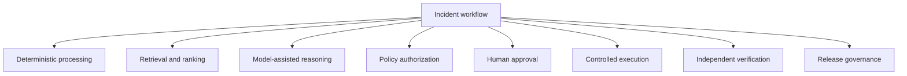
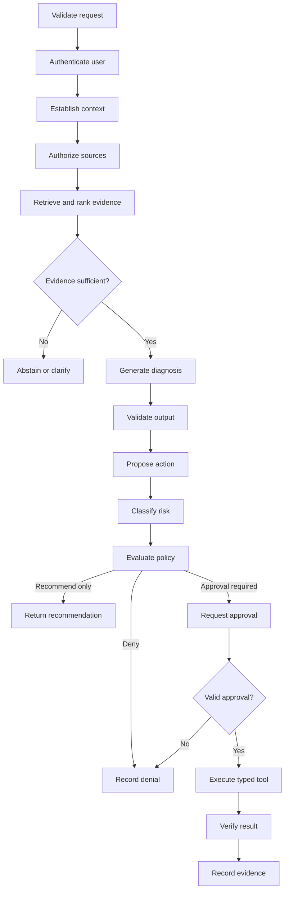

# Decision Decomposition

## Phase

```text
Phase 1D — Client Discovery Under Ambiguity
```

## Purpose

This tutorial decomposes the incident workflow into tasks, reasoning steps, authorization decisions, approvals, executions, and verification activities.

The purpose is to prevent an LLM or agent orchestrator from becoming responsible for decisions that belong to:

- Deterministic code
- Trusted identity
- Enterprise policy
- Authorized humans
- Controlled execution services
- Independent monitoring
- Release governance

This document defines decision ownership. It does not implement the runtime.

## Learning Objectives

After completing this tutorial, the learner should be able to:

1. Distinguish tasks from decisions.
2. Distinguish reasoning from authorization.
3. Assign each decision to the correct mechanism.
4. Define trusted inputs and structured outputs.
5. Define safe failure behavior.
6. Identify where human accountability is required.
7. Explain why schema-valid model output is not automatically correct or authorized.
8. Design an execution graph without granting the orchestrator enterprise authority.

## Core Principle

The model may reason and recommend.

The platform must validate, authorize, execute, verify, and record.

## Decision Categories



## Category Definitions

### Deterministic processing

Used when the expected behavior can be expressed through exact rules or contracts.

Examples:

- Validate an incident ID
- Validate required fields
- Generate a trace ID
- Check an expiration
- Enforce a retry limit
- Validate output schema

### Retrieval and ranking

Used to locate relevant evidence under mandatory access filters.

Examples:

- Retrieve approved runbooks
- Retrieve incident context
- Retrieve recent deployments
- Rank evidence by relevance
- Return source metadata

Retrieval relevance never grants access.

### Model-assisted reasoning

Used for bounded language and reasoning tasks.

Examples:

- Summarize evidence
- Compare symptoms
- Draft a diagnosis
- Explain uncertainty
- Recommend a next step

Model output remains advisory until validated and governed.

### Policy authorization

Used to determine whether a subject may perform an action on a resource under the current context.

Examples:

- May this user retrieve this runbook?
- May this workflow call this tool?
- Does this action require approval?
- Is this environment permitted?

Policy uses trusted identity and context—not model-generated authority.

### Human approval

Used when organizational accountability is required for a consequential action.

Examples:

- Approve a production restart
- Approve a rollback
- Approve a sensitive change
- Accept a defined operational risk

Approval must bind to the exact requested action.

### Controlled execution

Used to perform an approved side effect through a narrow service.

Examples:

- Add a ticket comment
- Restart a simulated service
- Trigger an approved rollback
- Verify service health

The execution service does not accept unrestricted natural-language commands.

### Independent verification

Used to confirm that an executed action produced the expected result.

Examples:

- Check service health
- Check error rate
- Confirm deployment version
- Confirm ticket update
- Confirm rollback state

The model does not certify its own success.

### Release governance

Used to determine whether a version or capability may enter the next rollout stage.

Examples:

- Promote from offline to shadow mode
- Promote from read-only to recommendation mode
- Roll back a failed release
- Hold deployment after a failed evaluation gate

## Decision Inventory

| ID | Decision or task | Category | Primary authority or mechanism |
|---|---|---|---|
| DEC-01 | Validate request schema | Deterministic | Gateway validation |
| DEC-02 | Authenticate requesting user | Identity | Identity provider |
| DEC-03 | Establish tenant and user context | Identity | Gateway using trusted claims |
| DEC-04 | Generate correlation ID | Deterministic | Gateway |
| DEC-05 | Validate incident existence | Deterministic retrieval | Incident service |
| DEC-06 | Identify affected service | Deterministic plus lookup | Service catalog |
| DEC-07 | Determine source access | Authorization | Policy and retrieval service |
| DEC-08 | Retrieve candidate evidence | Retrieval | Retrieval service |
| DEC-09 | Rank authorized evidence | Retrieval | Retrieval service |
| DEC-10 | Determine evidence sufficiency | Validation plus bounded reasoning | Runtime and evaluation rules |
| DEC-11 | Produce evidence summary | Model-assisted reasoning | Approved model |
| DEC-12 | Produce likely diagnosis | Model-assisted reasoning | Approved model using evidence |
| DEC-13 | Validate diagnosis contract | Deterministic | Runtime validator |
| DEC-14 | Propose remediation | Model-assisted reasoning | Approved model |
| DEC-15 | Classify action risk | Deterministic policy input | Tool registry and policy |
| DEC-16 | Determine tool permission | Authorization | Policy engine |
| DEC-17 | Determine approval requirement | Authorization | Policy engine |
| DEC-18 | Approve consequential action | Human approval | Authorized approver |
| DEC-19 | Validate approval binding | Deterministic | Approval service |
| DEC-20 | Execute approved action | Controlled execution | Trusted tool service |
| DEC-21 | Verify action result | Independent verification | Monitoring or verification tool |
| DEC-22 | Update incident record | Controlled execution | Ticket tool under policy |
| DEC-23 | Record workflow evidence | Deterministic | Evidence service |
| DEC-24 | Determine release promotion | Release governance | Authorized release process |

## Detailed Decision Contracts

## DEC-01 — Validate Request Schema

### Trusted inputs

- Request body
- API version
- Content type

### Rule

Validate exact required fields, types, lengths, and permitted values.

### Output

```json
{
  "valid": true,
  "errors": []
}
```

Example only; no validator is implemented during Phase 1.

### Failure behavior

Return a deterministic client error. Do not call retrieval or a model.

## DEC-02 — Authenticate Requesting User

### Trusted inputs

- Signed identity token
- Trusted issuer configuration
- Expected audience
- Current time

### Rule

Validate signature, issuer, audience, expiration, and required claims.

### Output

Trusted identity context.

### Failure behavior

Deny the request. Do not allow the model to infer identity.

## DEC-03 — Establish Tenant and User Context

### Trusted inputs

- Validated identity claims
- Tenant mapping
- Current session

### Rule

Derive subject, tenant, roles, and groups using trusted mappings.

### Failure behavior

Fail closed if tenant or identity context is ambiguous.

## DEC-04 — Generate Correlation ID

### Rule

Create a unique identifier before downstream processing.

### Purpose

Connect gateway, runtime, retrieval, model, policy, approval, tool, and evidence records.

### Failure behavior

Do not begin the workflow without trace context.

## DEC-05 — Validate Incident Existence

### Trusted inputs

- Incident ID
- Authorized incident-service client

### Rule

Confirm the incident exists and is visible to the requesting context.

### Failure behavior

Return not found or access denied without leaking whether a restricted incident exists.

## DEC-06 — Identify Affected Service

### Inputs

- Incident record
- Service catalog

### Rule

Resolve the service using governed identifiers.

### Failure behavior

Request clarification or route to human review when service identity is ambiguous.

The model may suggest a service, but a model suggestion is not authoritative service ownership.

## DEC-07 — Determine Source Access

### Trusted inputs

```text
subject
+ tenant
+ roles/groups
+ source
+ document/record
+ service
+ environment
+ classification
+ purpose
+ policy version
```

### Authority

Deterministic access policy.

### Failure behavior

Deny or exclude the source before model context.

## DEC-08 — Retrieve Candidate Evidence

### Inputs

- Authorized source scope
- Incident context
- Retrieval query
- Result limit

### Rule

Query only sources and records permitted by DEC-07.

### Failure behavior

Return an empty evidence result or source-specific error. Do not broaden access to improve recall.

## DEC-09 — Rank Authorized Evidence

### Rule

Rank only candidates that already passed authorization.

### Important distinction

Ranking affects relevance order. It does not change permission.

### Failure behavior

Return bounded candidates or abstain when ranking is unreliable.

## DEC-10 — Determine Evidence Sufficiency

### Inputs

- Retrieved evidence
- Relevance signals
- Source coverage
- Source authority
- Freshness
- Required diagnostic fields

### Rule

Use evaluated thresholds and validation rules—not model confidence alone.

### Outcomes

```text
SUFFICIENT
INSUFFICIENT
CONFLICTING
STALE
```

### Failure behavior

Abstain, request clarification, or escalate.

## DEC-11 — Produce Evidence Summary

### Inputs

Only authorized evidence and explicit system instructions.

### Model responsibility

Summarize without introducing unsupported facts.

### Validation

Every material factual statement should be attributable to evidence.

### Failure behavior

Reject unsupported or structurally invalid output.

## DEC-12 — Produce Likely Diagnosis

### Inputs

- Evidence summary
- Source citations
- Incident context
- Known limitations

### Model responsibility

Produce a bounded diagnosis and distinguish evidence from inference.

### Output must include

- Diagnosis summary
- Supporting evidence IDs
- Inferences
- Uncertainty
- Limitations

### Failure behavior

Abstain or escalate when evidence does not support a diagnosis.

## DEC-13 — Validate Diagnosis Contract

### Rule

Validate required fields, types, citation references, and permitted status.

### Important distinction

Schema validity proves structure only. It does not prove factual correctness, authorization, or safety.

### Failure behavior

Apply a bounded repair attempt or return a controlled failure.

## DEC-14 — Propose Remediation

### Model responsibility

Recommend a bounded next step based on approved evidence and available registered actions.

### Model may not

- Execute the action
- Approve the action
- Create credentials
- Add unregistered tools
- Change risk tier
- Bypass policy

### Initial-slice outcome

Recommendation only.

## DEC-15 — Classify Action Risk

### Trusted inputs

- Registered tool
- Action
- Resource
- Environment
- Side-effect metadata

### Authority

Tool registry and deterministic rules.

### Example risk tiers

| Tier | Example | Initial policy |
|---:|---|---|
| 0 | Retrieve runbook | Read-only |
| 1 | Search synthetic logs | Read-only and audited |
| 2 | Add ticket comment | Policy-controlled |
| 3 | Restart simulated service | Approval required |
| 4 | Modify production firewall | Prohibited |

The model may not lower a risk tier.

## DEC-16 — Determine Tool Permission

### Trusted inputs

- Validated identity
- Registered tool
- Action
- Resource
- Environment
- Risk tier
- Policy version

### Output

```text
ALLOW
DENY
APPROVAL_REQUIRED
```

### Failure behavior

Fail closed on missing or invalid context.

## DEC-17 — Determine Approval Requirement

### Rule

Use deterministic policy based on action risk, resource, environment, identity, and organizational controls.

### Failure behavior

A missing approval requirement must not default to `ALLOW`.

## DEC-18 — Approve Consequential Action

### Authority

Authorized human approver.

### Approval must bind

```text
approver
+ requester
+ incident
+ tool
+ action
+ parameters
+ resource
+ environment
+ policy version
+ expiration
```

### Failure behavior

Deny execution when approval is missing, expired, altered, or unauthorized.

## DEC-19 — Validate Approval Binding

### Authority

Deterministic approval service.

### Rule

Confirm the approval matches the exact pending request.

### Failure behavior

Reject replayed or changed requests.

## DEC-20 — Execute Approved Action

### Authority

Trusted narrow tool service.

### Requirements

- Valid policy decision
- Valid approval when required
- Idempotency
- Timeout
- Bounded credentials
- Result contract
- Audit record

### Failure behavior

Return controlled failure and preserve rollback or escalation context.

## DEC-21 — Verify Action Result

### Authority

Independent monitoring or verification service.

### Rule

Confirm the expected operational condition independently of the model and execution tool.

### Failure behavior

Mark remediation unsuccessful or indeterminate; do not allow the model to declare success.

## DEC-22 — Update Incident Record

### Authority

Typed ticket tool under policy.

### Rule

Record evidence, recommendation, action, and verification using the approved contract.

### Failure behavior

Preserve workflow evidence even if the ticket update fails.

## DEC-23 — Record Workflow Evidence

### Authority

Evidence service.

### Required records

- Trace ID
- Versions
- Sources
- Model result
- Validation result
- Policy decision
- Approval
- Tool result
- Verification
- Timing
- Limitations

### Failure behavior

Follow the defined evidence-criticality policy. High-risk execution must not proceed when required evidence cannot be recorded.

## DEC-24 — Determine Release Promotion

### Authority

Release governance—not the model or runtime.

### Inputs

- Evaluation results
- Security results
- Operational results
- Known limitations
- Rollback readiness
- Stakeholder approval

### Outcomes

```text
PROMOTE
HOLD
ROLL_BACK
```

## End-to-End Decision Flow



The initial vertical slice ends at `Return recommendation`. Execution paths remain future scope.

## Decision Trace Requirements

Every decision record should eventually include:

```yaml
decision_id: DEC-EXAMPLE
trace_id: trace-example
decision_type: authorization
input_references:
  - identity-context-version
  - policy-version
outcome: DENY
reason: missing-required-role
authority: policy-service
recorded_at: null
limitations:
  - tutorial example only
```

This is a future contract, not current runtime evidence.

## Model-versus-Platform Matrix

| Capability | Model may assist | Platform remains authoritative |
|---|---:|---:|
| Summarize evidence | Yes | Validates citations and structure |
| Draft diagnosis | Yes | Validates contract and records evidence |
| Recommend action | Yes | Registry limits available actions |
| Select source access | No | Policy and retrieval filters |
| Authenticate user | No | Identity provider |
| Approve action | No | Authorized human |
| Execute tool | No | Trusted execution service |
| Verify result | No | Monitoring or verification service |
| Promote release | No | Release governance |
| Modify evidence | No | Evidence-integrity controls |

## Anti-Patterns

### LLM as policy engine

Unsafe:

> “The prompt tells the model which users are administrators.”

Correct:

Trusted identity and policy determine authorization outside the model.

### Orchestrator as self-authorizer

Unsafe:

> “The agent decides whether its planned action is safe.”

Correct:

The runtime submits the action to deterministic policy and pauses when approval is required.

### Schema validation as correctness

Unsafe:

> “The JSON is valid, so the tool call is correct.”

Correct:

Validate structure, factual parameters, authorization, side effects, and final state separately.

### Retrieval score as access decision

Unsafe:

> “The document scored highly, so the model may use it.”

Correct:

Authorize first; rank only permitted candidates.

### Human approval as universal safeguard

Unsafe:

> “A human approved it, so the tool can have broad permissions.”

Correct:

Approval binds one authorized request. The tool still requires least privilege and typed parameters.

### Execution as proof of success

Unsafe:

> “The command returned success, so the incident is resolved.”

Correct:

Verify the operational result independently.

## Initial Vertical-Slice Decisions

The first slice implements or simulates only these future decision responsibilities:

| Decision | Initial-slice posture |
|---|---|
| Request validation | Planned implementation |
| Authentication | Synthetic trusted context |
| Source authorization | Planned deterministic simulation |
| Retrieval | Planned synthetic corpus |
| Evidence sufficiency | Planned evaluation rule |
| Diagnosis | Deterministic mock provider first |
| Output validation | Planned implementation |
| Remediation | Recommendation only |
| Tool authorization | Not implemented |
| Human approval | Not implemented |
| Execution | Prohibited |
| Verification | Not applicable without execution |
| Evidence recording | Planned |
| Release promotion | Future phase |

This table describes planned maturity. It is not implementation evidence.

## Discovery Questions

1. Which decisions are currently documented?
2. Which decisions rely on individual expertise?
3. Which decisions are legally or operationally consequential?
4. Which decisions can be expressed deterministically?
5. Which decisions require retrieval?
6. Where can model reasoning assist?
7. Which decisions require human accountability?
8. Who owns each policy?
9. What evidence must be recorded?
10. What failure must stop the workflow?
11. What decision can be safely deferred?
12. What decision may never be delegated to the model?

## Tutorial Exercise

For each proposed capability, identify:

```text
Task or decision
Trusted inputs
Responsible mechanism
Output contract
Failure behavior
Evidence
Human accountability
```

Apply the framework to:

1. Retrieve a runbook.
2. Summarize logs.
3. Recommend rollback.
4. Add a ticket comment.
5. Restart a service.
6. Modify a firewall.
7. Verify service recovery.
8. Promote the agent to the next rollout stage.

## Expected Learning Result

The learner should conclude:

- Reasoning and authorization are separate.
- Orchestration and authority are separate.
- Retrieval relevance and access are separate.
- Schema validity and correctness are separate.
- Approval and execution are separate.
- Execution and verification are separate.
- Deployment and release promotion are separate.
- Every consequential decision requires a trusted authority and evidence.

## Interview Explanation — 60 Seconds

I decompose an agent workflow by decision type before choosing the orchestration framework. Deterministic code validates requests and contracts. The retrieval service locates only authorized evidence. The model summarizes evidence, drafts a diagnosis, and proposes an action, but those outputs remain advisory. A tool registry assigns the action’s risk and permitted contract, while a deterministic policy engine decides whether it is allowed, denied, or requires approval. A trusted approval service binds an authorized human decision to the exact action and parameters. The execution service performs the narrow action, and an independent monitoring service verifies the result. This separation prevents the model or orchestrator from becoming the authorization authority and makes every decision testable and auditable.

## Interview Explanation — 30 Seconds

I separate deterministic validation, retrieval, model reasoning, authorization, approval, execution, and verification. The model may summarize evidence and propose an action, but policy authorizes it, a human approves consequential changes, a narrow tool executes it, and monitoring verifies the result. The runtime coordinates these steps without authorizing itself.

## Current Status

| Item | Status |
|---|---|
| Decision inventory | Documented |
| Decision contracts | Tutorial design |
| Runtime implementation | Not started |
| Identity integration | Not started |
| Retrieval implementation | Not started |
| Policy engine | Not implemented |
| Approval service | Not implemented |
| Tool execution | Prohibited |
| Release authority | None |

## Limitations

- The decision model is simulated.
- No real client policies have been reviewed.
- No identity provider is connected.
- No runtime exists.
- No retrieval, model, policy, approval, execution, or verification component is implemented.
- Decision inputs and outputs may change after later discovery.

## Phase 1D Completion Gate

Phase 1D passes when:

- Decision categories are defined.
- All 24 decisions have assigned mechanisms or authorities.
- Trusted inputs and safe failure behavior are explicit.
- Model and platform responsibilities are separated.
- Authorization, approval, execution, and verification are distinct.
- The initial vertical-slice boundary is preserved.
- Anti-patterns are documented.
- Limitations are explicit.
- No runtime authority is claimed.

## Next Authorized Work

```text
Phase 1E — Risk and Authority Matrix
```

Phase 1E will classify workflow risks, action tiers, control owners, and authority boundaries. It will not implement policy or tools.
