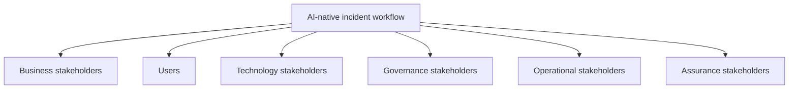

# Stakeholder Map

## Phase

```text
Phase 1B — Client Discovery Under Ambiguity
```

## Purpose

This tutorial identifies the people and organizational roles that influence, use, govern, approve, operate, or audit the proposed incident-assistance workflow.

The objective is to prevent the system from being designed only for the requester or engineering team while ignoring:

- End users
- Data owners
- Security
- Compliance
- Change authority
- Platform operations
- Support ownership
- Financial accountability
- Audit requirements

This is a simulated stakeholder model. It does not represent a real client organization.

## Learning Objectives

After completing this tutorial, the learner should be able to:

1. Identify primary, secondary, governance, and operational stakeholders.
2. Distinguish a user from a decision authority.
3. Separate business ownership from technical implementation.
4. Identify who owns data, policy, tools, approval, and operations.
5. Recognize conflicting stakeholder priorities.
6. Design an effective discovery workshop.
7. Define decision and escalation paths.
8. Explain stakeholder alignment during an interview.

## Stakeholder Principle

A stakeholder who requests an AI agent is not automatically authorized to:

- Approve the use case
- Release sensitive data
- Select the provider
- Grant tool permissions
- Approve production changes
- Accept operational risk
- Promote the system into production

Authority must be identified explicitly.

## Stakeholder Categories



## Primary Stakeholders

| ID | Stakeholder | Relationship to workflow | Primary concern |
|---|---|---|---|
| STK-01 | Executive sponsor | Funds and sponsors the initiative | Business value and risk |
| STK-02 | Incident responder | Primary user of initial slice | Faster evidence gathering |
| STK-03 | SRE or senior engineer | Validates diagnosis quality | Technical correctness |
| STK-04 | Service owner | Accountable for service health | Service-specific risk |
| STK-05 | Product owner | Owns workflow outcomes | Adoption and measurable value |
| STK-06 | AI platform architect | Designs system boundaries | Modularity and readiness |
| STK-07 | Application engineer | Implements services and adapters | Clear contracts and testability |
| STK-08 | Security architect | Defines security boundaries | Least privilege and threat control |
| STK-09 | Identity and access owner | Owns identity integration | Trusted claims and access lifecycle |
| STK-10 | Data or knowledge owner | Owns source access and quality | Authority, classification, freshness |
| STK-11 | Change approver | Authorizes consequential actions | Controlled and attributable change |
| STK-12 | Platform operator | Operates the deployed system | Reliability, support, and rollback |
| STK-13 | Compliance or privacy reviewer | Reviews regulatory obligations | Data handling and evidence |
| STK-14 | Auditor | Reconstructs decisions and actions | Integrity and traceability |
| STK-15 | FinOps owner | Reviews provider and platform cost | Cost effectiveness |
| STK-16 | Vendor or ecosystem specialist | Supports external platform integration | Product-specific constraints |

## Stakeholder Role Details

### STK-01 — Executive Sponsor

Responsibilities:

- Confirm business priority
- Approve funding
- Resolve organizational blockers
- Accept or escalate material business risk
- Review outcome measures

Must not:

- Grant technical permissions outside formal processes
- Override security or change controls through informal direction
- Declare the system production-ready without evidence

### STK-02 — Incident Responder

Responsibilities:

- Explain the current investigation workflow
- Identify evidence-gathering pain points
- Review diagnosis usefulness
- Correct inaccurate recommendations
- Escalate when evidence is insufficient

Initial authority:

- Submit incident-analysis requests
- Retrieve evidence already permitted by role
- Review recommendations

Initial prohibited authority:

- Grant the agent production credentials
- Approve high-risk actions unless separately authorized
- Change access policy

### STK-03 — SRE or Senior Engineer

Responsibilities:

- Validate technical diagnosis
- Identify authoritative runbooks
- Define safe troubleshooting steps
- Define failure and escalation behavior
- Support evaluation cases

Must distinguish:

- Technically possible action
- Operationally safe action
- Authorized action
- Approved action

These are not equivalent.

### STK-04 — Service Owner

Responsibilities:

- Confirm service criticality
- Confirm service dependencies
- Approve service-specific operating constraints
- Define acceptable degradation
- Participate in rollout decisions

The service owner is accountable for the service but may not own enterprise policy or identity.

### STK-05 — Product Owner

Responsibilities:

- Define user outcome
- Prioritize the vertical slice
- Maintain the product backlog
- Coordinate acceptance criteria
- Review adoption and feedback

Must not reduce success to model accuracy alone.

### STK-06 — AI Platform Architect

Responsibilities:

- Translate workflow into system responsibilities
- Define gateway, runtime, RAG, provider, tool, policy, approval, evaluation, and observability boundaries
- Record architecture decisions
- Explain trade-offs
- Prevent the model or orchestrator from becoming the authorization authority

Must not claim implementation or deployment without evidence.

### STK-07 — Application Engineer

Responsibilities:

- Implement typed services
- Implement API and event contracts
- Write unit and contract tests
- Handle deterministic errors
- Support debugging and code-with sessions

The application engineer implements approved contracts but does not independently grant business authority.

### STK-08 — Security Architect

Responsibilities:

- Define trust boundaries
- Review threat scenarios
- Define least-privilege principles
- Review model, retrieval, tool, and provider risks
- Define fail-closed requirements

The security architect provides control requirements but does not replace the business owner or service owner.

### STK-09 — Identity and Access Owner

Responsibilities:

- Define trusted identity claims
- Define role and group lifecycle
- Confirm token validation
- Define workload identities
- Define delegated-access boundaries

Must ensure the runtime cannot invent or elevate identity.

### STK-10 — Data or Knowledge Owner

Responsibilities:

- Identify authoritative sources
- Classify data
- Approve ingestion
- Define access controls
- Define freshness, retention, and deletion
- Resolve conflicting source authority

The data owner—not the model—determines which sources are authoritative.

### STK-11 — Change Approver

Responsibilities:

- Review consequential action requests
- Confirm scope and timing
- Approve or deny the exact action
- Confirm separation of duties
- Ensure approval expires

Approval must be bound to the precise action, parameters, resource, environment, policy version, and expiration.

### STK-12 — Platform Operator

Responsibilities:

- Operate the runtime
- Monitor health
- Respond to platform incidents
- Execute rollback
- Maintain runbooks
- Support release gates

The platform operator must have a defined support boundary before production rollout.

### STK-13 — Compliance or Privacy Reviewer

Responsibilities:

- Identify applicable obligations
- Define evidence and retention requirements
- Review data minimization
- Review provider and regional restrictions
- Review human-accountability requirements

Compliance requirements must be translated into testable technical and operational controls.

### STK-14 — Auditor

Responsibilities:

- Review evidence integrity
- Reconstruct decisions
- Confirm policy and approval provenance
- Confirm version and environment
- Review known limitations

The auditor is a consumer of evidence, not the producer of model conclusions.

### STK-15 — FinOps Owner

Responsibilities:

- Define cost-allocation requirements
- Review provider usage
- Review infrastructure cost
- Define budget alerts
- Evaluate cost per successful task

Lowest token cost does not automatically mean best business value.

### STK-16 — Vendor or Ecosystem Specialist

Responsibilities:

- Explain provider-specific capabilities
- Explain integration constraints
- Support adapter implementation
- Identify regional or contractual restrictions
- Validate product-specific configurations

The specialist informs the design but does not override client authority or data policy.

## Stakeholder Influence and Interest

| Stakeholder | Influence | Interest | Engagement approach |
|---|---|---|---|
| Executive sponsor | High | High | Decision and outcome reviews |
| Incident responder | Medium | High | Workflow workshops and usability tests |
| SRE | High | High | Technical design and evaluation |
| Service owner | High | High | Risk, SLO, and rollout reviews |
| Product owner | High | High | Backlog and acceptance reviews |
| AI platform architect | High | High | Continuous architecture leadership |
| Application engineer | Medium | High | Code-with and implementation sessions |
| Security architect | High | High | Threat and control reviews |
| Identity owner | High | Medium | Identity-contract reviews |
| Data owner | High | High | Source and permission reviews |
| Change approver | High | Medium | Approval-design sessions |
| Platform operator | High | High | Operational-readiness reviews |
| Compliance reviewer | High | Medium | Control and evidence reviews |
| Auditor | Medium | Medium | Evidence and integrity reviews |
| FinOps owner | Medium | Medium | Cost and usage reviews |
| Ecosystem specialist | Medium | Medium | Integration-specific sessions |

## Decision-Rights Matrix

| Decision | Recommends | Approves | Consulted | Informed |
|---|---|---|---|---|
| Select initial use case | Product owner | Executive sponsor | Users, architect, security | Delivery team |
| Define workflow | Incident responder | Product owner | SRE, service owner | Sponsor |
| Approve data sources | Data owner | Data owner | Security, compliance, architect | Engineering |
| Define identity claims | Identity owner | Identity owner | Security, architect | Engineering |
| Select model provider | AI architect | Platform and risk authority | Security, data, FinOps, legal | Engineering |
| Define tool contract | Engineer and architect | Tool owner | Security, service owner | Product |
| Define tool permission | Security and tool owner | Policy authority | Identity, service owner | Engineering |
| Approve consequential action | Requesting workflow | Change approver | Service owner, policy | Operator |
| Define evaluation thresholds | Evaluation lead | Product and risk owners | SRE, security, users | Sponsor |
| Approve production readiness | Delivery team | Release authority | Security, operations, product | Stakeholders |
| Promote rollout stage | Product and platform owners | Release authority | Security, service owner | Users |
| Execute rollback | Platform operator | Defined rollback authority | Service owner | Stakeholders |

The titles may differ in a real client environment. The decision rights must still be explicit.

## RACI for the Initial Vertical Slice

Legend:

- **R** — Responsible
- **A** — Accountable
- **C** — Consulted
- **I** — Informed

| Activity | Product owner | Responder | SRE | AI architect | Engineer | Security | Data owner | Platform operator |
|---|---:|---:|---:|---:|---:|---:|---:|---:|
| Define current workflow | A | R | C | C | I | I | I | I |
| Select initial slice | A | C | C | R | C | C | C | C |
| Approve runbook sources | I | C | C | C | I | C | A/R | I |
| Define access filters | I | C | I | C | C | A/R | C | I |
| Define API contracts | C | C | C | A | R | C | I | C |
| Define evaluation dataset | A | R | R | C | C | C | C | I |
| Define security cases | I | C | C | C | C | A/R | C | C |
| Implement prototype | I | C | C | A | R | C | I | C |
| Validate usefulness | A | R | R | C | C | C | C | I |
| Operate pilot | C | C | C | C | R | C | I | A |
| Approve next stage | A | C | C | C | I | C | C | R |

A real engagement must confirm names and accountability rather than assuming this matrix applies unchanged.

## Stakeholder Conflicts to Expect

### Speed versus control

Product and executive stakeholders may prioritize rapid value, while security and compliance require stronger boundaries.

Resolution approach:

- Select a lower-risk slice
- Make controls explicit
- Define staged autonomy
- Establish evidence-based promotion

### Accuracy versus latency

SREs may prefer deeper evidence analysis, while responders need rapid output.

Resolution approach:

- Define latency budgets
- Measure task success
- Separate initial response from deeper analysis
- Evaluate model and retrieval choices

### Usefulness versus privacy

Users may want broad knowledge access, while data owners require strict filtering.

Resolution approach:

- Apply source-level and query-time authorization
- Test permission correctness
- Prefer abstention over unauthorized retrieval

### Innovation versus operations

The project team may focus on features while operators require reliability, rollback, and support ownership.

Resolution approach:

- Include operators before deployment
- Define SLOs and runbooks
- Inject failures
- Require readiness evidence

### Cost versus quality

FinOps may prefer smaller or cheaper models, while users prefer stronger reasoning.

Resolution approach:

- Measure cost per successful task
- Use evaluation-based routing
- Use deterministic logic for bounded work
- Preserve minimum quality thresholds

### Autonomy versus accountability

Stakeholders may request full automation while approvers require attributable control.

Resolution approach:

- Begin with recommendation mode
- Classify action risk
- Use deterministic policy
- Bind approval to exact actions
- Increase autonomy only through staged gates

## Required Discovery Workshops

### Workshop 1 — Business Workflow

Participants:

- Product owner
- Incident responders
- SRE
- Service owner
- AI platform architect

Outputs:

- Current workflow
- Pain points
- User outcomes
- Candidate vertical slices

### Workshop 2 — Data and Identity

Participants:

- Data owner
- Identity owner
- Security architect
- Compliance reviewer
- AI platform architect
- Application engineer

Outputs:

- Source inventory
- Classifications
- Access model
- Retention constraints
- Provider restrictions

### Workshop 3 — Tools and Authority

Participants:

- SRE
- Service owner
- Tool owner
- Change approver
- Security architect
- Platform operator

Outputs:

- Tool inventory
- Side-effect tiers
- Policy inputs
- Approval requirements
- Verification and rollback requirements

### Workshop 4 — Evaluation and Operations

Participants:

- Product owner
- Responders
- SRE
- Evaluation lead
- Platform operator
- Security architect
- FinOps owner

Outputs:

- Success measures
- Golden cases
- Safety cases
- Latency and cost measures
- Operational-readiness requirements

## Workshop Facilitation Rules

The facilitator must:

1. Begin with the workflow.
2. Separate facts from assumptions.
3. Record unresolved questions.
4. Make decision rights visible.
5. Prevent technology selection from replacing discovery.
6. Ask who owns each source and action.
7. Ask what failure looks like.
8. Ask who can accept each risk.
9. Confirm measurable outputs.
10. End with owners and next actions.

The facilitator must not:

- Treat the loudest stakeholder as the authority
- Assume the requester owns all data
- Promise full autonomy
- Hide unresolved risks
- Force every stakeholder into one workshop
- Use architecture jargon instead of clarifying the workflow

## Stakeholder Interview Questions

### Executive sponsor

- What business outcome justifies the initiative?
- What risk is unacceptable?
- What decision requires executive escalation?
- What rollout evidence is expected?

### Incident responder

- Which evidence takes longest to gather?
- Which sources do you trust?
- Which recommendation would be useful?
- What mistake would make you stop using the system?

### SRE

- Which symptoms require expert judgment?
- Which procedures are deterministic?
- Which actions require rollback?
- What evidence proves remediation succeeded?

### Data owner

- Which sources are authoritative?
- How are permissions represented?
- How is freshness determined?
- What data may be sent to a provider?

### Security and identity

- Which claims are trusted?
- Which actions require policy evaluation?
- How are workload identities scoped?
- What must fail closed?

### Platform operator

- Who receives alerts?
- What is the support model?
- How is rollback performed?
- What telemetry is required?

## Stakeholder Alignment Outputs

Phase 1B produces:

- Stakeholder inventory
- Concerns and incentives
- Decision-rights matrix
- Initial RACI
- Conflict-resolution patterns
- Workshop plan
- Interview-question bank

It does not produce:

- Final organizational approval
- Named real-client participants
- Production access
- Provider approval
- Tool authority
- Release approval

## Tutorial Exercise

For the proposed action:

```text
Restart the production payment API
```

Identify:

1. Who proposes the action?
2. Who owns the service?
3. Who defines tool permissions?
4. Who evaluates policy?
5. Who approves the change?
6. Who executes it?
7. Who verifies the result?
8. Who records the evidence?
9. Who can order rollback?
10. Who is informed?

Then repeat for:

```text
Retrieve an authorized runbook
```

The two actions must not use identical authority requirements.

## Expected Learning Result

The learner should conclude:

- Users, owners, approvers, implementers, and auditors are distinct roles.
- Business sponsorship does not grant technical authority.
- Technical expertise does not automatically grant change authority.
- The model and orchestrator are not stakeholders with decision rights.
- Production readiness requires agreement across product, security, operations, and service ownership.
- Stakeholder alignment is part of system architecture.

## Interview Explanation — 60 Seconds

When I lead discovery, I identify more than the end user and executive sponsor. I map the people who own the workflow, data, identity, policy, tools, service, approval process, operations, cost, and audit evidence. I then make the decision rights explicit: who recommends, who approves, who executes, who verifies, and who remains accountable. This is especially important for agentic systems because a technically valid recommendation is not automatically an authorized action. I use focused workshops rather than placing every stakeholder in one meeting—for example, business workflow, data and identity, tools and authority, and evaluation and operations. The result is a shared operating model that prevents the model, orchestrator, requester, or engineering team from silently gaining authority they do not own.

## Interview Explanation — 30 Seconds

I map the users, workflow owners, data owners, security, approvers, operators, and auditors—not just the project sponsor. I clarify who recommends, authorizes, executes, verifies, and remains accountable. Focused workshops then resolve workflow, data, tool, evaluation, and operational boundaries. That prevents technical implementation or model reasoning from becoming informal enterprise authority.

## Current Status

| Item | Status |
|---|---|
| Stakeholder model | Documented |
| Real stakeholder validation | Not performed |
| Decision rights | Proposed for tutorial |
| RACI | Proposed for tutorial |
| Production authority | None |
| Runtime implementation | Not started |
| Tool execution | Not authorized |

## Limitations

- All stakeholder roles are simulated.
- Real titles and responsibilities will vary.
- The decision-rights matrix is not organizational approval.
- The RACI requires client validation.
- No real provider, source, tool, or production owner has approved access.
- No runtime or execution capability exists.

## Phase 1B Completion Gate

Phase 1B passes when:

- Primary stakeholders are identified.
- Concerns and incentives are explicit.
- Decision rights distinguish recommendation, approval, execution, and verification.
- Initial RACI is documented.
- Expected conflicts and resolution approaches are recorded.
- Workshops have defined participants and outputs.
- Stakeholder questions are documented.
- Limitations are explicit.
- No authority or implementation is implied.

## Next Authorized Work

```text
Phase 1C — Data Source Inventory
```

Phase 1C will classify source authority, ownership, access, freshness, retention, and AI-use constraints. It will not ingest data or implement retrieval.
