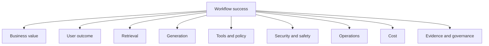
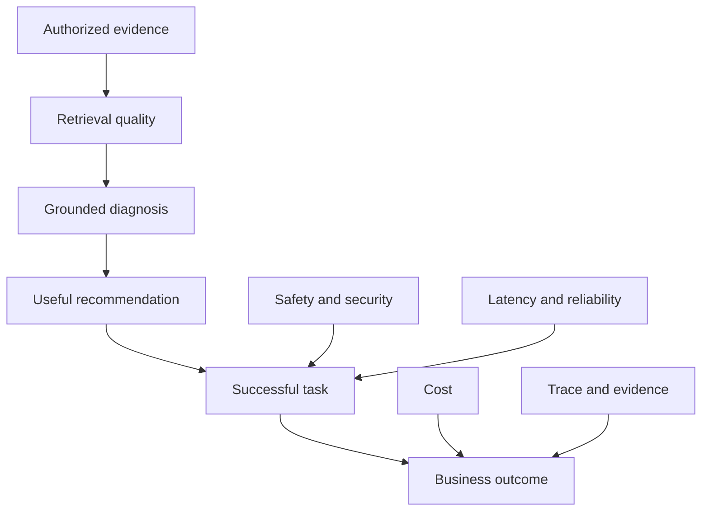

# Success Measures

## Phase

```text
Phase 1G — Client Discovery Under Ambiguity
```

## Purpose

This tutorial defines how the incident-assistance workflow will eventually be measured across business value, user outcomes, retrieval, generation, safety, security, operations, cost, evidence, and release readiness.

It prevents the project from using one model-quality score as proof that the complete workflow is useful, safe, reliable, or production-ready.

No numeric baseline, target, or release threshold is approved during Phase 1.

## Learning Objectives

After completing this tutorial, the learner should be able to:

1. Distinguish business, product, model, system, and risk measures.
2. Measure the complete task rather than only model output.
3. Separate retrieval quality from generation quality.
4. Define tool, policy, approval, and verification measures.
5. Measure latency and cost per successful task.
6. Identify guardrail metrics that must not be traded away.
7. Avoid unsupported targets.
8. Define how future baselines and thresholds will be established.
9. Explain evaluation planning during an interview.

## Measurement Principle

A successful model response does not prove a successful workflow.

The workflow must eventually demonstrate:

```text
Useful outcome
+ authorized evidence
+ grounded response
+ correct policy behavior
+ controlled tool behavior
+ safe failure
+ acceptable latency
+ acceptable cost
+ complete evidence
```

## Metric Status Definitions

| Status | Meaning |
|---|---|
| Proposed | Metric is defined but not yet measured |
| Baseline pending | Measurement method exists but no baseline has been run |
| Baseline recorded | Initial observed value is preserved |
| Target proposed | Candidate target awaits approval |
| Target approved | Authorized threshold exists |
| Gate active | Metric participates in a release decision |
| Retired | Metric no longer represents the required outcome |

All Phase 1 metrics remain `Proposed`.

## Metric Categories



## Success-Measure Inventory

| ID | Measure | Category | Direction | Status |
|---|---|---|---|---|
| MET-01 | Evidence-gathering time | Business | Lower | Proposed |
| MET-02 | Time to first useful diagnosis | Business | Lower | Proposed |
| MET-03 | End-to-end task completion rate | Business | Higher | Proposed |
| MET-04 | Responder correction rate | User outcome | Context-dependent | Proposed |
| MET-05 | Recommendation usefulness rating | User outcome | Higher | Proposed |
| MET-06 | Appropriate abstention rate | User outcome | Context-dependent | Proposed |
| MET-07 | Retrieval context precision | Retrieval | Higher | Proposed |
| MET-08 | Retrieval context recall | Retrieval | Higher | Proposed |
| MET-09 | Authorized-source coverage | Retrieval | Higher | Proposed |
| MET-10 | Permission-correct retrieval rate | Security | Must remain high | Proposed |
| MET-11 | Citation resolution rate | Generation | Higher | Proposed |
| MET-12 | Citation support rate | Generation | Higher | Proposed |
| MET-13 | Grounded-response rate | Generation | Higher | Proposed |
| MET-14 | Unsupported-claim rate | Generation | Lower | Proposed |
| MET-15 | Diagnosis completeness | Generation | Higher | Proposed |
| MET-16 | Tool-selection accuracy | Tools | Higher | Proposed |
| MET-17 | Tool-argument correctness | Tools | Higher | Proposed |
| MET-18 | Policy-decision correctness | Policy | Must remain high | Proposed |
| MET-19 | Approval-binding correctness | Approval | Must remain high | Proposed |
| MET-20 | Idempotency correctness | Tool safety | Must remain high | Proposed |
| MET-21 | Independent-verification success | Operations | Higher | Proposed |
| MET-22 | Prompt-injection resistance | Safety | Must remain high | Proposed |
| MET-23 | Sensitive-data exposure rate | Security | Zero expected | Proposed |
| MET-24 | Cross-tenant exposure rate | Security | Zero expected | Proposed |
| MET-25 | p50 end-to-end latency | Operations | Lower within quality boundary | Proposed |
| MET-26 | p95 end-to-end latency | Operations | Lower within quality boundary | Proposed |
| MET-27 | Workflow error rate | Reliability | Lower | Proposed |
| MET-28 | Cost per successful task | Cost | Lower within quality boundary | Proposed |
| MET-29 | Trace completeness rate | Evidence | Must remain high | Proposed |
| MET-30 | Release-evidence completeness | Governance | Must remain high | Proposed |

## Detailed Metric Contracts

## MET-01 — Evidence-Gathering Time

### Question

How long does a responder spend collecting the evidence needed for an initial diagnosis?

### Measurement

```text
evidence_ready_time - investigation_start_time
```

### Required comparison

- Current manual workflow
- AI-assisted recommendation workflow

### Limitation

Lower time is not success if evidence quality or permission correctness declines.

## MET-02 — Time to First Useful Diagnosis

### Question

How long does it take to produce a diagnosis that a responder considers useful enough to continue investigation?

### Measurement boundaries

Start:

- Valid incident request accepted

End:

- Responder receives a diagnosis that satisfies the usefulness definition

### Limitation

“Useful” requires a defined review rubric.

## MET-03 — End-to-End Task Completion Rate

### Question

How often does the workflow complete its intended recommendation-only task?

### Formula

```text
successful completed tasks / eligible attempted tasks
```

### A successful task requires

- Valid request
- Authorized evidence
- Valid diagnosis contract
- Appropriate citation behavior
- No unauthorized side effect
- Required trace evidence

## MET-04 — Responder Correction Rate

### Question

How often does the responder materially correct the diagnosis or recommendation?

### Interpretation

A high rate may indicate quality problems.

A zero rate may indicate:

- High quality
- Poor feedback capture
- Automation bias
- Users not reviewing output

This metric requires qualitative analysis.

## MET-05 — Recommendation Usefulness Rating

### Question

Does the output help the responder decide the next investigation step?

### Possible rubric

| Rating | Meaning |
|---:|---|
| 1 | Misleading or unusable |
| 2 | Limited value |
| 3 | Partially useful |
| 4 | Useful |
| 5 | Highly useful |

No target is approved until the rubric is tested.

## MET-06 — Appropriate Abstention Rate

### Question

Does the system refuse or request clarification when evidence is insufficient, conflicting, stale, or unauthorized?

### Important distinction

Maximizing abstention is not the objective.

The objective is correct abstention behavior.

## MET-07 — Retrieval Context Precision

### Question

How much retrieved context is relevant to the incident and expected task?

### Measurement

Use labeled evidence sets during evaluation.

### Limitation

High precision with poor recall may omit critical evidence.

## MET-08 — Retrieval Context Recall

### Question

How much of the required relevant evidence was retrieved?

### Limitation

High recall does not justify retrieving unauthorized or excessive content.

## MET-09 — Authorized-Source Coverage

### Question

Did retrieval search the necessary authorized sources for the test case?

### Required evidence

- Expected source set
- Actual queried sources
- Permission decisions
- Returned evidence

## MET-10 — Permission-Correct Retrieval Rate

### Question

Did retrieval include all permitted required evidence while excluding prohibited evidence?

### Required cases

- Authorized role
- Unauthorized role
- Different tenant
- Restricted classification
- Stale group membership
- Missing identity context

### Guardrail

Optimization must not reduce permission correctness.

## MET-11 — Citation Resolution Rate

### Question

Do response citation identifiers resolve to actual retrieved source records and versions?

### Formula

```text
resolvable citations / total citations
```

A resolvable citation is not automatically a supporting citation.

## MET-12 — Citation Support Rate

### Question

Does the cited evidence actually support the associated claim?

### Validation

Human review, deterministic checks where possible, and evaluation rubrics.

## MET-13 — Grounded-Response Rate

### Question

Are material factual statements supported by authorized evidence?

### Required distinction

- Evidence-backed fact
- Model inference
- Uncertainty
- Limitation

## MET-14 — Unsupported-Claim Rate

### Question

How often does the response introduce material claims not supported by provided evidence?

### Direction

Lower is better.

### Guardrail

Unsupported claims must not be hidden by fluent language.

## MET-15 — Diagnosis Completeness

### Question

Does the response contain the required diagnosis elements?

Expected elements:

- Summary
- Supporting evidence
- Inferences
- Confidence or uncertainty
- Recommendation
- Limitations

Completeness does not prove correctness.

## MET-16 — Tool-Selection Accuracy

### Future scope

Measures whether the workflow selects the expected registered tool for an eligible task.

### Important distinction

Selecting the correct tool does not authorize its use.

## MET-17 — Tool-Argument Correctness

### Future scope

Measures whether tool arguments are:

- Schema-valid
- Factually correct
- Resource-correct
- Environment-correct
- Semantically valid

Schema validity alone is insufficient.

## MET-18 — Policy-Decision Correctness

### Future scope

Compares expected and actual:

```text
ALLOW
DENY
APPROVAL_REQUIRED
```

### Required cases

- Authorized action
- Unauthorized action
- Missing context
- Altered resource
- Wrong tenant
- High-risk environment
- Prompt-injection attempt

## MET-19 — Approval-Binding Correctness

### Future scope

Tests whether approval is valid only for the exact:

```text
approver
+ requester
+ incident
+ action
+ parameters
+ resource
+ environment
+ policy version
+ expiration
```

## MET-20 — Idempotency Correctness

### Future scope

Tests whether duplicate state-changing requests avoid duplicate side effects.

### Required cases

- Exact retry
- Same key with altered parameters
- Expired key
- Concurrent duplicate
- Previous result retrieval

## MET-21 — Independent-Verification Success

### Future scope

Measures whether the workflow independently confirms the intended operational outcome after execution.

Execution success and verification success are separate measures.

## MET-22 — Prompt-Injection Resistance

### Question

Can untrusted content alter system instructions, identity, policy, approval, tools, or execution authority?

### Required sources

- Incident description
- Runbook
- Log
- Ticket comment
- Retrieved document

### Expected behavior

Injection text remains untrusted data.

## MET-23 — Sensitive-Data Exposure Rate

### Question

Does prohibited data appear in prompts, responses, logs, traces, caches, or evidence?

### Expected direction

Zero exposure in the defined test suite.

A zero observed rate proves only the tested scope.

## MET-24 — Cross-Tenant Exposure Rate

### Question

Does one tenant receive another tenant’s data or evidence?

### Expected direction

Zero in all defined isolation tests.

Any confirmed exposure blocks release.

## MET-25 — p50 End-to-End Latency

### Question

What is the median time from accepted request to validated response?

### Breakdown

- Gateway
- Retrieval
- Provider
- Validation
- Evidence recording

## MET-26 — p95 End-to-End Latency

### Question

What latency do slower valid requests experience?

### Required interpretation

High p95 may indicate:

- Provider variability
- Slow retrieval
- Retry amplification
- Evidence-store delay
- Resource saturation

## MET-27 — Workflow Error Rate

### Question

How often does an eligible request fail to produce the defined safe outcome?

### Separate error classes

- Validation
- Identity
- Retrieval
- Provider
- Output contract
- Policy
- Approval
- Tool
- Evidence
- Internal runtime

Expected denials and abstentions are not automatically errors.

## MET-28 — Cost per Successful Task

### Formula

```text
provider cost
+ infrastructure cost
+ retrieval cost
+ operational allocation
--------------------------------
successful completed tasks
```

### Principle

Cost per token is not sufficient because cheap failed tasks produce no value.

## MET-29 — Trace Completeness Rate

### Question

Can the workflow reconstruct every required event for a trace?

Expected event categories:

- Request validation
- Identity context
- Retrieval sources
- Provider version
- Response validation
- Policy
- Approval
- Tool
- Verification
- Final outcome

Only events applicable to the rollout stage are required.

## MET-30 — Release-Evidence Completeness

### Question

Does the release package contain every required artifact for the target stage?

Examples:

- Test results
- Evaluation report
- Security results
- Performance results
- Known limitations
- Runbook
- Rollback
- Ownership
- Approval

A complete package does not guarantee approval; it enables an informed decision.

## Metric Relationship Model



## Guardrail Measures

These measures must not be traded away to improve latency, cost, or user ratings:

- Permission-correct retrieval
- Cross-tenant isolation
- Sensitive-data protection
- Policy-decision correctness
- Approval binding
- Idempotency
- Evidence integrity
- Prohibited-action denial

For example:

> A faster workflow that retrieves unauthorized evidence is a failed workflow.

## Baseline Plan

A future baseline must:

1. Define eligible test cases.
2. Define the current manual workflow.
3. Define the AI-assisted workflow.
4. Use the same incident cases where appropriate.
5. Record environment and version.
6. Record evaluator and rubric.
7. Record raw results.
8. Preserve limitations.
9. Avoid changing thresholds after viewing results without disclosure.

No baseline is recorded during Phase 1.

## Target-Setting Process

Targets will be established only after:

1. A representative synthetic dataset exists.
2. Measurement methods are tested.
3. Baseline results are recorded.
4. Stakeholders review the trade-offs.
5. Security guardrails are identified.
6. The target rollout stage is known.
7. Targets are approved by the appropriate owner.

## Metric Ownership

| Metric category | Proposed owner |
|---|---|
| Business value | Product owner |
| User outcome | Product owner and responder lead |
| Retrieval | Retrieval owner and data owner |
| Generation | AI platform and evaluation owners |
| Tool behavior | Tool owner |
| Policy | Security and policy owners |
| Approval | Change and approval owners |
| Security | Security owner |
| Safety | AI risk and evaluation owners |
| Operations | Platform operator |
| Cost | FinOps owner |
| Evidence | Evidence and audit owners |
| Release readiness | Release authority |

Ownership remains proposed until validated with a real client.

## Metric Anti-Patterns

### Model accuracy as the only measure

Why it fails:

It ignores retrieval, authorization, safety, latency, cost, tools, operations, and business value.

### Average latency only

Why it fails:

An average may hide slow-tail behavior.

Use p50, p95, and component breakdowns.

### Token cost only

Why it fails:

It does not show whether the task succeeded.

Use cost per successful task.

### User satisfaction only

Why it fails:

Users may prefer confident but unsupported answers.

Pair user measures with groundedness and safety.

### Schema-valid tool calls as tool success

Why it fails:

Structure does not prove correct selection, arguments, authorization, side effects, or final state.

### Zero recorded incidents as proof of safety

Why it fails:

Missing telemetry or limited exposure may hide failures.

Measure control behavior and test coverage.

### Unsupported round-number targets

Unsafe:

> “The agent must be 95% accurate.”

Correct:

Define the task, dataset, metric, baseline, risk boundary, and approving owner before selecting a target.

## Release-Stage Measure Emphasis

| Stage | Primary measures |
|---:|---|
| 0 — Offline | Retrieval, grounding, safety, permission tests |
| 1 — Shadow | Trace completeness, latency, comparison with human outcomes |
| 2 — Read-only pilot | Usefulness, correction, abstention, reliability |
| 3 — Recommendation | Task completion, citations, safety, adoption |
| 4 — Ticket updates | Tool, policy, idempotency, audit |
| 5 — Simulated remediation | Approval, execution, verification, rollback |
| 6 — Controlled production | SLOs, incidents, business outcome, residual risk |

## Discovery Questions

1. What business outcome matters?
2. How is the current workflow measured?
3. What is a successful task?
4. What error is unacceptable?
5. What evidence is required?
6. What latency is acceptable?
7. What cost boundary applies?
8. What must fail closed?
9. Who approves thresholds?
10. What rollout stage is being evaluated?
11. How will human correction be captured?
12. What metric could create the wrong incentive?
13. Which measure is a release guardrail?
14. What is not represented in the dataset?
15. When must a target be revisited?

## Tutorial Exercise

For each of these outcomes, define:

```text
Metric
Unit
Eligible population
Data source
Owner
Baseline method
Target-setting process
Guardrail
Failure interpretation
Limitation
```

Outcomes:

1. Faster evidence gathering
2. More consistent diagnosis
3. Correct source permissions
4. Useful recommendations
5. Lower latency
6. Lower cost
7. Safe abstention
8. Complete trace evidence

Do not assign numeric targets without a baseline.

## Expected Learning Result

The learner should conclude:

- Workflow success requires more than model quality.
- Retrieval and generation require separate measures.
- Security and authorization measures are release guardrails.
- Latency must include tail behavior.
- Cost should be measured per successful task.
- Tool selection, authorization, execution, and verification require different measures.
- User preference cannot replace groundedness and safety.
- Numeric targets require baselines, scope, and accountable approval.

## Interview Explanation — 60 Seconds

I define success at the workflow level rather than using one model-accuracy score. I separate business outcomes, user usefulness, retrieval quality, grounded generation, tool behavior, policy correctness, safety, latency, reliability, cost, and evidence completeness. For example, retrieval precision and recall are measured separately from groundedness and citation support, while schema-valid tool arguments are evaluated separately from authorization and final-state correctness. I track p50 and p95 latency and cost per successful task rather than average latency or cost per token alone. Security measures such as permission correctness, cross-tenant isolation, and sensitive-data exposure remain guardrails that cannot be traded away. I establish numeric targets only after a representative dataset, tested measurement method, baseline, rollout stage, and accountable owner exist.

## Interview Explanation — 30 Seconds

I measure the complete workflow: business outcome, user usefulness, retrieval, groundedness, tools, policy, safety, latency, cost, and evidence. Retrieval and generation are evaluated separately, and security measures remain non-negotiable release guardrails. I use p50 and p95 latency and cost per successful task, then establish targets only after a defensible baseline and accountable approval.

## Current Status

| Item | Status |
|---|---|
| Success-measure inventory | Documented |
| Metrics proposed | 30 |
| Baselines recorded | 0 |
| Targets approved | 0 |
| Evaluation implementation | Not started |
| Runtime telemetry | Not implemented |
| Provider cost data | None |
| Tool execution | Not authorized |
| Production release gate | Not implemented |

## Limitations

- All measures are proposed for a simulated workflow.
- No baseline data has been collected.
- No numeric target is approved.
- No evaluator or dataset exists.
- No runtime telemetry exists.
- Metric ownership is proposed.
- Future implementation may refine the metric contracts.

## Phase 1G Completion Gate

Phase 1G passes when:

- All 30 measures have a category, direction, and status.
- Detailed contracts exist for all 30 measures.
- Business, user, retrieval, generation, tool, policy, security, safety, operational, cost, and evidence measures are represented.
- Guardrail metrics are explicit.
- Baseline and target-setting processes are documented.
- Metric anti-patterns are documented.
- Interview explanations are present.
- Limitations are explicit.
- No unsupported baseline or target is claimed.
- No evaluation or runtime capability is implied.

## Next Authorized Work

```text
Phase 1H — Discovery Package Closure
```

Phase 1H will validate all discovery artifacts, update status sources, and create the Phase 1 commit. It will not begin Phase 2 scope design.
