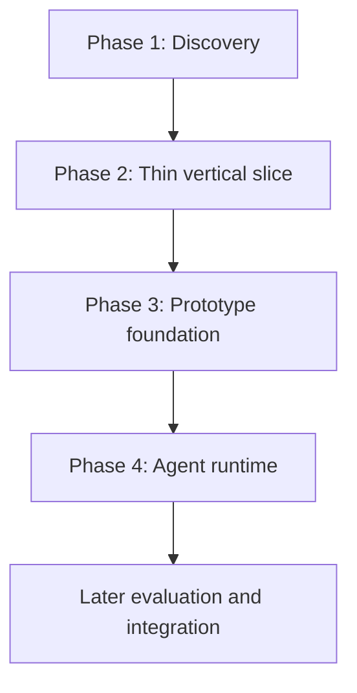
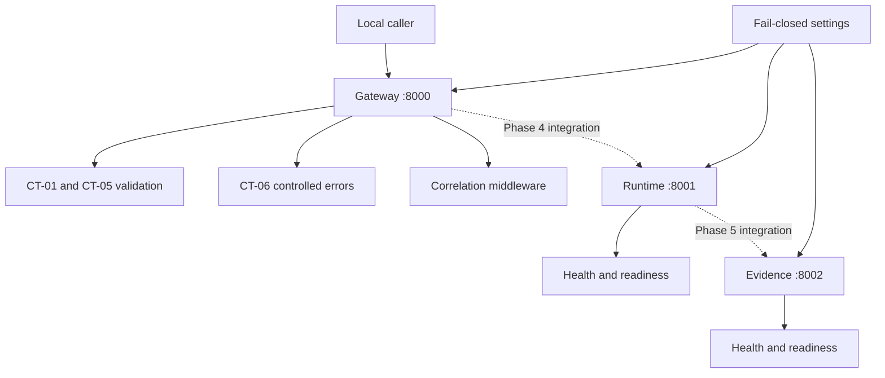
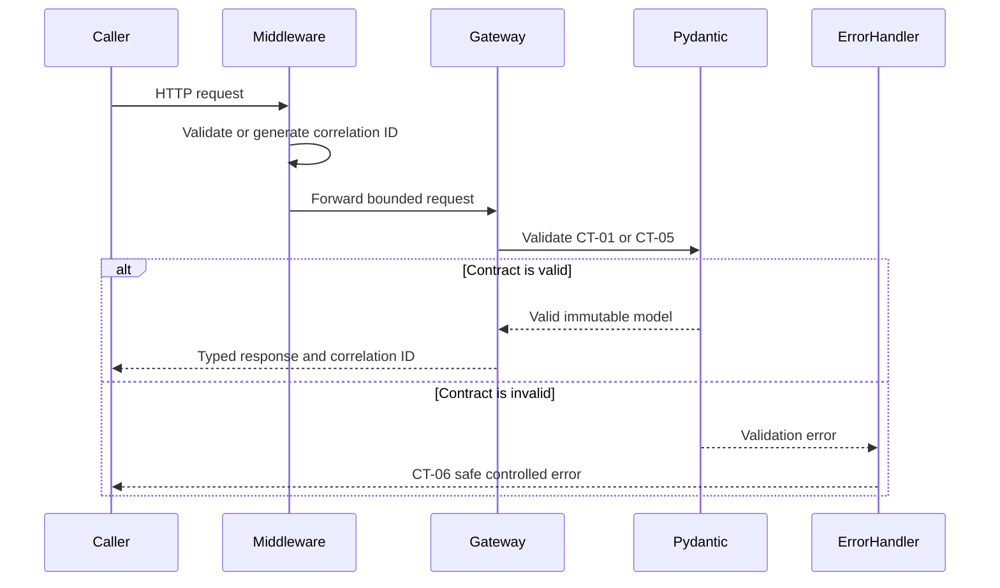

# Phase 3 — Cloud-Native Prototype Foundation

## 1. Purpose

Phase 3 turns the approved thin vertical slice into typed, executable, testable local service boundaries.

The client’s original request was broad:

> Build an AI agent that automatically resolves incidents.

Discovery showed that immediate autonomous remediation would introduce undefined authority, data-access, operational, and safety risks.

The first bounded use case was therefore reframed as:

> Accept a structured incident request, validate it, retrieve only authorized evidence in a future phase, produce a citation-backed recommendation in a future phase, and never execute remediation in the initial slice.

Phase 3 implements the software foundation for that bounded use case. It does not yet implement retrieval, model inference, agent orchestration, tool execution, or remediation.

---

## 2. Why This Phase Exists

A notebook or prompt demonstration can show that a model produces an interesting response. It does not establish that the surrounding system is safe, repeatable, observable, or supportable.

Before adding model behavior, the platform needs deterministic answers to questions such as:

- What request is accepted?
- Which fields are required?
- How are unknown fields handled?
- What identity and authorization information will later be required?
- What constitutes valid evidence?
- What does an abstention look like?
- What does a safe failure look like?
- How is one request traced across services?
- Which capabilities are explicitly disabled?
- Can the service start and report health?
- Can tests run without external credentials?
- Can another engineer reproduce the environment?

Phase 3 answers those questions through code, contracts, tests, packaging, and evidence.

---

## 3. Delivery-Lifecycle Position



Phase 3 must inherit its scope from Phases 1 and 2. It must not silently broaden the use case.

The implementation chain is:

```text
Discovery finding
→ bounded requirement
→ interface contract
→ validation rule
→ executable service boundary
→ automated test
→ recorded evidence
```

---

## 4. Traceability from Discovery to Prototype

| Earlier finding | Design decision | Phase 3 implementation | Evidence |
|---|---|---|---|
| The client request was ambiguous | Start with a recommendation-only slice | No remediation or mutation endpoint exists | Route-inventory tests |
| Production actions are consequential | Keep execution outside the prototype | Tool and mutation capabilities are fixed to false | Configuration tests |
| Incident input is inconsistent | Require a structured request | CT-01 `DiagnosticRequest` | Contract tests |
| Identity must not be inferred by the model | Define explicit identity context | CT-02 `IdentityContext` | Contract tests |
| Authorization must be deterministic | Define a policy-decision contract | CT-03 `AuthorizationDecision` | Policy-invariant tests |
| Evidence requires lineage | Define authorized evidence metadata | CT-04 `EvidenceItem` | Evidence-lineage tests |
| Unsupported conclusions must abstain | Define recommendation and abstention outcomes | CT-05 `DiagnosticResponse` | Response-invariant tests |
| Failures must not expose sensitive input | Define controlled errors | CT-06 `ControlledError` | Invalid-request API tests |
| Behavior must be reconstructable | Define trace events and correlation IDs | CT-07 `TraceEvent` and middleware | Unit and integration tests |
| The prototype must be reproducible | Lock dependencies and package locally | Hash-locked requirements and Docker definitions | Lock and packaging validation |
| Production authority is not granted | Default every prohibited capability to false | Fail-closed settings model | Configuration tests |

This table is the central lesson of Phase 3: implementation begins from validated workflow and boundary decisions, not from a preferred AI framework.

---

## 5. Learning Objectives

After completing this phase, the learner should be able to:

### Product and discovery translation

- Explain how a broad AI request becomes a bounded use case.
- Connect stakeholder, workflow, data, risk, and authority findings to code.
- Identify what belongs in the prototype and what must remain deferred.
- Define success without treating a demo as production evidence.

### Python engineering

- Organize a Python application using a `src` layout.
- Separate contracts, API behavior, core configuration, and service entry points.
- Use type annotations and strict static analysis.
- Write deterministic unit, contract, and integration tests.

### Pydantic

- Define executable request and response schemas.
- Reject unknown fields.
- Validate defaults and assignments.
- Apply bounded strings, identifiers, timestamps, scores, and enumerations.
- Express cross-field invariants.
- Serialize contracts predictably.
- Use validation as a data-quality boundary, not an authorization mechanism.

### FastAPI

- Create small service applications.
- Define typed request and response endpoints.
- Generate OpenAPI specifications from executable contracts.
- Add exception handlers for controlled validation failures.
- Add middleware for correlation identifiers.
- Separate health from readiness.
- Keep route scope aligned with authorized behavior.

### Cloud-native foundations

- Externalize configuration.
- Use fail-closed capability settings.
- Pin dependencies with hashes.
- Run containers as a non-root identity.
- Restrict container privileges and connectivity.
- Define repeatable local service topology.
- Automate quality and packaging checks in CI.

### Evidence discipline

- Distinguish implemented, tested, configured, blocked, and planned capabilities.
- Avoid claiming that a passing schema test proves an enterprise integration.
- Record limitations alongside successful evidence.
- Explain exactly what the prototype proves.

---

## 6. What a Prototype Is

A prototype is a controlled learning instrument.

Its purpose is to reduce uncertainty about:

- Scope
- Interfaces
- Data shape
- Failure behavior
- Integration boundaries
- Operational assumptions
- Security constraints
- Delivery feasibility

A useful enterprise prototype should answer a specific question.

For Phase 3, that question is:

> Can the approved incident-diagnostic slice be represented as strict contracts and exposed through reproducible local services without enabling models, retrieval, tools, or production authority?

The current evidence supports “yes” for the typed local foundation.

---

## 7. What a Prototype Is Not

This prototype is not:

- A production deployment
- A completed AI agent
- An autonomous remediation system
- An enterprise retrieval implementation
- A model-provider integration
- Evidence of customer adoption
- Evidence of business-value realization
- Evidence of production reliability
- Permission to mutate infrastructure

A successful prototype reduces selected uncertainties. It does not eliminate every delivery risk.

---

## 8. Why Python

Python is used because it provides a practical ecosystem for:

- Typed API development
- Data validation
- AI and retrieval libraries
- Testing
- Observability
- Cloud SDKs
- Automation

Python’s flexibility also creates risk. Without explicit typing and validation, invalid assumptions can move between services silently.

This lab therefore combines Python with:

- Pydantic for runtime contract validation
- mypy for static type checking
- Ruff for linting and formatting
- pytest for executable behavior
- coverage.py for test-coverage evidence

These tools address different failure classes. None replaces the others.

---

## 9. Why FastAPI

FastAPI is the HTTP service framework for the prototype.

It is useful here because it connects:

- Python type annotations
- Pydantic schemas
- Request validation
- Response validation
- OpenAPI generation
- Exception handling
- Middleware
- Testable ASGI applications

FastAPI does not provide business authorization automatically. It also does not make an AI system safe merely because the API is typed.

In this lab, FastAPI is the transport and service-boundary layer.

### FastAPI responsibilities in Phase 3

FastAPI is responsible for:

- Receiving HTTP requests
- Binding payloads to Pydantic models
- Rejecting structurally invalid input
- Returning declared response types
- Producing OpenAPI documentation
- Running correlation middleware
- Invoking controlled error handling
- Exposing health and readiness endpoints

FastAPI is not responsible for:

- Deciding whether a user may access a runbook
- Choosing production actions
- Approving remediation
- Determining enterprise policy
- Executing tools
- Calling external models in Phase 3

---

## 10. Why Pydantic

Pydantic turns documented interface expectations into executable contracts.

A Markdown table can describe a required `incident_id`. Pydantic can reject a request when that field is missing or malformed.

This makes the contract testable.

### Pydantic responsibilities in Phase 3

Pydantic is used to:

- Require mandatory fields
- Apply length and range constraints
- Normalize bounded text
- Validate timestamps
- Restrict values through enumerations
- Reject unexpected fields
- Validate cross-field relationships
- Produce deterministic serialized output
- Generate JSON Schema for OpenAPI

### Fail-closed model configuration

The shared contract model uses strict configuration principles such as:

- `extra="forbid"` to reject undocumented fields
- `frozen=True` to prevent silent mutation
- `str_strip_whitespace=True` to normalize boundary input
- `validate_assignment=True` to enforce validation on assignment
- `validate_default=True` to validate default values

These controls reduce ambiguity at the interface boundary.

### What Pydantic does not do

Pydantic confirms that data matches a declared shape and invariant.

It does not prove that:

- The caller is authentic
- The caller is authorized
- The evidence is true
- The source is trustworthy
- A recommendation is safe
- A production action is permitted

Schema validation and authorization are separate controls.

---

## 11. Repository Structure

```text
.
├── .github/
│   └── workflows/
│       └── phase3-ci.yml
├── requirements/
│   ├── development.lock
│   └── runtime.lock
├── src/
│   └── incident_diagnostic_api/
│       ├── api/
│       │   ├── app.py
│       │   ├── contracts.py
│       │   ├── errors.py
│       │   ├── health.py
│       │   └── models.py
│       ├── contracts/
│       │   ├── authorization.py
│       │   ├── common.py
│       │   ├── enums.py
│       │   ├── error.py
│       │   ├── evidence.py
│       │   ├── identity.py
│       │   ├── request.py
│       │   ├── response.py
│       │   └── trace.py
│       ├── core/
│       │   ├── config.py
│       │   └── correlation.py
│       ├── services/
│       │   ├── evidence.py
│       │   ├── gateway.py
│       │   └── runtime.py
│       └── main.py
├── tests/
│   ├── contract/
│   ├── integration/
│   └── unit/
├── .dockerignore
├── Dockerfile
├── compose.yaml
└── pyproject.toml
```

### Directory responsibilities

| Location | Responsibility |
|---|---|
| `contracts/` | Executable business and integration contracts |
| `api/` | HTTP routing, health, errors, and middleware composition |
| `core/` | Cross-cutting configuration and correlation behavior |
| `services/` | Independently addressable FastAPI service identities |
| `tests/unit/` | Small deterministic behavior tests |
| `tests/contract/` | Contract invariants and rejection behavior |
| `tests/integration/` | API, service, OpenAPI, and packaging-boundary tests |
| `requirements/` | Reproducible runtime and development resolutions |
| `.github/workflows/` | Automated quality and container evidence |

---

## 12. Implemented Architecture



Solid arrows represent executable Phase 3 behavior.

Dotted arrows represent planned integration boundaries. They are not implemented service-to-service calls.

---

## 13. Service Boundaries

### 13.1 Gateway service

The gateway is the only Phase 3 service with contract-validation routes.

It exposes:

- `GET /health`
- `GET /ready`
- `POST /v1/contracts/diagnostic-request/validate`
- `POST /v1/contracts/diagnostic-response/validate`
- `GET /openapi.json`

The gateway:

- Accepts typed payloads
- Applies Pydantic validation
- Returns controlled validation failures
- Propagates a safe correlation ID
- Publishes OpenAPI schemas

It does not:

- Generate a diagnosis
- Retrieve evidence
- Invoke the runtime service
- Execute a tool
- Modify infrastructure

### 13.2 Runtime service

The runtime exposes:

- `GET /health`
- `GET /ready`
- `GET /openapi.json`

The service identity reserves a boundary for later orchestration.

It does not currently:

- Execute an agent graph
- Maintain workflow state
- Call a model
- Call the evidence service
- Invoke a tool
- Request human approval

### 13.3 Evidence service

The evidence service exposes:

- `GET /health`
- `GET /ready`
- `GET /openapi.json`

The service identity reserves a boundary for later permission-aware retrieval.

It does not currently:

- Connect to an enterprise source
- Ingest documents
- Generate embeddings
- Query a vector database
- Rank evidence
- Return runbook content

---

## 14. Request Lifecycle in Phase 3



No model, retrieval system, or tool participates in this lifecycle.

---

## 15. Executable Contract Inventory

| Contract | Purpose | Primary module | Phase 3 status |
|---|---|---|---|
| CT-01 Diagnostic Request | Bounded incident input | `contracts/request.py` | Implemented and tested |
| CT-02 Identity Context | Identity and entitlement context | `contracts/identity.py` | Implemented and tested |
| CT-03 Authorization Decision | Deterministic policy result | `contracts/authorization.py` | Implemented and tested |
| CT-04 Evidence Item | Authorized evidence and lineage | `contracts/evidence.py` | Implemented and tested |
| CT-05 Diagnostic Response | Recommendation or abstention | `contracts/response.py` | Implemented and tested |
| CT-06 Controlled Error | Safe deterministic failure | `contracts/error.py` | Implemented and tested |
| CT-07 Trace Event | Lifecycle evidence | `contracts/trace.py` | Implemented and tested |

Implementing a contract establishes an interface. It does not prove that every producer or consumer of that interface exists.

---

## 16. Contract Tutorial

### 16.1 CT-01 — Diagnostic Request

CT-01 converts an unstructured incident description into a bounded request.

Required information includes:

- Request identity
- Trace identity
- Incident identity
- Service identity
- Environment
- Incident summary
- Observed symptoms
- Request timestamp
- Supported request type

Optional context may include:

- Alert identifiers
- Deployment identifier
- Error codes
- Affected component
- Known start time
- Existing ticket reference
- Additional bounded context

Why it matters:

- The API does not depend on an unconstrained prompt.
- Downstream components receive a predictable structure.
- Invalid or unsupported requests fail before orchestration.
- Tests can cover required fields and boundary values.

### 16.2 CT-02 — Identity Context

CT-02 represents identity explicitly.

It includes concepts such as:

- Subject
- Tenant
- Authentication method
- Authentication time
- Session
- Roles
- Groups
- Source entitlements
- Assurance level
- Expiration
- Issuer
- Delegation context

Why it matters:

- Identity is not inferred from conversation text.
- Expired identity can be rejected deterministically.
- Source access can later be tied to entitlements.
- Delegation can be represented without granting implicit authority.

### 16.3 CT-03 — Authorization Decision

CT-03 represents the output of a deterministic policy boundary.

It can express:

- Allow
- Deny
- Constrain
- Allowed resources
- Evidence limits
- Required citations
- Recommendation-only posture
- Reason codes
- Policy version
- Decision expiration

Why it matters:

- The model does not authorize itself.
- Policy outcomes are inspectable.
- Constrained access differs from broad allow.
- Authorization evidence can be linked to later retrieval.

### 16.4 CT-04 — Evidence Item

CT-04 defines what an evidence result must contain.

It includes:

- Evidence identity
- Request and trace lineage
- Source identity and type
- Document and passage identity
- Content
- Retrieval score
- Authorization-decision identity
- Freshness
- Sensitivity
- Content hash
- Retrieval timestamp

Why it matters:

- A response can cite a specific passage.
- Evidence can be traced to an authorization decision.
- Stale or conflicting evidence can be handled explicitly.
- Content is data, not trusted instruction.

### 16.5 CT-05 — Diagnostic Response

CT-05 defines two primary successful API postures:

- Recommendation
- Abstention

A recommendation requires evidence lineage and remains unexecuted.

An abstention explains why the system cannot safely recommend an answer.

Why it matters:

- The system has a first-class safe-stop path.
- Confidence language is bounded.
- Recommended actions require human review.
- Execution status remains `not_executed`.

### 16.6 CT-06 — Controlled Error

CT-06 provides a safe, predictable error envelope.

It contains:

- Controlled error code
- Error category
- Safe message
- Retry posture
- Failed lifecycle stage
- Timestamp
- Request and trace identifiers when safely available

Why it matters:

- Internal stack traces do not become the API contract.
- Rejected content is not reflected unnecessarily.
- Clients can respond deterministically to error categories.
- Operational analysis receives stable identifiers.

### 16.7 CT-07 — Trace Event

CT-07 defines evidence for lifecycle reconstruction.

It captures:

- Event identity
- Request and trace identity
- Event name
- Component
- Lifecycle stage
- Outcome
- Policy-decision reference
- Duration
- Input and output references
- Reason codes
- Timestamp
- Bounded attributes

Why it matters:

- A later workflow can be reconstructed across components.
- Policy and evidence lineage can be correlated.
- Failures can be located by lifecycle stage.
- Trace data remains structured.

---

## 17. Deterministic Validation

A valid request is returned only after contract validation succeeds.

An invalid request produces a CT-06 controlled error.

Deterministic validation means:

- The same invalid structure produces the same error category.
- Missing required fields are rejected.
- Unknown fields are rejected.
- Unsupported enumerations are rejected.
- Overlong values are rejected.
- Cross-field contradictions are rejected.
- Failures do not depend on an LLM interpretation.

This is important because prompt instructions are probabilistic. Interface validation must not be probabilistic.

---

## 18. Correlation-ID Tutorial

A correlation ID connects activity belonging to one request.

The middleware:

- Preserves a valid client-provided identifier.
- Generates an identifier when none is supplied.
- Replaces identifiers containing spaces or control characters.
- Replaces oversized identifiers.
- Adds the accepted identifier to the response.
- Makes it available to handlers.

A correlation ID supports observability. It is not:

- Authentication
- Authorization
- A secret
- A tenant boundary
- Proof that two events are trustworthy

---

## 19. Health versus Readiness

### Health

Health answers:

> Is this process alive and able to respond?

Endpoint:

```text
GET /health
```

### Readiness

Readiness answers:

> Is this service prepared to accept its currently authorized workload?

Endpoint:

```text
GET /ready
```

In Phase 3, readiness covers only the local service foundation. It does not claim that models, retrieval, tools, or production integrations are ready.

As later dependencies are implemented, readiness rules must be updated deliberately. A service should not report readiness for capabilities that do not exist.

---

## 20. OpenAPI as Executable Documentation

FastAPI generates OpenAPI from the routes and Pydantic models.

OpenAPI helps learners inspect:

- Available paths
- HTTP methods
- Required request fields
- Enumerated values
- Response schemas
- Controlled error schemas

OpenAPI is valuable because documentation and executable contracts originate from the same code.

It still requires testing. Generated documentation does not prove that business invariants or authorization are correct.

---

## 21. Fail-Closed Configuration

The Phase 3 configuration model keeps these capabilities disabled:

| Capability | Phase 3 value |
|---|---|
| External model access | `false` |
| Enterprise retrieval | `false` |
| Tool execution | `false` |
| Infrastructure mutation | `false` |
| Cloud deployment | `false` |
| Production deployment | `false` |

Tests verify that the prohibited values cannot be changed to `true` through the Phase 3 settings contract.

This prevents configuration from silently granting authority that the phase has not earned.

---

## 22. Test Strategy

The test suite is divided by responsibility.

### Unit tests

Unit tests cover small deterministic behavior such as:

- Primitive types
- Enumerations
- Configuration
- Correlation-ID handling
- Defensive branches

### Contract tests

Contract tests cover:

- Required fields
- Rejected extra fields
- Enumeration boundaries
- Timestamp rules
- Identity expiration
- Authorization constraints
- Evidence lineage
- Recommendation invariants
- Abstention invariants
- Controlled errors
- Trace-event structure

### Integration tests

Integration tests cover:

- Health endpoints
- Readiness endpoints
- Service identity
- OpenAPI path inventory
- Valid contract-validation requests
- Invalid contract-validation requests
- Controlled error responses
- Correlation headers
- Separation of gateway, runtime, and evidence routes
- Dockerfile policies
- Compose security policies

### Why all three are needed

| Test level | Main question |
|---|---|
| Unit | Does this function or rule behave correctly? |
| Contract | Does this interface preserve its invariants? |
| Integration | Do the assembled local boundaries behave correctly? |

A large test count alone is not the goal. Each test must protect a requirement, invariant, failure mode, or authority boundary.

---

## 23. Local Tutorial

### 23.1 Prerequisites

Required:

- Python 3.12
- Git
- A local virtual environment
- pip
- Docker with Compose for container execution

Docker is optional for Python-only validation but required to verify the container gate.

### 23.2 Activate the environment

```bash
source .venv/bin/activate
```

### 23.3 Install hash-locked development dependencies

```bash
python -m pip install \
  --require-hashes \
  --requirement requirements/development.lock
```

Install the local package without resolving additional dependencies:

```bash
python -m pip install \
  --no-deps \
  --no-build-isolation \
  --editable .
```

Validate the environment:

```bash
python -m pip check
```

### 23.4 Start the gateway

```bash
python -m uvicorn \
  incident_diagnostic_api.services.gateway:app \
  --host 127.0.0.1 \
  --port 8000
```

### 23.5 Start the runtime service

In a second terminal:

```bash
source .venv/bin/activate

python -m uvicorn \
  incident_diagnostic_api.services.runtime:app \
  --host 127.0.0.1 \
  --port 8001
```

### 23.6 Start the evidence service

In a third terminal:

```bash
source .venv/bin/activate

python -m uvicorn \
  incident_diagnostic_api.services.evidence:app \
  --host 127.0.0.1 \
  --port 8002
```

### 23.7 Check health

```bash
curl --fail --silent --show-error \
  http://127.0.0.1:8000/health

curl --fail --silent --show-error \
  http://127.0.0.1:8001/health

curl --fail --silent --show-error \
  http://127.0.0.1:8002/health
```

### 23.8 Check readiness

```bash
curl --fail --silent --show-error \
  http://127.0.0.1:8000/ready

curl --fail --silent --show-error \
  http://127.0.0.1:8001/ready

curl --fail --silent --show-error \
  http://127.0.0.1:8002/ready
```

### 23.9 Inspect OpenAPI

Open the gateway documentation:

```text
http://127.0.0.1:8000/docs
```

Or retrieve the schema:

```bash
curl --fail --silent --show-error \
  http://127.0.0.1:8000/openapi.json
```

Confirm that the gateway contains the two validation routes and that runtime and evidence do not.

---

## 24. Contract Validation Tutorial

### 24.1 Send a valid CT-01 request

```bash
curl \
  --fail \
  --silent \
  --show-error \
  --request POST \
  --header 'Content-Type: application/json' \
  --header 'X-Correlation-ID: tutorial-request-001' \
  --data '{
    "contract_version": "1.0",
    "request_id": "req-tutorial-001",
    "trace_id": "trace-tutorial-001",
    "incident_id": "INC-10427",
    "service_id": "payments-api",
    "environment": "production",
    "incident_summary": "Elevated payment authorization failures",
    "observed_symptoms": [
      "HTTP 503 rate increased",
      "Dependency timeout alerts firing"
    ],
    "request_timestamp": "2026-07-19T18:30:00Z",
    "request_type": "diagnostic_recommendation"
  }' \
  http://127.0.0.1:8000/v1/contracts/diagnostic-request/validate
```

Expected learning outcome:

- The request is accepted because it satisfies CT-01.
- The response preserves the typed contract.
- The correlation identifier is returned in the response headers.
- No diagnosis is generated.

### 24.2 Send an invalid CT-01 request

```bash
curl \
  --silent \
  --show-error \
  --request POST \
  --header 'Content-Type: application/json' \
  --data '{
    "request_id": "req-invalid-001",
    "unexpected_field": "must be rejected"
  }' \
  http://127.0.0.1:8000/v1/contracts/diagnostic-request/validate
```

Expected learning outcome:

- Missing required fields are rejected.
- The undocumented field is rejected.
- The response uses the controlled error structure.
- The API does not attempt to infer the missing values.

---

## 25. Local Quality Gates

Run linting:

```bash
python -m ruff check src tests
```

Verify formatting:

```bash
python -m ruff format --check src tests
```

Run strict type checking:

```bash
python -m mypy src tests
```

Run all tests:

```bash
python -m pytest -q
```

Run coverage:

```bash
python -m pytest \
  --cov=incident_diagnostic_api \
  --cov-branch \
  --cov-report=term-missing \
  -q
```

The configured coverage threshold is a release gate. Coverage does not prove correctness, but falling coverage indicates that executable behavior may lack regression protection.

---

## 26. Dependency Integrity

Phase 3 contains two generated lock files:

| Lock file | Contents |
|---|---|
| `requirements/runtime.lock` | Runtime dependencies only |
| `requirements/development.lock` | Runtime and development dependencies |

Both files:

- Pin resolved versions.
- Include SHA-256 hashes.
- Support pip hash-checking mode.

Development packages such as pytest, mypy, Ruff, pip-tools, and type stubs must not enter the runtime lock.

Validate the runtime lock:

```bash
python -m pip install \
  --dry-run \
  --require-hashes \
  --requirement requirements/runtime.lock
```

Validate the development lock:

```bash
python -m pip install \
  --dry-run \
  --require-hashes \
  --requirement requirements/development.lock
```

---

## 27. Container Tutorial

### 27.1 Dockerfile responsibilities

The Dockerfile:

- Uses Python 3.12 slim.
- Installs only the runtime lock.
- Requires dependency hashes.
- Prevents dependency expansion.
- Copies application source.
- Runs as UID and GID `10001`.
- Defaults to the gateway service.
- Defines a health check.

### 27.2 Compose responsibilities

The Compose definition:

- Defines gateway, runtime, and evidence.
- Uses ports 8000, 8001, and 8002.
- Publishes ports only on `127.0.0.1`.
- Uses a read-only root filesystem.
- Drops all Linux capabilities.
- Enables `no-new-privileges`.
- Provides a bounded temporary filesystem.
- Uses an internal network.
- Explicitly disables prohibited capabilities.

### 27.3 Validate Compose

```bash
docker compose config --quiet
```

### 27.4 Build

```bash
docker compose build
```

A successful build proves that the image can be assembled in that environment. It does not prove that the services are healthy.

### 27.5 Start and wait

```bash
docker compose up \
  --detach \
  --wait \
  --wait-timeout 60
```

### 27.6 Inspect

```bash
docker compose ps
```

### 27.7 Test endpoints

```bash
curl --fail http://127.0.0.1:8000/health
curl --fail http://127.0.0.1:8001/health
curl --fail http://127.0.0.1:8002/health
```

### 27.8 Tear down

```bash
docker compose down \
  --volumes \
  --remove-orphans
```

---

## 28. CI Tutorial

The Phase 3 GitHub Actions workflow contains two jobs.

### Quality job

The quality job:

1. Checks out the repository.
2. Configures Python 3.12.
3. Installs hash-locked dependencies.
4. Installs the local package without dependency resolution.
5. Runs `pip check`.
6. Runs Ruff linting.
7. Checks formatting.
8. Runs strict mypy.
9. Runs tests with branch coverage.
10. Uploads coverage evidence.

### Container job

The container job:

1. Checks out the repository.
2. Validates the Compose model.
3. Builds the container image.
4. Starts all three services.
5. Waits for service health.
6. Calls health endpoints.
7. Calls readiness endpoints.
8. Records service status.
9. Records logs.
10. Tears down the environment.

A workflow file is only a configured control. It becomes execution evidence only after GitHub reports a successful run.

---

## 29. Phase 3 Evidence Summary

| Evidence | Result |
|---|---|
| Executable interface contracts | 7 of 7 implemented |
| Local pytest suite | 292 passing |
| Container-policy tests | 9 passing |
| Ruff linting | Passed |
| Ruff formatting | Passed |
| Strict mypy | Passed |
| Line coverage | 100.00% |
| Branch coverage | 98.84% |
| Combined coverage | 99.85% |
| Dependency consistency | Passed |
| Runtime lock hashes | Present |
| Development lock hashes | Present |
| Static Dockerfile controls | Passed |
| Static Compose controls | Passed |
| Local Docker image build | Blocked by Docker–WSL integration |
| Local container startup | Not verified |
| GitHub Actions workflow definition | Implemented and statically validated |
| GitHub Actions execution | Not yet verified |

Evidence counts are snapshots. If the test suite changes, update this table only after rerunning the complete gate.

---

## 30. Docker Verification Limitation

Docker Desktop WSL integration is not enabled for the active local distribution.

Therefore:

- The Dockerfile is implemented and statically tested.
- The Compose definition is implemented and statically tested.
- Local image-build success is not claimed.
- Local container-startup success is not claimed.
- Local container-health success is not claimed.
- The GitHub Actions container job is configured to provide runtime evidence after push.

This limitation must remain visible until executable container evidence exists.

---

## 31. Why PostgreSQL and Redis Are Deferred

PostgreSQL and Redis are not included in the current topology.

The Phase 3 prototype has no implemented requirement for:

- Durable workflow state
- Session persistence
- Checkpoint recovery
- Cache semantics
- Distributed locks
- Idempotency storage
- Approval persistence

Adding unused databases would create decorative architecture.

A later phase may introduce persistence only after defining:

- The owning component
- The stored data
- Retention
- Tenant isolation
- Encryption
- Failure behavior
- Recovery behavior
- Health semantics
- Typed interfaces
- Tests
- Migration ownership

---

## 32. Prototype Usefulness

The prototype is useful because it creates early evidence about the hardest non-model boundaries.

It proves locally that:

- The documented contracts can be represented in code.
- Invalid inputs fail deterministically.
- Recommendation and abstention are distinct outcomes.
- Authorization and evidence lineage have explicit structures.
- Correlation behavior is testable.
- Three bounded service identities can start independently in Python.
- Tests require no external model credentials.
- Prohibited capabilities remain disabled.
- Dependencies can be resolved reproducibly.
- Container policies can be checked statically.

It also reveals unresolved work:

- No agent state machine exists.
- No retrieval path exists.
- No provider abstraction exists.
- No model evaluation exists.
- No tool boundary exists.
- No human-approval workflow exists.
- No production SLO evidence exists.

A good prototype makes both progress and remaining uncertainty visible.

---

## 33. Interview Explanation — 60 Seconds

I started the prototype from the approved workflow and thin vertical slice rather than from an agent framework. Discovery established that the first release should validate an incident request and eventually return an evidence-backed recommendation without executing remediation. I translated that boundary into seven Pydantic contracts covering the request, identity, authorization, evidence, response, controlled errors, and trace events. FastAPI exposes only health, readiness, OpenAPI, and bounded contract-validation routes. Configuration fixes external models, enterprise retrieval, tools, infrastructure mutation, and production deployment to false. I added unit, contract, and integration tests, hash-locked dependencies, non-root container definitions, and CI quality and container gates. The result is not yet an AI agent; it is a secure, measurable foundation that allows later orchestration and retrieval work to be added without redefining the interfaces or authority model.

---

## 34. Interview Explanation — 30 Seconds

I converted the approved recommendation-only incident slice into a typed FastAPI foundation. Seven Pydantic contracts define requests, identity, policy, evidence, responses, errors, and traces. The services expose only bounded validation, health, and readiness behavior, while models, retrieval, tools, and production authority remain disabled. Tests, hash-locked dependencies, containers, and CI make the prototype reproducible and measurable before agent behavior is introduced.

---

## 35. Common Interview Follow-Up Questions

### Why did you not start with an LLM?

Because the highest early risks were undefined workflow, contracts, authority, and failure behavior. Adding a model first would hide those gaps behind plausible output.

### Why use Pydantic if FastAPI already validates requests?

FastAPI delegates much of its request validation to Pydantic. The Pydantic models are also reusable outside HTTP routes and provide the executable domain contracts.

### Why separate gateway, runtime, and evidence this early?

The separation makes ownership and future trust boundaries explicit. Phase 3 creates service identities without pretending that their future integrations already exist.

### Why implement identity and authorization contracts before integration?

Later components need stable inputs and outputs. Defining these contracts early prevents the model or orchestrator from becoming an implicit authorization authority.

### Why is abstention a first-class response?

An enterprise system needs a safe outcome when evidence is missing, conflicting, stale, or unauthorized. Failure to answer is sometimes the correct result.

### Does high coverage mean the system is production-ready?

No. Coverage shows how much executable code was exercised. Production readiness also requires real integrations, load testing, security validation, operational ownership, rollback evidence, and SLO performance.

### Why defer PostgreSQL and Redis?

There is no current state or caching consumer. Infrastructure should be introduced to satisfy a tested requirement, not to make the diagram look more sophisticated.

---

## 36. Troubleshooting

### `pyproject.toml` does not parse

Validate it with:

```bash
python - <<'PY'
from pathlib import Path
import tomllib

tomllib.loads(
    Path("pyproject.toml").read_text(encoding="utf-8")
)
print("PASS: pyproject.toml parses")
PY
```

Check that dependency entries have commas and remain inside their arrays.

### mypy reports missing YAML stubs

Confirm that `types-PyYAML` exists in the development dependency group and development lock, but not in the runtime lock.

### Docker is unavailable in WSL

Enable Docker Desktop integration for the active WSL distribution, restart the shell, and run:

```bash
docker info
docker compose version
```

Do not record image-build or container-startup success until those commands and the container gate pass.

### An invalid payload returns FastAPI’s default error

Confirm that the application registers the custom request-validation exception handler and that the failing route belongs to the gateway application created by the shared application factory.

### Runtime or evidence exposes validation routes

The contract router must be included only when constructing the gateway. Route-inventory integration tests should fail if this boundary changes.

---

## 37. Prohibited Claims

Phase 3 does not prove:

- An AI-generated incident diagnosis
- Retrieval from enterprise sources
- Model-provider integration
- Agent planning
- Agent memory
- Tool invocation
- Human approval
- Automated remediation
- Production infrastructure mutation
- Cloud deployment
- Production readiness
- External customer use
- Measured business value

---

## 38. Phase 3 Exit Posture

The local Python and FastAPI prototype foundation is implemented and tested.

The phase has:

- Executable Pydantic contracts
- Bounded FastAPI services
- Deterministic validation
- Controlled errors
- Correlation handling
- Health and readiness
- Fail-closed configuration
- Unit, contract, and integration tests
- Hash-locked dependencies
- Static container security controls
- A CI workflow definition

Local Docker execution remains blocked until Docker Desktop WSL integration is enabled. GitHub Actions execution also remains unverified until the workflow runs after push.

Phase 4 must not silently override these limitations. Agent-runtime work should begin only after Phase 3 status documents are synchronized and the gate records whether container verification passed in CI.
