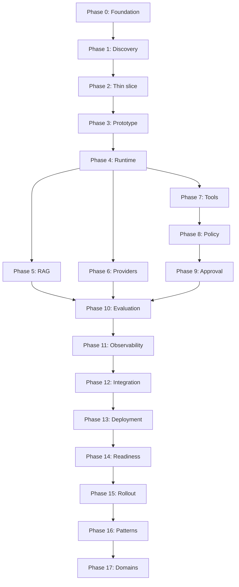

# Learning Roadmap and Phase Gates

## Purpose

This roadmap defines the authorized learning and implementation order for the Enterprise AI-Native Forward-Deployed Engineering Lab.

The delivery lifecycle is:

```text
Problem
→ Discovery
→ Thin vertical slice
→ Prototype
→ Evaluation
→ Integration
→ Production readiness
→ Staged rollout
→ Reusable pattern
```

A later phase must not compensate for an incomplete earlier phase:

- A model must not compensate for an undefined workflow.
- Prompts must not compensate for missing authorization.
- Observability must not compensate for missing evaluation.
- Kubernetes must not compensate for an unreliable application.
- Human approval must not compensate for excessive tool privileges.
- Deployment must not be described as production readiness without evidence.

## Learning Outcomes

The completed lab will teach the learner to:

1. Lead discovery under ambiguity.
2. Convert a broad AI request into a measurable vertical slice.
3. Build typed cloud-native AI services.
4. Implement explicit agent state and orchestration.
5. Build permission-aware RAG.
6. Abstract providers without hiding their differences.
7. Expose enterprise systems through narrow tools.
8. Keep authorization outside the model and orchestrator.
9. Require trusted approval for consequential actions.
10. Evaluate components and complete workflows.
11. Reconstruct behavior through logs, metrics, traces, and evidence.
12. Integrate with enterprise platforms.
13. Deploy through cloud-native patterns.
14. Produce production-readiness evidence.
15. Release autonomy progressively.
16. Create reusable enterprise patterns.
17. Adapt the system to regulated domains.
18. Explain every decision during an interview.

## Phase Status Definitions

| Status | Meaning |
|---|---|
| Not started | No authorized work has begun |
| In progress | Tutorial artifacts are being developed |
| Locally complete | Required local artifacts and validations pass |
| Evidence-recorded | Required evidence is preserved and reviewed |
| Committed | Phase is preserved in Git |
| Complete | All phase-gate requirements are satisfied |
| Blocked | A prerequisite or verification is missing |

## Phase Dependency Model



## Phase 0 — JD Decomposition and Tutorial Foundation

### Objective

Prevent the project from becoming a collection of disconnected technology demonstrations.

### Learn

- Requirement traceability
- Tutorial sequencing
- Evidence maturity
- System and authority boundaries
- Planned versus implemented capability

### Required artifacts

```text
README.md
docs/jd-map/ACCENTURE_AI_NATIVE_JD_REQUIREMENT_MAP.md
docs/roadmap/LEARNING_ROADMAP_AND_PHASE_GATES.md
docs/scenario/CLIENT_SCENARIO_AND_SYSTEM_BOUNDARY.md
docs/governance/CLAIM_EVIDENCE_AND_AUTHORITY_RULES.md
```

### Gate

Phase 0 passes when:

- All JD requirements map to phases and evidence.
- The client scenario is explicit.
- The initial vertical slice is bounded.
- Current and prohibited authority are recorded.
- Phase dependencies are documented.
- Empty directories do not imply implementation.
- Planned capabilities are not presented as completed.

## Phase 1 — Client Discovery Under Ambiguity

### Objective

Clarify an undefined request for an autonomous incident-remediation agent before selecting models or frameworks.

### Learn

- Stakeholder mapping
- Current-state workflow
- Decision decomposition
- Authoritative data
- Risk and authority
- Assumptions and dependencies
- Business and technical success measures

### Artifacts

```text
docs/discovery/
├── CURRENT_STATE_WORKFLOW.md
├── STAKEHOLDER_MAP.md
├── DATA_SOURCE_INVENTORY.md
├── DECISION_DECOMPOSITION.md
├── RISK_AND_AUTHORITY_MATRIX.md
├── ASSUMPTION_REGISTER.md
└── SUCCESS_MEASURES.md
```

### Gate

The problem can be explained without mentioning a model, framework, or vector database.

## Phase 2 — Thin Vertical Slice

### Objective

Reduce the client request to one valuable, measurable, low-risk workflow.

### Initial slice

```text
Validated incident request
→ Authorized evidence retrieval
→ Citation-backed diagnosis
→ Recommended remediation
→ Evidence record
```

### Explicit exclusions

- Production mutation
- Autonomous remediation
- General shell access
- Cross-tenant retrieval
- Unrestricted memory
- LLM authorization decisions

### Gate

The complete slice has written acceptance criteria and requires no production mutation.

## Phase 3 — Cloud-Native Prototype Foundation

### Objective

Replace notebook-style experimentation with typed, testable, reproducible local service boundaries derived from the approved thin vertical slice.

### Learn and build

- Python 3.12 project structure
- FastAPI service boundaries
- Strict Pydantic contracts
- REST and OpenAPI
- Gateway, runtime, and evidence service identities
- Deterministic validation and controlled errors
- Correlation identifiers
- Fail-closed configuration
- Runtime and development dependency locks
- Dockerfile and Docker Compose
- Unit, contract, and integration tests
- Coverage gates
- CI quality and container workflows
- Implementation tutorial and evidence record
- Persistence decision record

PostgreSQL and Redis are deferred until a later phase defines a typed persistence or cache consumer, ownership, failure behavior, health semantics, and tests.

### Gate

- All seven interface contracts are executable and tested.
- Gateway, runtime, and evidence Python services start locally.
- Health and readiness pass locally.
- Valid contract requests succeed.
- Invalid requests fail deterministically.
- Correlation identifiers are returned.
- Tests require no external model credentials.
- Prohibited capabilities remain disabled.
- Runtime and development locks pass hash-mode validation.
- Container definitions pass static policy tests.
- CI quality and container jobs are defined.
- Container build, startup, health, and readiness pass in CI.
- Phase 3 claims do not exceed recorded evidence.

### Current gate posture

```text
Complete

Phase 3 execution evidence:

GitHub Actions run: 29706949782
Evidence commit: f94d90b3b03b70cb5102945e0dc32d3badef15c2
Python quality and contract job: Passed
Container build and health job: Passed
Image build: Passed
Isolated service startup: Passed
Health and readiness: Passed
Non-root and read-only runtime controls: Passed
Capability-drop and no-new-privileges controls: Passed
No host-published container ports: Passed
Internal Docker network: Passed

Local Docker execution remains unavailable because Docker Desktop WSL integration is disabled. CI provides the required independent container-execution evidence.
```

## Phase 4 — Agent Runtime and Orchestration

### Objective

Make workflow state, transitions, retries, and stop conditions explicit.

### Learn and build

- Typed runtime state
- Execution graph
- Step and retry budgets
- Stop conditions
- Checkpoints
- Approval pauses
- Deterministic state machine
- Optional LangGraph adapter after the underlying model is tested

### Gate

- Every transition is explicit.
- Invalid transitions fail.
- Budgets are enforced.
- Recorded state can be replayed.
- The runtime cannot authorize itself.

## Phase 5 — Permission-Aware RAG

### Objective

Retrieve useful evidence without exposing unauthorized information.

### Learn and build

- Authoritative sources
- Parsing and structure-aware chunking
- Metadata and versions
- Embeddings and vector retrieval
- Optional keyword, hybrid search, and reranking
- Citations and abstention
- ACL and authorization filters
- Freshness controls

### Gate

- Authorized evidence is retrievable.
- Unauthorized evidence never enters model context.
- Citations identify source and version.
- Insufficient evidence causes abstention or clarification.
- Retrieval quality and permission correctness are tested separately.

## Phase 6 — Multi-Provider Abstraction

### Objective

Reduce provider coupling while preserving provider-specific capabilities.

### Adapters

- Deterministic local mock provider
- OpenAI
- Anthropic
- Google/Vertex

### Learn and build

- Common request and response envelopes
- Capability metadata
- Structured-output differences
- Tool-calling differences
- Context and regional constraints
- Normalized errors
- Bounded retries and fallbacks
- Evaluation-based selection

### Gate

The mock provider passes the complete contract suite, and every adapter declares its real capabilities without treating providers as identical.

## Phase 7 — Typed Enterprise Tools

### Objective

Expose narrow enterprise capabilities instead of unrestricted execution.

### Initial tools

```text
get_incident
retrieve_runbook
search_logs
get_recent_deployments
add_ticket_comment
request_remediation
verify_service_health
```

### Learn and build

- Pydantic tool contracts
- Tool registry
- Parameter validation
- Least-privilege identity
- Timeouts and retries
- Idempotency
- Side-effect classification
- Result validation
- Audit evidence

### Gate

Malformed calls fail, duplicate mutations are controlled, identities are bounded, and no general shell tool exists.

## Phase 8 — Deterministic Policy Routing

### Objective

Keep enterprise authorization outside prompts, models, and orchestration.

### Decisions

```text
ALLOW
DENY
APPROVAL_REQUIRED
```

### Learn and build

- RBAC and ABAC
- Trusted policy inputs
- Policy versions
- Fail-closed behavior
- Adversarial bypass testing

### Gate

Identical trusted inputs produce deterministic decisions, and prompt content cannot override policy.

## Phase 9 — Human Approval and Trusted Execution

### Objective

Bind consequential actions to attributable, limited, and non-replayable approval.

### Approval binding

```text
approver
+ incident
+ action
+ parameters
+ resource
+ policy version
+ expiration
```

### Gate

Expired, altered, replayed, or unauthorized approvals fail. Approval evidence is stored in trusted workflow state.

## Phase 10 — Evaluation and EvalOps

### Objective

Determine whether the agent is correct, safe, reliable, and cost-effective.

### Evaluation layers

- Retrieval relevance, recall, coverage, freshness, and permissions
- Generation grounding, citations, completeness, and abstention
- Tool selection, parameters, authorization, and final state
- Workflow completion, retries, escalation, latency, and cost
- Adversarial injection, leakage, bypass, and excessive autonomy

### Gate

A versioned evaluation report contains results, thresholds, limitations, and a release recommendation.

## Phase 11 — Lifecycle Observability

### Objective

Reconstruct the behavior of the distributed workflow.

### Learn and build

- Structured logs
- Metrics
- Distributed traces
- Correlation IDs
- Safe trace attributes
- p50 and p95 latency
- Provider and tool errors
- Policy denials
- Approval delays
- Cost per successful task

### Gate

One correlation ID reconstructs the path across gateway, runtime, retrieval, provider, policy, approval, tool, and response validation.

## Phase 12 — Enterprise Integration and Code-With Session

### Objective

Integrate with client systems without tightly coupling the core runtime.

### Learn and build

- Ticket adapter
- Log-search adapter
- Identity adapter
- Webhooks
- Event envelopes
- Schema versions
- Circuit breakers
- Partial-failure handling
- Idempotent consumers
- Guided code-with exercise

### Gate

A learner can add one typed integration through the tutorial without modifying the core runtime.

## Phase 13 — Cloud-Native Deployment

### Objective

Package, configure, deploy, scale, observe, and roll back the application repeatably.

### Learn and build

- Docker and Compose
- Kubernetes
- Helm
- Terraform
- CI/CD
- Secrets and configuration
- Health probes
- Network policy
- Scaling and rollback
- Serverless/event-driven alternatives

### Gate

The same application contract runs locally and in the selected deployment target with configuration externalized.

## Phase 14 — Production-Readiness Gate

### Objective

Prove operational readiness rather than equating deployment with production.

### Required evidence

- Architecture decisions
- Threat model and data flow
- Access-control tests
- Evaluation and performance results
- Cost estimate
- SLOs
- Runbook
- Rollback plan
- Incident procedure
- Ownership
- Known limitations

### Gate

```text
IDENTITY................PASS
RAG PERMISSIONS.........PASS
TOOL CONTRACTS..........PASS
POLICY..................PASS
EVALUATION..............PASS
OBSERVABILITY...........PASS
ROLLBACK................PASS
EVIDENCE PACKAGE........PASS
```

## Phase 15 — Staged Release and Controlled Autonomy

### Objective

Prevent a direct jump from offline tests to autonomous production execution.

| Stage | Capability |
|---:|---|
| 0 | Offline evaluation |
| 1 | Shadow processing |
| 2 | Read-only pilot |
| 3 | Recommendation mode |
| 4 | Low-risk ticket updates |
| 5 | Approval-gated simulated remediation |
| 6 | Limited controlled production action |

### Gate

Every promotion has entry criteria, exit criteria, rollback, ownership, and evidence. Failure returns the system to the previous approved stage.

## Phase 16 — Reusable Enterprise Patterns

### Objective

Reuse engineering knowledge without carrying one client’s assumptions into another environment.

### Every pattern contains

1. Problem
2. When to use it
3. When not to use it
4. Architecture
5. Contracts
6. Security boundaries
7. Failure modes
8. Tests
9. Evaluation criteria
10. Deployment guidance
11. Decision record
12. Interview explanation

### Gate

A second workflow can reuse the pattern without inheriting the original data, policy, or platform assumptions.

## Phase 17 — Domain Adaptation Packs

### Objective

Demonstrate how shared components support different industry boundaries.

| Domain | Workflow | Authority boundary |
|---|---|---|
| Healthcare | Clinical-intake draft | Clinician approves and signs |
| Finance | Payment-exception investigation | Segregation of duties |
| Retail | Order/refund exception | Refund authorization threshold |

### Gate

Domain-specific data, policy, approval, evaluation, and evidence differences are explicit and tested.

## Cross-Phase Evidence Rule

| Maturity | Evidence |
|---|---|
| Documented | Reviewed architecture or decision record |
| Implemented | Working code or configuration |
| Tested | Test output |
| Evidence-recorded | Preserved result and interpretation |
| Deployed | Runtime and deployment evidence |
| Complete | All required artifacts and gate decisions |

A planned capability must never be described as implemented.

## Cross-Phase Security Rule

These controls remain outside model reasoning:

- Authentication
- Authorization
- Secret access
- Tool credentials
- Approval identity
- Idempotency
- Audit integrity
- Release promotion
- Production rollback

## Cross-Phase Interview Rule

Every implementation phase must end with:

1. A 60-second explanation
2. A faithful 30-second version
3. An architecture walkthrough
4. An implementation question
5. A failure question
6. A client trade-off question
7. An evidence-backed proof point
8. A known limitation

## Current Status

| Phase | Status |
|---:|---|
| Phase 0 — JD-aligned tutorial foundation | Complete |
| Phase 1 — Client discovery package | Complete |
| Phase 2 — Thin vertical slice | Complete |
| Phase 3 — Cloud-native prototype foundation | Complete |
| Phase 3 — Dependency integrity | Complete |
| Phase 3 — Container execution | Passed in CI |
| Phase 3 — Quality execution | Passed in CI |
| Phase 4 — Deterministic runtime and orchestration | Complete |
| Phase 4 — Quality execution | Passed in CI |
| Phase 4 — Container execution | Passed in CI |
| Phase 4 — CI run | 29724059742 |
| Phase 4 — Evidence commit | d65a465c57707aac1a144f69b40c2856e5f3d40e |
| Phase 5 — Permission-aware RAG | In progress |
| Phase 5A — Design and authority boundary | Complete |
| Phase 5A — Evidence commit | 5b7907bf1bf8aa96c163d034baf183de3e600587 |
| Phase 5A — CI run | [29768908988](https://github.com/S3curethecloud/enterprise-ai-native-forward-deployed-engineering-lab/actions/runs/29768908988) |
| Phase 5B — Typed retrieval contracts | Complete |
| Phase 5B — Implementation commit | efd62671b27e725d2936a2c7ae3a1a0d24b06ca6 |
| Phase 5B — CI run | [29780263857](https://github.com/S3curethecloud/enterprise-ai-native-forward-deployed-engineering-lab/actions/runs/29780263857) |
| Phase 5B — Retrieval contract tests | 37 passing |
| Phase 5C — Synthetic corpus and deterministic keyword retrieval | Complete |
| Phase 5C — Implementation commit | 8cee3d71676440824b700c62359c162a98cb2b8e |
| Phase 5C — CI run | [29795504565](https://github.com/S3curethecloud/enterprise-ai-native-forward-deployed-engineering-lab/actions/runs/29795504565) |
| Phase 5C — Retrieval tests | 76 passing |
| Phase 5D — Tenant, service, and classification filtering | Complete |
| Phase 5D — Closure commit | bdc235b7936186baedeec1181938f57977150b35 |
| Phase 5D — Closure CI run | [29807419438](https://github.com/S3curethecloud/enterprise-ai-native-forward-deployed-engineering-lab/actions/runs/29807419438) |
| Phase 5E — Local deterministic embeddings and vector retrieval | Complete |
| Phase 5E — Implementation commit | fa02cb90e62c5a1279b1ec7b025d54375fba72f3 |
| Phase 5E — CI run | [29810229699](https://github.com/S3curethecloud/enterprise-ai-native-forward-deployed-engineering-lab/actions/runs/29810229699) |
| Phase 5E — Closure commit | 573b8c196ae46dd272fcb90c6695cbcc6af87bfd |
| Phase 5E — Closure CI run | [29811114122](https://github.com/S3curethecloud/enterprise-ai-native-forward-deployed-engineering-lab/actions/runs/29811114122) |
| Phase 5E — Embedding tests | 15 passing |
| Phase 5E — Vector tests | 23 passing |
| Phase 5E — Retrieval tests | 124 passing |
| Phase 5E — Complete local test suite | 814 passing |
| Phase 5F — Hybrid retrieval and reranking | Complete |
| Phase 5F — Implementation commit | ec0dca55d934d2324a514956aadfb3c8daf341bc |
| Phase 5F — CI run | [29813776046](https://github.com/S3curethecloud/enterprise-ai-native-forward-deployed-engineering-lab/actions/runs/29813776046) |
| Phase 5F — Closure commit | 2489a6e54fe5b93484b09b40c5ffd9764075dcee |
| Phase 5F — Closure CI run | [29815184214](https://github.com/S3curethecloud/enterprise-ai-native-forward-deployed-engineering-lab/actions/runs/29815184214) |
| Phase 5F — Hybrid pytest cases | 33 passing |
| Phase 5F — Retrieval tests | 157 passing |
| Phase 5F — Complete local test suite | 847 passing |
| Phase 5G — Context construction and token budgets | Complete |
| Phase 5G — Implementation commit | 369e05e21b61f6e0961111d9cfff4515ca0e27db |
| Phase 5G — CI run | [29817755525](https://github.com/S3curethecloud/enterprise-ai-native-forward-deployed-engineering-lab/actions/runs/29817755525) |
| Phase 5G — Closure commit | 3851259a94474cab6b4d167b84cca56278e1a3b3 |
| Phase 5G — Closure CI run | [29818951742](https://github.com/S3curethecloud/enterprise-ai-native-forward-deployed-engineering-lab/actions/runs/29818951742) |
| Phase 5G — Context pytest cases | 22 passing |
| Phase 5G — Retrieval tests | 179 passing |
| Phase 5G — Complete local test suite | 869 passing |
| Phase 5H — Prompt-injection and retrieval-contamination controls | Complete |
| Phase 5H — Implementation commit | 2c1a812bbba005345c3f394011a9b1c3580ce995 |
| Phase 5H — CI run | [29820773913](https://github.com/S3curethecloud/enterprise-ai-native-forward-deployed-engineering-lab/actions/runs/29820773913) |
| Phase 5H — Closure commit | f72e2a5230517597a641e8994cff4a72612bc833 |
| Phase 5H — Closure CI run | [29822375893](https://github.com/S3curethecloud/enterprise-ai-native-forward-deployed-engineering-lab/actions/runs/29822375893) |
| Phase 5H — Content-control pytest cases | 26 passing |
| Phase 5H — Retrieval tests | 205 passing |
| Phase 5H — Complete local test suite | 895 passing |
| Phase 5I — Citation validation and controlled abstention | Complete |
| Phase 5I — Implementation commit | f4d3c2079535699374e3ff08a1f955f8f26321f9 |
| Phase 5I — CI run | [29848371644](https://github.com/S3curethecloud/enterprise-ai-native-forward-deployed-engineering-lab/actions/runs/29848371644) |
| Phase 5I — Closure commit | 501ee512037943a0960878a296309c5922777e9f |
| Phase 5I — Closure CI run | [29852373709](https://github.com/S3curethecloud/enterprise-ai-native-forward-deployed-engineering-lab/actions/runs/29852373709) |
| Phase 5I — Citation-validation pytest cases | 26 passing |
| Phase 5I — Retrieval tests | 231 passing |
| Phase 5I — Complete local test suite | 921 passing |
| Phase 5J — Retrieval evaluation and lifecycle telemetry | Complete |
| Phase 5J — Implementation commit | 65befbcc2a5d9a6ac71b90b994c9d60f25ea5cfe |
| Phase 5J — CI run | [29865065469](https://github.com/S3curethecloud/enterprise-ai-native-forward-deployed-engineering-lab/actions/runs/29865065469) |
| Phase 5J — Closure commit | 4d7922863d015131456b053512458b35d16a57e4 |
| Phase 5J — Closure CI run | [29866079305](https://github.com/S3curethecloud/enterprise-ai-native-forward-deployed-engineering-lab/actions/runs/29866079305) |
| Phase 5J — Evaluation pytest cases | 33 passing |
| Phase 5J — Retrieval tests | 264 passing |
| Phase 5J — Complete local test suite | 954 passing |
| Phase 5 — Permission-aware RAG | Complete |
| Phase 6A — Provider-neutral contracts | Complete |
| Phase 6A — Implementation commit | 68512606235f60a1b8ad7a3e655f597aa1f3788f |
| Phase 6A — Implementation CI run | [29890345022](https://github.com/S3curethecloud/enterprise-ai-native-forward-deployed-engineering-lab/actions/runs/29890345022) |
| Phase 6A — Evidence commit | 0314605bdba27a41022c578c2bf424615e1cbee8 |
| Phase 6A — Evidence CI run | [29891756010](https://github.com/S3curethecloud/enterprise-ai-native-forward-deployed-engineering-lab/actions/runs/29891756010) |
| Phase 6A — Provider contract pytest cases | 29 passing |
| Phase 6B — Deterministic local mock provider | Complete |
| Phase 6B — Implementation commit | b1a6142ad682b8752c0c0a822ed5fc807c08b9b9 |
| Phase 6B — Implementation CI run | [29896004047](https://github.com/S3curethecloud/enterprise-ai-native-forward-deployed-engineering-lab/actions/runs/29896004047) |
| Phase 6B — Mock pytest cases | 20 passing |
| Phase 6 — Provider pytest cases | 49 passing |
| Phase 6 — Complete local test suite | 1,003 passing |
| Phase 6 — Public provider exports | 19 |
| Phase 6 — Closure commit | 6e4aa1edbb7c5fd160ca020d777052445fb4249b |
| Phase 6 — Closure CI run | [29900746310](https://github.com/S3curethecloud/enterprise-ai-native-forward-deployed-engineering-lab/actions/runs/29900746310) |
| Phase 7A — Fail-closed typed tool registry | Implementation verified; closure-commit CI pending |
| Phase 7A — Implementation commit | 94eef8f1b7da84cd39d6c608250278603a033f97 |
| Phase 7A — Implementation CI run | [30527591986](https://github.com/S3curethecloud/enterprise-ai-native-forward-deployed-engineering-lab/actions/runs/30527591986) |
| Phase 7A — Registry pytest cases | 39 passing |
| Phase 7A — Complete local test suite | 1,042 passing |
| Phase 7B — Typed request and result envelopes | Not authorized before Phase 7A closure-commit CI |
| Phases 8–17 | Not started |

## Phase 7A Fail-Closed Tool Registry Closure Evidence

Phase 6 closure commit `6e4aa1edbb7c5fd160ca020d777052445fb4249b` passed exact-commit CI run
[29900746310](https://github.com/S3curethecloud/enterprise-ai-native-forward-deployed-engineering-lab/actions/runs/29900746310),
authorizing the gradual start of Phase 7.

Phase 7A implementation commit `94eef8f1b7da84cd39d6c608250278603a033f97` passed
exact-commit CI run
[30527591986](https://github.com/S3curethecloud/enterprise-ai-native-forward-deployed-engineering-lab/actions/runs/30527591986).

Verified Phase 7A evidence:

- Seven governed, typed tool definitions
- Closed `ToolName` allowlist
- Immutable registry metadata
- Explicit capability, side-effect, risk, idempotency, approval, timeout, and
  authorization metadata
- `execution_enabled=False` for every definition
- `general_shell_access=False` for every definition
- 39 focused Phase 7A registry pytest cases passed
- 1,042 complete repository pytest cases passed
- Ruff linting and formatting passed
- Strict MyPy checking passed
- Dependency integrity passed
- Python quality and contract-tests CI job passed
- Local container build and health-verification CI job passed

Phase 7A is metadata-only. It does not implement a tool request or result
envelope, invocation interface, mock execution, policy-decision evaluation,
approval execution, credential access, network access, filesystem access,
general shell access, MCP server, real enterprise integration, provider call,
infrastructure mutation, cloud deployment, or production authority.

Phase 7A closure remains pending until this documentation-only closure commit
passes exact-commit CI. Phase 7B remains unauthorized until that closure gate
passes.

Tool execution remains unauthorized. Real enterprise integrations remain unauthorized.

## Phase 4 Closure Evidence

Phase 4 implemented typed workflow state, deterministic transitions, step and retry budgets, explicit stop conditions, five bounded terminal states, append-only in-memory checkpoints, optimistic concurrency, deterministic replay, CT-07 runtime traces, and runtime-only FastAPI routes.

Evidence:

```text
Implementation commit:
d65a465c57707aac1a144f69b40c2856e5f3d40e

GitHub Actions run:
29724059742

CI result:
SUCCESS

Both required jobs passed:

Python quality and contract tests
Local container build and health verification
Phase 5D Closure Evidence

Closure commit:
bdc235b7936186baedeec1181938f57977150b35

Exact-commit CI run:
29807419438

CI result:
SUCCESS

Phase 5E Verified Implementation Evidence

Implementation commit:
fa02cb90e62c5a1279b1ec7b025d54375fba72f3

Exact-commit CI run:
29810229699

CI result:
SUCCESS

Implemented and verified:

Permission-aware keyword, vector, and hybrid retrieval
Deterministic whole-chunk context construction
Versioned context-budget configuration
Maximum item and per-source contribution limits
Maximum aggregate token estimate
Minimum source diversity
Candidate-to-corpus integrity resolution
Stable retrieval-order preservation
Contiguous context ranks
Citation and policy-lineage preservation
Omitted-candidate counts
Explicit truncation evidence
Controlled context insufficiency

Phase 5G Closure Evidence

Closure commit:
3851259a94474cab6b4d167b84cca56278e1a3b3

Exact-commit closure CI run:
29818951742

Phase 5H Verified Implementation

Implementation commit:
2c1a812bbba005345c3f394011a9b1c3580ce995

Exact-commit implementation CI run:
29820773913

Implemented and verified:

Deterministic retrieval-content controls
Explicit control version
Eight bounded risk categories
Untrusted-evidence labeling
Non-echoing pattern metadata
Content hashes and bounded offsets
Whole-item quarantine
Clean, filtered, and blocked outcomes
No retained-evidence rewriting
Stable assessment ordering
Lineage preservation

Phase 5H Closure Evidence

Closure commit:
f72e2a5230517597a641e8994cff4a72612bc833

Exact-commit closure CI run:
29822375893

Phase 5I Verified Implementation

Implementation commit:
f4d3c2079535699374e3ff08a1f955f8f26321f9

Exact-commit implementation CI run:
29848371644

Implemented and verified:

Versioned deterministic citation validation
Exact source-document-chunk resolution
Document-version validation
Content-hash and complete-content validation
Deterministic locator validation
Lifecycle and temporal validation
Source-TTL freshness validation
Explicit document-expiry validation
All-or-nothing validated bundles
Five controlled abstention reasons
Request, trace, policy, corpus, and source lineage
No retained-evidence rewriting

Phase 5I Closure Evidence

Closure commit:
501ee512037943a0960878a296309c5922777e9f

Exact-commit closure CI run:
29852373709

Phase 5J Verified Implementation

Implementation commit:
65befbcc2a5d9a6ac71b90b994c9d60f25ea5cfe

Exact-commit implementation CI run:
29865065469

Implemented and verified:

Versioned evaluation and telemetry contracts
Synthetic ground-truth expectations
Precision at K and recall at K
Reciprocal rank
Citation, freshness, and abstention correctness
Bounded query-latency and context-size measurements
Explicit deterministic thresholds
Stable pass-or-fail evidence
Five allowlisted retrieval lifecycle stages
Content-minimized append-only telemetry
Per-trace deterministic hash lineage
History tamper detection
CT-07 and Phase 4 checkpoint boundaries preserved

Phase 5 Closure Evidence

Phase 5J closure commit:
4d7922863d015131456b053512458b35d16a57e4

Exact-commit CI run:
29866079305

Phase 5 result:
COMPLETE

Phase 6 Verified Implementation

Phase 6A implementation commit:
68512606235f60a1b8ad7a3e655f597aa1f3788f

Phase 6A implementation CI run:
29890345022

Phase 6A evidence commit and CI:
0314605bdba27a41022c578c2bf424615e1cbee8
29891756010

Phase 6B implementation commit and CI:
b1a6142ad682b8752c0c0a822ed5fc807c08b9b9
29896004047

Next Authorized Work After Phase 6 Closure-Commit CI

PHASE 7 — TYPED ENTERPRISE TOOLS

Phase 7 may begin only after the Phase 6 closure-evidence commit passes
exact-commit CI.

Not authorized:

Real provider adapters or calls
Provider credentials
Enterprise sources
Production data
Prompt or real model execution
Tool execution
Human approval execution
API routes
Infrastructure mutation
Cloud deployment
Production deployment
```

### Phase 7B Typed Tool Envelope Evidence

- Phase 7B implementation commit: `fdf784b65d4fb1692297b37969427d0bdc445123`.
- Phase 7B implementation CI run: `30535135636` passed.
- Focused Phase 7B contract tests: 40 passed.
- Complete tools tests: 79 passed.
- Complete repository tests: 1,082 passed.
- Phase 7B closure status: pending closure commit CI.
- Phase 7C status: unauthorized until Phase 7B closure commit passes exact-commit CI.
- Tool invocation remains unauthorized.
- Mock execution remains unauthorized.
- Real enterprise integrations remain unauthorized.
- All tool execution remains unauthorized.

<!-- PHASE 7C CLOSURE EVIDENCE START -->

## Phase 7C Closure Evidence

Phase 7C deterministic local mock tools are implemented and verified.

- Phase 7C implementation commit: `4431ba32b46669c4fb601d014b98715e106b31a4`
- Phase 7C implementation CI run: `30786524852`
- Focused tool tests: 99 passed
- Complete repository tests: 1,102 passed
- Required CI jobs passed:
  - Python quality and contract tests
  - Local container build and health verification

Phase 7C remains bounded to deterministic local mock tools only.

Tool execution remains unauthorized. Real enterprise integrations remain unauthorized. Real provider adapters and provider calls remain unauthorized. Network access, credentials, shell execution, and external system mutation remain unauthorized.

Phase 7D is authorized only after this Phase 7C closure documentation commit passes exact-commit CI.

<!-- PHASE 7C CLOSURE EVIDENCE END -->

<!-- PHASE 7D CLOSURE EVIDENCE START -->

## Phase 7D Fail-Closed Deterministic Dispatcher Closure Evidence

This block is the current authoritative Phase 7D posture. Earlier Phase 7A–7C status statements are retained as historical gate evidence and do not supersede this block.

Phase 7D fail-closed deterministic dispatcher implementation is verified at corrected implementation commit `8d2b0ec68f283a9449fab35963b5ceb6a7c70606`. The initial implementation commit `53e1614199622c12f9f5037d6c378b0ed4904021` is not final Phase 7D evidence because the dispatcher source and test file modes required a subsequent normalization-only commit.

Exact-commit CI run [30794548243](https://github.com/S3curethecloud/enterprise-ai-native-forward-deployed-engineering-lab/actions/runs/30794548243) passed against `8d2b0ec68f283a9449fab35963b5ceb6a7c70606`.

Verified Phase 7D evidence:

- `src/incident_diagnostic_api/tools/dispatcher.py` is stored as mode `100644`.
- `tests/tools/test_dispatcher.py` is stored as mode `100644`.
- Focused tool tests: 111 passed.
- Complete repository tests: 1,114 passed.
- Python quality and contract tests: passed.
- Local container build and health verification: passed.
- Registered read-only tools may dispatch only to deterministic local mock results.
- Side-effecting tools fail closed with approval required.
- Real execution-enabled definitions fail closed.
- General shell access fails closed.
- Phase 7D remains bounded to deterministic local dispatch only.

Real tool execution remains unauthorized. Real enterprise integrations remain unauthorized. Real provider adapters and provider calls remain unauthorized. Network access, credentials, shell execution, provider SDK execution, filesystem mutation, infrastructure mutation, cloud deployment, production deployment, and external system mutation remain unauthorized.

This documentation package does not itself close Phase 7D. Until exact-commit CI succeeds for the commit containing this four-file closure package, Phase 7D status remains `CLOSURE_PENDING` and Phase 7E remains unauthorized.

If exact-commit CI succeeds for this documentation commit, Phase 7D becomes `CLOSED`. That closure permits a separate determination of the next Phase 7 capability; it does not itself authorize Phase 7E implementation or any real tool execution.

<!-- PHASE 7D CLOSURE EVIDENCE END -->

<!-- PHASE 7E CLOSURE EVIDENCE START -->

## Phase 7E Deterministic Tool Dispatch Outcome Consistency Evidence Closure

This block is the current authoritative Phase 7E posture. Earlier Phase 7A-7D status statements are retained as historical gate evidence and do not supersede this block.

Phase 7E implements deterministic, in-process consistency evidence for typed Phase 7 tool request/outcome pairs. It remains bounded to evidence evaluation over the current local Phase 7 contracts, registry declarations, deterministic mock-result semantics, and fail-closed dispatcher semantics.

Accepted Phase 7E lineage:

- R3 architecture commit: `c908b7043cd32721c0f85734c08610c626233e31`.
- R3 bounded implementation-authority review commit: `5f69482d06c07f6e58c8e097ca8f270c68bf1c49`.
- Corrected runtime implementation commit: `1deb0d83de122c77db9585d5815a8fb64d13d979`.
- Corrected runtime implementation CI run: `34656904707` passed.
- Acceptance-gap remediation commit: `be713da8d701b3afc69760b43dd6ca26a30f3bba`.
- Acceptance-gap remediation CI run: `34658471447` passed.
- Final evidence-reconciliation commit: `27a2473234c414e2fc9ce1acfd79a1f9bdbb43b4`.
- Final evidence-reconciliation tree: `78acc302b92510d174b01561f14867f0e6a910d4`.
- Final exact-commit CI run: `34659047459` passed against `27a2473234c414e2fc9ce1acfd79a1f9bdbb43b4`.
- Final independent implementation acceptance review R3: `PASS`.

Verified Phase 7E evidence:

- Focused Phase 7E test count: 95, derived from the fixed test source and parametrization.
- Complete Phase 7 tool test count: 205, derived from the fixed test source and parametrization.
- Complete repository tests: 1,209 passed in exact-commit CI.
- Total branch coverage: 93.90 percent.
- Dependency integrity: passed.
- Ruff linting: passed.
- Ruff formatting: passed.
- Strict MyPy: passed.
- Python quality and contract-tests CI job: passed.
- Local container build and health-verification CI job: passed.
- Coverage artifact ID: `10285519396`.
- Coverage artifact SHA256: `73031c81d2328a4aeda8055b3e1be4563047e01deebe6df7d13a49229551a671`.
- Production runtime source remained unchanged after corrected runtime implementation commit `1deb0d83de122c77db9585d5815a8fb64d13d979`.

Phase 7E does not establish dispatcher producer provenance, registry producer provenance, durable evidence-builder provenance, real-execution provenance, policy authorization, human approval, durable persistence, tamper evidence, cryptographic integrity, digital signatures, or production deployment.

`EVIDENCE_BUILDER_PROVENANCE=NOT_ESTABLISHED` and `DIRECT_CONSTRUCTION_PROVES_EVALUATION=NO` remain authoritative limitations. Real tool execution, network access, credential access, shell access, provider execution, filesystem mutation, infrastructure mutation, external system mutation, cloud deployment, and production deployment remain unauthorized.

This four-document package does not itself close Phase 7E. Until exact-commit CI succeeds for the commit containing this exact closure package, Phase 7E status remains `CLOSURE_PENDING` and Phase 8 advancement authority remains `NONE`.

If and only if exact-commit CI succeeds for this closure documentation commit, Phase 7E becomes `CLOSED`. That closure permits only a separate determination of Phase 8 authority. It does not start Phase 8, authorize Phase 8 implementation, establish a policy decision, establish human approval, or authorize real tool execution.

<!-- PHASE 7E CLOSURE EVIDENCE END -->
