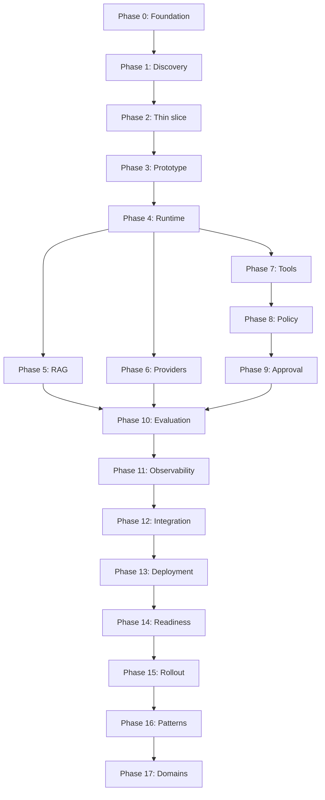

# Learning Roadmap and Phase Gates

## Purpose

This roadmap defines the authorized learning and implementation order for the Enterprise AI-Native Forward-Deployed Engineering Lab.

The delivery lifecycle is:

```text
Problem
→ Discovery
→ Thin vertical slice
→ Prototype
→ Evaluation
→ Integration
→ Production readiness
→ Staged rollout
→ Reusable pattern
```

A later phase must not compensate for an incomplete earlier phase:

- A model must not compensate for an undefined workflow.
- Prompts must not compensate for missing authorization.
- Observability must not compensate for missing evaluation.
- Kubernetes must not compensate for an unreliable application.
- Human approval must not compensate for excessive tool privileges.
- Deployment must not be described as production readiness without evidence.

## Learning Outcomes

The completed lab will teach the learner to:

1. Lead discovery under ambiguity.
2. Convert a broad AI request into a measurable vertical slice.
3. Build typed cloud-native AI services.
4. Implement explicit agent state and orchestration.
5. Build permission-aware RAG.
6. Abstract providers without hiding their differences.
7. Expose enterprise systems through narrow tools.
8. Keep authorization outside the model and orchestrator.
9. Require trusted approval for consequential actions.
10. Evaluate components and complete workflows.
11. Reconstruct behavior through logs, metrics, traces, and evidence.
12. Integrate with enterprise platforms.
13. Deploy through cloud-native patterns.
14. Produce production-readiness evidence.
15. Release autonomy progressively.
16. Create reusable enterprise patterns.
17. Adapt the system to regulated domains.
18. Explain every decision during an interview.

## Phase Status Definitions

| Status | Meaning |
|---|---|
| Not started | No authorized work has begun |
| In progress | Tutorial artifacts are being developed |
| Locally complete | Required local artifacts and validations pass |
| Evidence-recorded | Required evidence is preserved and reviewed |
| Committed | Phase is preserved in Git |
| Complete | All phase-gate requirements are satisfied |
| Blocked | A prerequisite or verification is missing |

## Phase Dependency Model



## Phase 0 — JD Decomposition and Tutorial Foundation

### Objective

Prevent the project from becoming a collection of disconnected technology demonstrations.

### Learn

- Requirement traceability
- Tutorial sequencing
- Evidence maturity
- System and authority boundaries
- Planned versus implemented capability

### Required artifacts

```text
README.md
docs/jd-map/ACCENTURE_AI_NATIVE_JD_REQUIREMENT_MAP.md
docs/roadmap/LEARNING_ROADMAP_AND_PHASE_GATES.md
docs/scenario/CLIENT_SCENARIO_AND_SYSTEM_BOUNDARY.md
docs/governance/CLAIM_EVIDENCE_AND_AUTHORITY_RULES.md
```

### Gate

Phase 0 passes when:

- All JD requirements map to phases and evidence.
- The client scenario is explicit.
- The initial vertical slice is bounded.
- Current and prohibited authority are recorded.
- Phase dependencies are documented.
- Empty directories do not imply implementation.
- Planned capabilities are not presented as completed.

## Phase 1 — Client Discovery Under Ambiguity

### Objective

Clarify an undefined request for an autonomous incident-remediation agent before selecting models or frameworks.

### Learn

- Stakeholder mapping
- Current-state workflow
- Decision decomposition
- Authoritative data
- Risk and authority
- Assumptions and dependencies
- Business and technical success measures

### Artifacts

```text
docs/discovery/
├── CURRENT_STATE_WORKFLOW.md
├── STAKEHOLDER_MAP.md
├── DATA_SOURCE_INVENTORY.md
├── DECISION_DECOMPOSITION.md
├── RISK_AND_AUTHORITY_MATRIX.md
├── ASSUMPTION_REGISTER.md
└── SUCCESS_MEASURES.md
```

### Gate

The problem can be explained without mentioning a model, framework, or vector database.

## Phase 2 — Thin Vertical Slice

### Objective

Reduce the client request to one valuable, measurable, low-risk workflow.

### Initial slice

```text
Validated incident request
→ Authorized evidence retrieval
→ Citation-backed diagnosis
→ Recommended remediation
→ Evidence record
```

### Explicit exclusions

- Production mutation
- Autonomous remediation
- General shell access
- Cross-tenant retrieval
- Unrestricted memory
- LLM authorization decisions

### Gate

The complete slice has written acceptance criteria and requires no production mutation.

## Phase 3 — Cloud-Native Prototype Foundation

### Objective

Replace notebook-style experimentation with typed, testable, reproducible local service boundaries derived from the approved thin vertical slice.

### Learn and build

- Python 3.12 project structure
- FastAPI service boundaries
- Strict Pydantic contracts
- REST and OpenAPI
- Gateway, runtime, and evidence service identities
- Deterministic validation and controlled errors
- Correlation identifiers
- Fail-closed configuration
- Runtime and development dependency locks
- Dockerfile and Docker Compose
- Unit, contract, and integration tests
- Coverage gates
- CI quality and container workflows
- Implementation tutorial and evidence record
- Persistence decision record

PostgreSQL and Redis are deferred until a later phase defines a typed persistence or cache consumer, ownership, failure behavior, health semantics, and tests.

### Gate

- All seven interface contracts are executable and tested.
- Gateway, runtime, and evidence Python services start locally.
- Health and readiness pass locally.
- Valid contract requests succeed.
- Invalid requests fail deterministically.
- Correlation identifiers are returned.
- Tests require no external model credentials.
- Prohibited capabilities remain disabled.
- Runtime and development locks pass hash-mode validation.
- Container definitions pass static policy tests.
- CI quality and container jobs are defined.
- Container build, startup, health, and readiness pass in CI.
- Phase 3 claims do not exceed recorded evidence.

### Current gate posture

```text
Locally complete — container and CI execution evidence pending

The local Docker engine is unavailable because Docker Desktop WSL integration is not enabled. Static container evidence exists, but runtime container success is not yet claimed.
```

## Phase 4 — Agent Runtime and Orchestration

### Objective

Make workflow state, transitions, retries, and stop conditions explicit.

### Learn and build

- Typed runtime state
- Execution graph
- Step and retry budgets
- Stop conditions
- Checkpoints
- Approval pauses
- Deterministic state machine
- Optional LangGraph adapter after the underlying model is tested

### Gate

- Every transition is explicit.
- Invalid transitions fail.
- Budgets are enforced.
- Recorded state can be replayed.
- The runtime cannot authorize itself.

## Phase 5 — Permission-Aware RAG

### Objective

Retrieve useful evidence without exposing unauthorized information.

### Learn and build

- Authoritative sources
- Parsing and structure-aware chunking
- Metadata and versions
- Embeddings and vector retrieval
- Optional keyword, hybrid search, and reranking
- Citations and abstention
- ACL and authorization filters
- Freshness controls

### Gate

- Authorized evidence is retrievable.
- Unauthorized evidence never enters model context.
- Citations identify source and version.
- Insufficient evidence causes abstention or clarification.
- Retrieval quality and permission correctness are tested separately.

## Phase 6 — Multi-Provider Abstraction

### Objective

Reduce provider coupling while preserving provider-specific capabilities.

### Adapters

- Deterministic local mock provider
- OpenAI
- Anthropic
- Google/Vertex

### Learn and build

- Common request and response envelopes
- Capability metadata
- Structured-output differences
- Tool-calling differences
- Context and regional constraints
- Normalized errors
- Bounded retries and fallbacks
- Evaluation-based selection

### Gate

The mock provider passes the complete contract suite, and every adapter declares its real capabilities without treating providers as identical.

## Phase 7 — Typed Enterprise Tools

### Objective

Expose narrow enterprise capabilities instead of unrestricted execution.

### Initial tools

```text
get_incident
retrieve_runbook
search_logs
get_recent_deployments
add_ticket_comment
request_remediation
verify_service_health
```

### Learn and build

- Pydantic tool contracts
- Tool registry
- Parameter validation
- Least-privilege identity
- Timeouts and retries
- Idempotency
- Side-effect classification
- Result validation
- Audit evidence

### Gate

Malformed calls fail, duplicate mutations are controlled, identities are bounded, and no general shell tool exists.

## Phase 8 — Deterministic Policy Routing

### Objective

Keep enterprise authorization outside prompts, models, and orchestration.

### Decisions

```text
ALLOW
DENY
APPROVAL_REQUIRED
```

### Learn and build

- RBAC and ABAC
- Trusted policy inputs
- Policy versions
- Fail-closed behavior
- Adversarial bypass testing

### Gate

Identical trusted inputs produce deterministic decisions, and prompt content cannot override policy.

## Phase 9 — Human Approval and Trusted Execution

### Objective

Bind consequential actions to attributable, limited, and non-replayable approval.

### Approval binding

```text
approver
+ incident
+ action
+ parameters
+ resource
+ policy version
+ expiration
```

### Gate

Expired, altered, replayed, or unauthorized approvals fail. Approval evidence is stored in trusted workflow state.

## Phase 10 — Evaluation and EvalOps

### Objective

Determine whether the agent is correct, safe, reliable, and cost-effective.

### Evaluation layers

- Retrieval relevance, recall, coverage, freshness, and permissions
- Generation grounding, citations, completeness, and abstention
- Tool selection, parameters, authorization, and final state
- Workflow completion, retries, escalation, latency, and cost
- Adversarial injection, leakage, bypass, and excessive autonomy

### Gate

A versioned evaluation report contains results, thresholds, limitations, and a release recommendation.

## Phase 11 — Lifecycle Observability

### Objective

Reconstruct the behavior of the distributed workflow.

### Learn and build

- Structured logs
- Metrics
- Distributed traces
- Correlation IDs
- Safe trace attributes
- p50 and p95 latency
- Provider and tool errors
- Policy denials
- Approval delays
- Cost per successful task

### Gate

One correlation ID reconstructs the path across gateway, runtime, retrieval, provider, policy, approval, tool, and response validation.

## Phase 12 — Enterprise Integration and Code-With Session

### Objective

Integrate with client systems without tightly coupling the core runtime.

### Learn and build

- Ticket adapter
- Log-search adapter
- Identity adapter
- Webhooks
- Event envelopes
- Schema versions
- Circuit breakers
- Partial-failure handling
- Idempotent consumers
- Guided code-with exercise

### Gate

A learner can add one typed integration through the tutorial without modifying the core runtime.

## Phase 13 — Cloud-Native Deployment

### Objective

Package, configure, deploy, scale, observe, and roll back the application repeatably.

### Learn and build

- Docker and Compose
- Kubernetes
- Helm
- Terraform
- CI/CD
- Secrets and configuration
- Health probes
- Network policy
- Scaling and rollback
- Serverless/event-driven alternatives

### Gate

The same application contract runs locally and in the selected deployment target with configuration externalized.

## Phase 14 — Production-Readiness Gate

### Objective

Prove operational readiness rather than equating deployment with production.

### Required evidence

- Architecture decisions
- Threat model and data flow
- Access-control tests
- Evaluation and performance results
- Cost estimate
- SLOs
- Runbook
- Rollback plan
- Incident procedure
- Ownership
- Known limitations

### Gate

```text
IDENTITY................PASS
RAG PERMISSIONS.........PASS
TOOL CONTRACTS..........PASS
POLICY..................PASS
EVALUATION..............PASS
OBSERVABILITY...........PASS
ROLLBACK................PASS
EVIDENCE PACKAGE........PASS
```

## Phase 15 — Staged Release and Controlled Autonomy

### Objective

Prevent a direct jump from offline tests to autonomous production execution.

| Stage | Capability |
|---:|---|
| 0 | Offline evaluation |
| 1 | Shadow processing |
| 2 | Read-only pilot |
| 3 | Recommendation mode |
| 4 | Low-risk ticket updates |
| 5 | Approval-gated simulated remediation |
| 6 | Limited controlled production action |

### Gate

Every promotion has entry criteria, exit criteria, rollback, ownership, and evidence. Failure returns the system to the previous approved stage.

## Phase 16 — Reusable Enterprise Patterns

### Objective

Reuse engineering knowledge without carrying one client’s assumptions into another environment.

### Every pattern contains

1. Problem
2. When to use it
3. When not to use it
4. Architecture
5. Contracts
6. Security boundaries
7. Failure modes
8. Tests
9. Evaluation criteria
10. Deployment guidance
11. Decision record
12. Interview explanation

### Gate

A second workflow can reuse the pattern without inheriting the original data, policy, or platform assumptions.

## Phase 17 — Domain Adaptation Packs

### Objective

Demonstrate how shared components support different industry boundaries.

| Domain | Workflow | Authority boundary |
|---|---|---|
| Healthcare | Clinical-intake draft | Clinician approves and signs |
| Finance | Payment-exception investigation | Segregation of duties |
| Retail | Order/refund exception | Refund authorization threshold |

### Gate

Domain-specific data, policy, approval, evaluation, and evidence differences are explicit and tested.

## Cross-Phase Evidence Rule

| Maturity | Evidence |
|---|---|
| Documented | Reviewed architecture or decision record |
| Implemented | Working code or configuration |
| Tested | Test output |
| Evidence-recorded | Preserved result and interpretation |
| Deployed | Runtime and deployment evidence |
| Complete | All required artifacts and gate decisions |

A planned capability must never be described as implemented.

## Cross-Phase Security Rule

These controls remain outside model reasoning:

- Authentication
- Authorization
- Secret access
- Tool credentials
- Approval identity
- Idempotency
- Audit integrity
- Release promotion
- Production rollback

## Cross-Phase Interview Rule

Every implementation phase must end with:

1. A 60-second explanation
2. A faithful 30-second version
3. An architecture walkthrough
4. An implementation question
5. A failure question
6. A client trade-off question
7. An evidence-backed proof point
8. A known limitation

## Current Status

| Phase | Status |
|---:|---|
| Phase 0 — JD-aligned tutorial foundation | Complete |
| Phase 1 — Client discovery package | Complete |
| Phase 2 — Thin vertical slice | Complete |
| Phase 3 — Python and FastAPI foundation | Locally complete |
| Phase 3 — Dependency integrity | Complete |
| Phase 3 — Container definitions | Static validation passed |
| Phase 3 — Local container execution | Blocked by Docker–WSL integration |
| Phase 3 — CI definition | Complete |
| Phase 3 — CI execution | Pending |
| Phase 3 overall | Execution evidence pending |
| Phase 4 — Agent runtime and orchestration | Not authorized |
| Phases 5–17 | Not started |

## Next Authorized Work

```text
Phase 3 Evidence Closure

Commit and push the authorized Phase 3 implementation, execute the GitHub Actions quality and container jobs, inspect their evidence, and update the Phase 3 gate.

External model providers, enterprise retrieval, tool execution, infrastructure mutation, cloud deployment, and production deployment remain unauthorized.

Phase 4 — Agent Runtime and Orchestration is not yet authorized.
```
