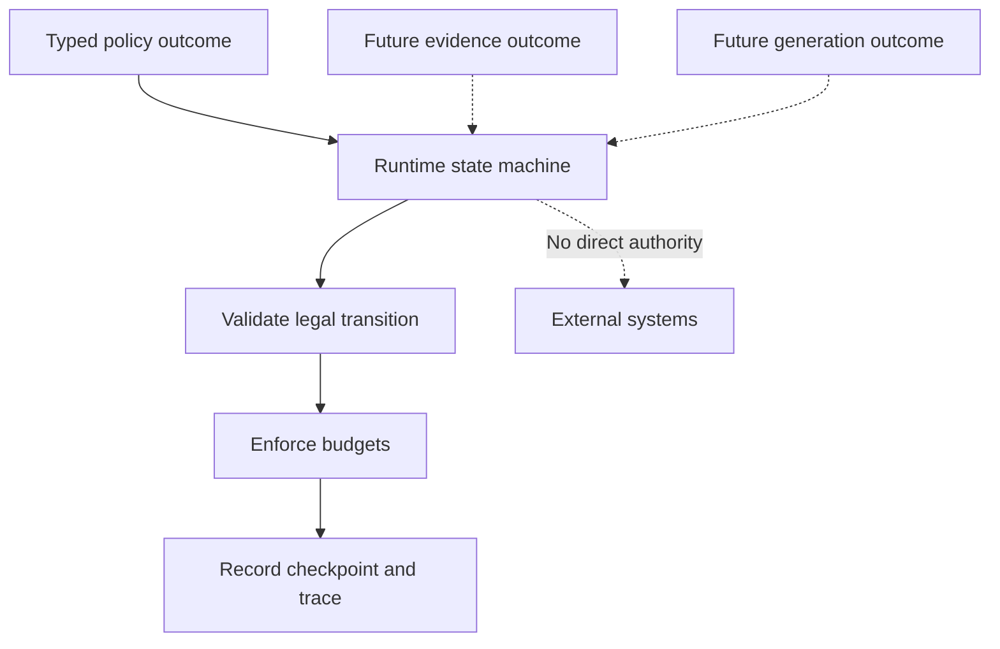
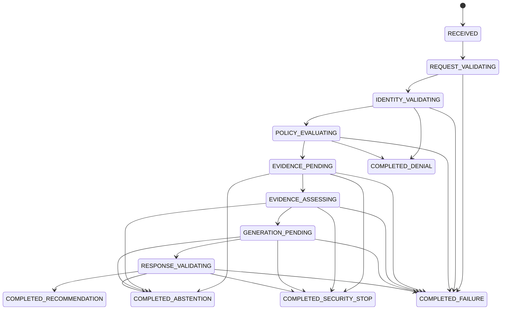

# Phase 4 — Runtime State and Transition Design

## 1. Purpose

Phase 4 introduces an explicit local runtime state machine for the incident-diagnostic workflow.

The runtime coordinates workflow progress. It does not decide enterprise authorization, retrieve enterprise evidence, call a model, execute tools, or mutate production systems.

This document defines the runtime before implementation:

- Runtime state
- Legal transitions
- Terminal outcomes
- Step and retry budgets
- Stop conditions
- Checkpoints
- Replay behavior
- Trace requirements
- Failure mapping
- Authority boundaries
- Test evidence

---

## 2. Source Requirements

The design derives from:

- `docs/discovery/CURRENT_STATE_WORKFLOW.md`
- `docs/discovery/DECISION_DECOMPOSITION.md`
- `docs/discovery/RISK_AND_AUTHORITY_MATRIX.md`
- `docs/vertical-slice/VERTICAL_SLICE_DEFINITION.md`
- `docs/vertical-slice/ACCEPTANCE_CRITERIA.md`
- `docs/vertical-slice/INTERFACE_CONTRACTS.md`
- `docs/vertical-slice/FAILURE_MODE_CATALOG.md`
- `docs/vertical-slice/SYSTEM_BOUNDARIES.md`
- `docs/prototype/PHASE_3_IMPLEMENTATION_AND_EVIDENCE.md`
- `docs/prototype/PHASE_3_GATE.md`

The runtime must not silently broaden the approved slice.

---

## 3. Phase 4 Objective

The objective is:

> Make workflow state, legal transitions, budgets, retries, stop conditions, checkpoints, and terminal outcomes explicit and testable.

Phase 4 answers:

- What state is the workflow in?
- Which transition is legal next?
- Which component supplied the transition outcome?
- Has the step budget been exhausted?
- Has the retry budget been exhausted?
- Has a terminal condition occurred?
- Can the recorded workflow be replayed?
- Can invalid transitions alter state?
- Can the runtime grant itself authority?

---

## 4. Authorized Scope

Phase 4 authorizes:

- Typed local runtime state
- Deterministic transition rules
- Step budgets
- Retry budgets
- Explicit stop conditions
- Recommendation terminal state
- Abstention terminal state
- Denial terminal state
- Failure terminal state
- Security-stop terminal state
- In-memory checkpoints
- Deterministic replay
- Runtime trace events
- Local synthetic outcome fixtures
- Unit, contract, transition, and integration tests
- Runtime tutorial and gate evidence

---

## 5. Prohibited Scope

Phase 4 does not authorize:

- External model calls
- Enterprise retrieval
- Document ingestion
- Embedding generation
- Vector-database access
- Model-selected tools
- Tool execution
- Shell execution
- Infrastructure mutation
- Human approval execution
- Production credentials
- Cloud deployment
- Production deployment
- Autonomous remediation
- LLM authorization decisions
- Orchestrator authorization decisions

Synthetic test outcomes must not be represented as real model, retrieval, policy, approval, or production results.

---

## 6. Core Runtime Principle

```text
The runtime coordinates.
The policy boundary authorizes.
Capability adapters perform bounded work.
Humans retain consequential authority.
```

The runtime may consume a typed authorization decision.

The runtime may not create, alter, extend, reinterpret, or override that decision.

---

## 7. Runtime versus Capability Execution



Solid arrows represent Phase 4 behavior.

Dotted arrows represent future typed inputs. Phase 4 does not implement those integrations.

---

## 8. State Machine Model

The runtime begins in `RECEIVED`.

It reaches exactly one terminal state.



The diagram defines state reachability. The transition table is authoritative.

---

## 9. Runtime State Inventory

| State | Type | Meaning |
|---|---|---|
| `RECEIVED` | Initial | A bounded runtime record exists |
| `REQUEST_VALIDATING` | Active | CT-01 validation outcome is expected |
| `IDENTITY_VALIDATING` | Active | CT-02 identity outcome is expected |
| `POLICY_EVALUATING` | Active | CT-03 authorization outcome is expected |
| `EVIDENCE_PENDING` | Active | A future Phase 5 evidence outcome is expected |
| `EVIDENCE_ASSESSING` | Active | Evidence sufficiency outcome is expected |
| `GENERATION_PENDING` | Active | A future provider outcome is expected |
| `RESPONSE_VALIDATING` | Active | CT-05 validation outcome is expected |
| `COMPLETED_RECOMMENDATION` | Terminal | A validated recommendation is ready for human review |
| `COMPLETED_ABSTENTION` | Terminal | The workflow safely abstained |
| `COMPLETED_DENIAL` | Terminal | Identity or deterministic policy denied processing |
| `COMPLETED_FAILURE` | Terminal | A controlled failure ended processing |
| `COMPLETED_SECURITY_STOP` | Terminal | A security-containment condition ended processing |

---

## 10. Terminal-State Semantics

### Completed recommendation

`COMPLETED_RECOMMENDATION` means:

- A CT-05 recommendation response passed validation.
- Evidence lineage is represented.
- The execution status remains `not_executed`.
- The result is ready for human review.
- No remediation was executed.

### Completed abstention

`COMPLETED_ABSTENTION` means:

- The workflow stopped safely.
- A bounded abstention reason exists.
- Request and trace identifiers are preserved.
- The result does not claim unsupported success.

### Completed denial

`COMPLETED_DENIAL` means:

- Identity or deterministic policy did not permit processing.
- No later capability stage may run.
- The runtime did not convert denial into abstention or approval.
- A controlled error and trace evidence may be produced.

### Completed failure

`COMPLETED_FAILURE` means:

- A non-security error prevented safe continuation.
- Retry was prohibited or exhausted.
- A CT-06 controlled error can represent the outcome.
- The failure must not be reported as success.

### Completed security stop

`COMPLETED_SECURITY_STOP` means:

- A containment-class event was detected.
- No later stage may execute.
- The runtime records the stop without activating an enterprise response process.
- Sensitive content must not be copied into telemetry.

---

## 11. Transition Command Inventory

| Command | Intended source |
|---|---|
| `BEGIN_REQUEST_VALIDATION` | Runtime |
| `REQUEST_VALIDATED` | Local CT-01 validator |
| `REQUEST_REJECTED` | Local CT-01 validator |
| `IDENTITY_VALIDATED` | Future identity boundary or local fixture |
| `IDENTITY_DENIED` | Future identity boundary or local fixture |
| `IDENTITY_FAILED` | Future identity boundary or local fixture |
| `POLICY_ALLOWED` | Deterministic policy decision |
| `POLICY_DENIED` | Deterministic policy decision |
| `POLICY_FAILED` | Deterministic policy boundary |
| `EVIDENCE_AVAILABLE` | Future Phase 5 adapter or local fixture |
| `EVIDENCE_INSUFFICIENT` | Future Phase 5 adapter or local fixture |
| `EVIDENCE_FAILED` | Future Phase 5 adapter or local fixture |
| `EVIDENCE_SECURITY_STOP` | Future Phase 5 adapter or local fixture |
| `EVIDENCE_SUFFICIENT` | Evidence-assessment boundary or local fixture |
| `EVIDENCE_CONFLICTED` | Evidence-assessment boundary or local fixture |
| `ASSESSMENT_FAILED` | Evidence-assessment boundary or local fixture |
| `ASSESSMENT_SECURITY_STOP` | Evidence-assessment boundary or local fixture |
| `GENERATION_COMPLETED` | Future provider adapter or local fixture |
| `GENERATION_ABSTAINED` | Future provider adapter or local fixture |
| `GENERATION_FAILED` | Future provider adapter or local fixture |
| `GENERATION_SECURITY_STOP` | Future provider adapter or local fixture |
| `RESPONSE_VALIDATED` | Local CT-05 validator |
| `RESPONSE_ABSTAINED` | Local CT-05 validator |
| `RESPONSE_REJECTED` | Local CT-05 validator |
| `RESPONSE_SECURITY_STOP` | Local safety validator |
| `TRANSIENT_FAILURE` | Current bounded stage |
| `RETRY_CURRENT_STAGE` | Runtime retry controller |

The command name records a typed outcome. It does not grant the producer authority beyond its contract.

---

## 12. Authoritative Transition Table

| Current state | Command | Next state |
|---|---|---|
| `RECEIVED` | `BEGIN_REQUEST_VALIDATION` | `REQUEST_VALIDATING` |
| `REQUEST_VALIDATING` | `REQUEST_VALIDATED` | `IDENTITY_VALIDATING` |
| `REQUEST_VALIDATING` | `REQUEST_REJECTED` | `COMPLETED_FAILURE` |
| `IDENTITY_VALIDATING` | `IDENTITY_VALIDATED` | `POLICY_EVALUATING` |
| `IDENTITY_VALIDATING` | `IDENTITY_DENIED` | `COMPLETED_DENIAL` |
| `IDENTITY_VALIDATING` | `IDENTITY_FAILED` | `COMPLETED_FAILURE` |
| `POLICY_EVALUATING` | `POLICY_ALLOWED` | `EVIDENCE_PENDING` |
| `POLICY_EVALUATING` | `POLICY_DENIED` | `COMPLETED_DENIAL` |
| `POLICY_EVALUATING` | `POLICY_FAILED` | `COMPLETED_FAILURE` |
| `EVIDENCE_PENDING` | `EVIDENCE_AVAILABLE` | `EVIDENCE_ASSESSING` |
| `EVIDENCE_PENDING` | `EVIDENCE_INSUFFICIENT` | `COMPLETED_ABSTENTION` |
| `EVIDENCE_PENDING` | `EVIDENCE_FAILED` | `COMPLETED_FAILURE` |
| `EVIDENCE_PENDING` | `EVIDENCE_SECURITY_STOP` | `COMPLETED_SECURITY_STOP` |
| `EVIDENCE_ASSESSING` | `EVIDENCE_SUFFICIENT` | `GENERATION_PENDING` |
| `EVIDENCE_ASSESSING` | `EVIDENCE_CONFLICTED` | `COMPLETED_ABSTENTION` |
| `EVIDENCE_ASSESSING` | `ASSESSMENT_FAILED` | `COMPLETED_FAILURE` |
| `EVIDENCE_ASSESSING` | `ASSESSMENT_SECURITY_STOP` | `COMPLETED_SECURITY_STOP` |
| `GENERATION_PENDING` | `GENERATION_COMPLETED` | `RESPONSE_VALIDATING` |
| `GENERATION_PENDING` | `GENERATION_ABSTAINED` | `COMPLETED_ABSTENTION` |
| `GENERATION_PENDING` | `GENERATION_FAILED` | `COMPLETED_FAILURE` |
| `GENERATION_PENDING` | `GENERATION_SECURITY_STOP` | `COMPLETED_SECURITY_STOP` |
| `RESPONSE_VALIDATING` | `RESPONSE_VALIDATED` | `COMPLETED_RECOMMENDATION` |
| `RESPONSE_VALIDATING` | `RESPONSE_ABSTAINED` | `COMPLETED_ABSTENTION` |
| `RESPONSE_VALIDATING` | `RESPONSE_REJECTED` | `COMPLETED_FAILURE` |
| `RESPONSE_VALIDATING` | `RESPONSE_SECURITY_STOP` | `COMPLETED_SECURITY_STOP` |

`TRANSIENT_FAILURE` and `RETRY_CURRENT_STAGE` are governed separately by the retry rules.

Every transition not listed is invalid.

---

## 13. Invalid Transition Behavior

An invalid transition must:

1. Fail deterministically.
2. Preserve the current state.
3. Preserve the checkpoint sequence.
4. Preserve step and retry counters.
5. Produce no downstream capability request.
6. Return a controlled runtime error.
7. Retain request and trace correlation.
8. Record diagnostic evidence without sensitive payload reflection.

Examples:

- `POLICY_ALLOWED` from `RECEIVED`
- `RESPONSE_VALIDATED` from `IDENTITY_VALIDATING`
- Any command from a terminal state
- Retry after denial
- Retry after a security stop
- Moving backward to an earlier stage
- Skipping evidence assessment
- Reaching recommendation without response validation

---

## 14. Runtime State Contract

The runtime state must contain:

| Field | Purpose |
|---|---|
| `runtime_id` | Unique local workflow identity |
| `request_id` | CT-01 request identity |
| `trace_id` | End-to-end trace identity |
| `incident_id` | Incident correlation |
| `service_id` | Bounded service scope |
| `current_state` | Current enumerated runtime state |
| `step_count` | Accepted-transition count |
| `retry_count` | Total accepted retry count |
| `stage_retry_count` | Retry count for the current stage |
| `max_steps` | Explicit step budget |
| `max_retries` | Explicit total retry budget |
| `max_stage_retries` | Explicit per-stage retry budget |
| `transition_sequence` | Monotonic transition sequence |
| `last_command` | Most recently accepted command |
| `terminal_reason_code` | Bounded terminal reason |
| `policy_decision_id` | Referenced deterministic policy decision |
| `authorization_expires_at` | Decision-expiration boundary |
| `created_at` | Runtime creation timestamp |
| `updated_at` | Last accepted-transition timestamp |
| `state_version` | Optimistic state version |
| `contract_version` | Runtime contract version |

The state must be immutable. Each accepted transition returns a new validated state.

---

## 15. Runtime Invariants

The implementation must enforce:

1. `request_id`, `trace_id`, `incident_id`, and `service_id` never change.
2. `runtime_id` never changes.
3. `step_count` never decreases.
4. `retry_count` never decreases.
5. `transition_sequence` increases by exactly one per accepted transition.
6. `state_version` increases by exactly one per accepted transition.
7. Terminal states cannot transition.
8. A recommendation terminal state requires response validation.
9. A denial cannot become an allow.
10. A security stop cannot resume.
11. A retry cannot broaden authority or resource scope.
12. An expired policy decision cannot support continuation.
13. No transition can claim execution.
14. Invalid transitions do not mutate state.
15. Checkpoint content must match the returned state.

---

## 16. Step Budget

Default:

```text
max_steps = 16
```

Allowed configuration range:

```text
1 through 32
```

Rules:

- Every accepted transition increments `step_count`.
- Every accepted retry also increments `step_count`.
- State creation does not increment the count.
- An invalid transition does not consume the budget.
- The transition that would exceed the budget is rejected.
- Budget exhaustion produces `COMPLETED_FAILURE`.
- The terminal reason is `STEP_BUDGET_EXHAUSTED`.
- No downstream stage may run after exhaustion.

The default supports the bounded happy path and limited retries without permitting an unbounded loop.

---

## 17. Retry Budget

Defaults:

```text
max_retries = 2
max_stage_retries = 1
```

Allowed ranges:

```text
max_retries: 0 through 5
max_stage_retries: 0 through 3
```

A retry is allowed only when:

- The failure classification is transient.
- The current stage is active.
- Authorization remains valid where required.
- Request and trace identifiers remain unchanged.
- Resource scope does not broaden.
- Total retry budget remains.
- Stage retry budget remains.
- The retry is observable.
- No duplicate side effect can occur.

A retry is prohibited for:

- Invalid request
- Invalid or missing identity
- Access denial
- Policy denial
- Unsupported service
- Unsupported contract version
- Production-mutation request
- Unauthorized-source request
- Contract content requiring user correction
- Security-containment event
- Terminal state

Retry exhaustion produces:

```text
COMPLETED_FAILURE
RETRY_BUDGET_EXHAUSTED
```

Phase 4 retries state transitions only. It does not retry an external dependency call.

---

## 18. Stop Conditions

The runtime stops immediately when:

- A terminal state is reached.
- The step budget is exhausted.
- The retry budget is exhausted.
- The current-stage retry budget is exhausted.
- Identity is denied.
- Policy is denied.
- Authorization is missing or expired.
- A production-mutation request is detected.
- Unauthorized-source disclosure is detected.
- Cross-tenant content is detected.
- Credential or secret exposure is detected.
- Evidence-integrity failure suggests tampering.
- Policy bypass is detected.
- Approval spoofing is detected.
- Restricted data enters telemetry.
- Response validation fails without a safe abstention.

Stop means:

- No later transition is accepted.
- No capability request is issued.
- A final checkpoint is stored.
- A terminal trace event is recorded.
- The result cannot be reported as successful execution.

---

## 19. Checkpoint Model

Phase 4 uses an in-memory checkpoint store.

Each accepted transition records:

| Field | Purpose |
|---|---|
| `runtime_id` | Workflow identity |
| `sequence` | Monotonic checkpoint number |
| `previous_state` | State before the transition |
| `command` | Accepted transition command |
| `next_state` | State after the transition |
| `reason_code` | Bounded transition reason |
| `step_count` | Step count after transition |
| `retry_count` | Retry count after transition |
| `state_version` | Version after transition |
| `trace_id` | Correlation identity |
| `recorded_at` | Checkpoint timestamp |
| `state_hash` | Deterministic serialized-state hash |

Rules:

- Checkpoints are append-only.
- Existing checkpoints cannot be overwritten.
- Duplicate sequence numbers are rejected.
- Checkpoints for different runtime IDs cannot be mixed.
- Returned checkpoint objects are immutable.
- Storage is process-local and non-durable.
- Process restart loses checkpoints.
- No production recovery claim is permitted.

---

## 20. Replay Model

Replay reconstructs state from:

1. The initial runtime state.
2. The ordered checkpoint commands.
3. The same authoritative transition table.
4. The same budget rules.
5. The same runtime contract version.

Replay passes only when:

- Sequence numbers are contiguous.
- Runtime, request, and trace identities remain stable.
- Every transition is legal.
- Reconstructed state hashes match recorded hashes.
- The final reconstructed state equals the recorded final state.
- No checkpoint is missing.
- No checkpoint was inserted or reordered.

Replay does not repeat:

- Model calls
- Retrieval
- Policy evaluation
- Tool calls
- Human approval
- External side effects

Replay proves deterministic state reconstruction, not external-world reconstruction.

---

## 21. Concurrency and Version Rules

Phase 4 is single-process and in-memory.

The store must use `state_version` as an optimistic concurrency boundary.

An update must provide the expected current version.

If the expected version differs from the stored version:

- The transition fails.
- State remains unchanged.
- No checkpoint is written.
- A controlled concurrency error is returned.

Phase 4 does not claim:

- Distributed locking
- Multi-process coordination
- Cross-node consistency
- Durable transactions
- Exactly-once processing

---

## 22. Trace Requirements

Every accepted transition must record or produce data sufficient for a CT-07 trace event.

Required trace relationships:

| Runtime condition | Trace outcome |
|---|---|
| Transition begins | `STARTED` where an event is emitted |
| Transition succeeds | `SUCCEEDED` |
| Identity or policy denies | `DENIED` |
| Safe abstention | `ABSTAINED` |
| Controlled failure | `FAILED` |
| Security containment | `FAILED` with bounded security reason |

Trace data must include:

- `runtime_id`
- `request_id`
- `trace_id`
- Previous state
- Command
- Next state
- Transition sequence
- Step count
- Retry count
- Reason codes
- Contract version
- Timestamp

Trace data must not contain:

- Secrets
- Credentials
- Raw restricted evidence
- Raw prompts
- Arbitrary exception strings
- Full rejected request bodies

---

## 23. Failure Mapping

| Runtime condition | Terminal state | Controlled code |
|---|---|---|
| Invalid request | `COMPLETED_FAILURE` | `INVALID_REQUEST` |
| Invalid identity | `COMPLETED_DENIAL` | `IDENTITY_REQUIRED` or `IDENTITY_EXPIRED` |
| Policy denial | `COMPLETED_DENIAL` | `ACCESS_DENIED` |
| Policy unavailable | `COMPLETED_FAILURE` | `POLICY_UNAVAILABLE` |
| Unsupported service | `COMPLETED_FAILURE` | `SERVICE_UNSUPPORTED` |
| Evidence unavailable | `COMPLETED_FAILURE` or abstention | `SOURCE_UNAVAILABLE` |
| Evidence insufficient | `COMPLETED_ABSTENTION` | `EVIDENCE_INSUFFICIENT` |
| Evidence conflict | `COMPLETED_ABSTENTION` | `EVIDENCE_CONFLICT` |
| Invalid response | `COMPLETED_FAILURE` | `RESPONSE_INVALID` |
| Dependency failure | `COMPLETED_FAILURE` | `DEPENDENCY_FAILURE` |
| Step budget exhausted | `COMPLETED_FAILURE` | Phase 4 runtime reason |
| Retry budget exhausted | `COMPLETED_FAILURE` | Phase 4 runtime reason |
| Invalid transition | No state change | Phase 4 runtime reason |
| Version conflict | No state change | Phase 4 runtime reason |
| Security containment | `COMPLETED_SECURITY_STOP` | Phase 4 runtime reason |

Phase 4 runtime reason codes must be bounded enumerations. They must not be arbitrary strings.

---

## 24. Policy Authority Boundary

The runtime may:

- Validate that a CT-03 decision exists.
- Confirm that the decision refers to the expected request, trace, and subject.
- Confirm that the decision is not expired.
- Follow `allow`, `deny`, or `constrain`.
- Preserve the policy-decision identifier.
- Enforce constraints already expressed by policy.

The runtime may not:

- Produce an `allow` decision.
- Convert `deny` to `allow`.
- Extend decision expiration.
- Add resources to allowed scope.
- Remove constraints.
- Treat missing policy as allow.
- Ask an LLM to reinterpret policy.
- Use retry to obtain broader authority.
- Treat a test fixture as production authorization.

---

## 25. Human Approval Boundary

Phase 4 does not implement human approval.

A recommendation reaches `COMPLETED_RECOMMENDATION` for human review. That state does not mean:

- Approved
- Executed
- Scheduled
- Deployed
- Remediated
- Closed

Approval pause and trusted approval execution remain deferred to the dedicated human-approval phase.

---

## 26. Local Synthetic Outcome Rules

Phase 4 tests may provide synthetic typed outcomes for stages whose integrations do not yet exist.

Synthetic outcomes must:

- Be created only in tests or explicitly labeled local fixtures.
- Carry no production credential.
- Perform no network operation.
- Perform no file-system mutation outside test storage.
- Perform no tool call.
- Perform no infrastructure mutation.
- Be identified as synthetic in trace attributes.
- Never be described as real retrieval, generation, policy, or approval evidence.

The production package must not silently substitute fixtures for unavailable dependencies.

---

## 27. Planned Runtime Package Structure

```text
src/incident_diagnostic_api/runtime/
├── __init__.py
├── enums.py
├── errors.py
├── models.py
├── transitions.py
├── budgets.py
├── checkpoints.py
├── replay.py
├── traces.py
└── engine.py
```

Planned tests:

```text
tests/runtime/
├── __init__.py
├── test_state_contract.py
├── test_transition_table.py
├── test_invalid_transitions.py
├── test_step_budget.py
├── test_retry_budget.py
├── test_terminal_states.py
├── test_checkpoints.py
├── test_replay.py
├── test_concurrency.py
├── test_trace_mapping.py
└── test_authority_boundary.py
```

The implementation may be divided into smaller subphases. Empty files or directories must not be used to imply progress.

---

## 28. Implementation Order

1. Define runtime enumerations.
2. Define immutable state and checkpoint contracts.
3. Define bounded runtime errors and reason codes.
4. Implement the authoritative transition table.
5. Implement step-budget enforcement.
6. Implement retry-budget enforcement.
7. Implement terminal-state guards.
8. Implement the in-memory checkpoint store.
9. Implement optimistic version checks.
10. Implement deterministic replay.
11. Implement CT-07 trace mapping.
12. Implement the local runtime engine.
13. Add runtime integration tests.
14. Add tutorial evidence.
15. Execute the Phase 4 gate.

---

## 29. Test Plan

### State-contract tests

Verify:

- Required identifiers
- Enumerated state
- Budget bounds
- Immutable models
- Stable identifiers
- Terminal-reason rules
- Version and sequence rules

### Transition tests

Verify:

- Every listed transition
- Every unlisted transition fails
- Terminal states reject all commands
- No stage can be skipped
- No backward transition exists

### Budget tests

Verify:

- Step count increments correctly
- Retry counts increment correctly
- Invalid transitions consume no budget
- Step exhaustion stops the workflow
- Retry exhaustion stops the workflow
- Per-stage retry limits are enforced

### Checkpoint tests

Verify:

- A checkpoint follows each accepted transition
- Checkpoints are append-only
- Duplicate sequences fail
- Runtime identities cannot mix
- State hashes are deterministic
- Stored objects are immutable

### Replay tests

Verify:

- Happy-path replay
- Abstention replay
- Denial replay
- Failure replay
- Security-stop replay
- Missing-checkpoint detection
- Reordered-checkpoint detection
- Hash-mismatch detection

### Concurrency tests

Verify:

- Correct expected version succeeds
- Stale version fails
- Failed version checks write no checkpoint
- Failed version checks preserve state

### Authority tests

Verify:

- Runtime cannot create policy allow
- Denial cannot resume
- Security stop cannot resume
- Retry cannot broaden scope
- Recommendation never claims execution
- External capabilities remain disabled

---

## 30. Phase 4 Gate

Phase 4 passes only when:

- Every legal transition has a test.
- Representative illegal transitions fail deterministically.
- Invalid transitions do not mutate state.
- Terminal states cannot resume.
- Step budgets are enforced.
- Retry budgets are enforced.
- Checkpoints follow every accepted transition.
- Recorded workflows replay deterministically.
- Version conflicts fail without mutation.
- Trace evidence preserves correlation.
- Recommendation remains `not_executed`.
- The runtime cannot authorize itself.
- Tests require no provider or enterprise credentials.
- External models remain disabled.
- Enterprise retrieval remains disabled.
- Tool execution remains disabled.
- Infrastructure mutation remains disabled.
- Cloud and production deployment remain disabled.
- Tutorial and evidence claims match executable behavior.

---

## 31. Current Phase 4 Decision

```text
BOUNDED LOCAL IMPLEMENTATION VALIDATED
REMOTE PHASE 4 CI CLOSURE PENDING
```

Locally implemented and validated:

- Runtime enumerations and immutable state contracts
- Authoritative transition table
- Step and retry budgets
- Explicit stop conditions
- Append-only in-memory checkpoints
- Optimistic concurrency
- Deterministic replay
- CT-07 runtime traces
- Deterministic runtime engine
- Runtime-only FastAPI routes
- Runtime and integration tests
- Tutorial and gate evidence

Current authorized work:

```text
Phase 4 evidence review, implementation commit, remote CI,
and closure evidence only
```

Not authorized:

```text
External providers
Enterprise retrieval
Tools
Human approval execution
Infrastructure mutation
Cloud deployment
Production deployment
Any later phase
```
