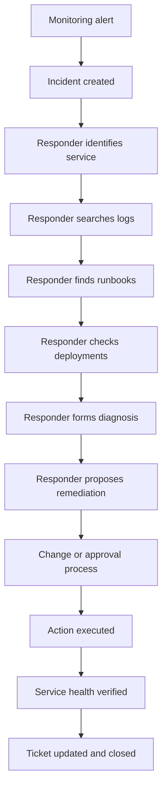
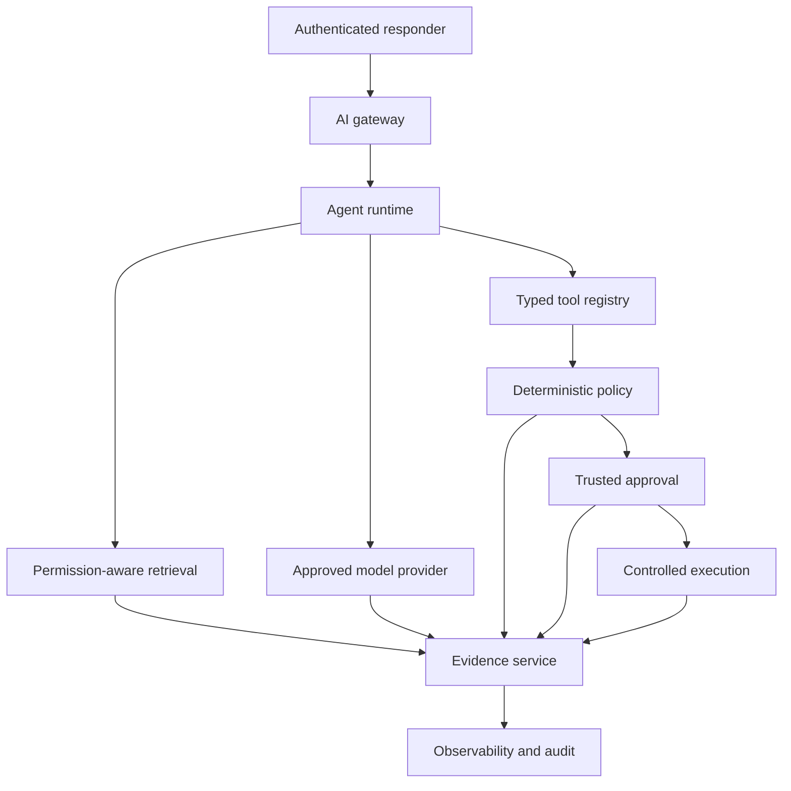
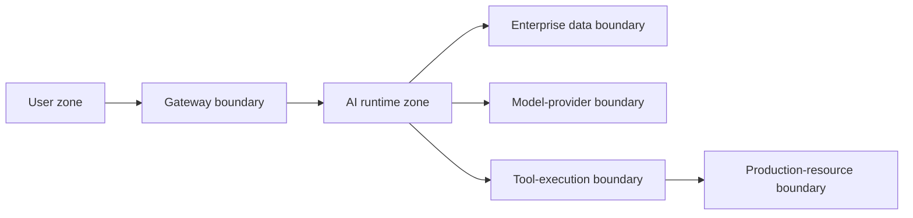
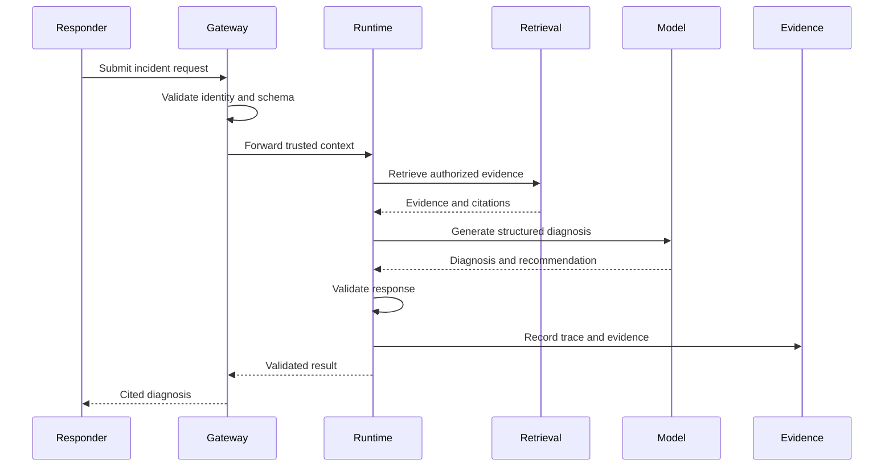

# Client Scenario and System Boundary

## Purpose

This document defines the flagship client problem, current workflow, stakeholders, data sources, authority boundaries, initial vertical slice, success measures, and explicit exclusions for the Enterprise AI-Native Forward-Deployed Engineering Lab.

It establishes what the lab is solving before selecting a model, provider, agent framework, vector database, or deployment platform.

## Tutorial Principle

Start with the workflow, not the model.

The client’s initial request is treated as an input to discovery, not as an approved technical design.

## Client Profile

The simulated client is a large regulated enterprise operating customer-facing digital services across multiple cloud and on-premises environments.

The organization has:

- A central service-management platform
- Separate application and infrastructure teams
- Distributed operational runbooks
- Multiple logging and monitoring tools
- Formal production-change controls
- Security and compliance requirements
- A mixture of legacy and cloud-native systems
- Human approval requirements for consequential changes

No real company, customer, production system, or regulated dataset is represented in this tutorial.

## Initial Client Request

The client states:

> “We want an AI agent that can investigate incidents and automatically fix production problems.”

This request is ambiguous because it does not define:

- Which incidents are in scope
- Who will use the system
- Which data sources are authoritative
- What “investigate” means
- What “automatically fix” means
- Which actions are safe
- Which actions require approval
- Which identities and credentials are permitted
- How success will be measured
- Who owns the system after deployment
- How failures will be detected and reversed

The lab must resolve these questions before granting execution authority.

## Assumed Business Problem

Operational responders spend too much time gathering fragmented evidence before they can form and validate an incident diagnosis.

Relevant information may exist across:

- Incident tickets
- Service ownership records
- Operational runbooks
- Application and infrastructure logs
- Recent deployment records
- Change-management records
- Architecture documentation
- Monitoring alerts
- Known-error records

The primary initial problem is evidence gathering and diagnosis consistency—not autonomous remediation.

## Current-State Workflow



## Current-State Problems

### Fragmented evidence

Responders must move between multiple systems and manually correlate results.

### Inconsistent diagnosis

Different responders may use different sources, search strategies, and troubleshooting sequences.

### Slow incident triage

Time is spent locating and validating evidence before technical remediation begins.

### Weak provenance

Ticket comments may record conclusions without preserving which sources supported them.

### Informal escalation

Approval context may exist in chat or meetings without being bound to the exact requested action.

### Operational risk

An unconstrained agent could execute a technically valid but unauthorized or unsafe action.

## Target Users

| User | Responsibility | Permitted initial interaction |
|---|---|---|
| Incident responder | Investigate and coordinate incidents | Submit and review analysis |
| Service owner | Validate service-specific diagnosis | Review evidence and recommendation |
| SRE | Perform advanced diagnosis | Review analysis and propose action |
| Change approver | Authorize consequential changes | Approve or deny bound requests |
| Security reviewer | Review access and policy behavior | Inspect policy and audit evidence |
| Platform operator | Operate the AI platform | Monitor runtime health |
| Auditor | Reconstruct decisions | Read immutable evidence |
| Developer | Maintain services and tools | No production approval authority |

## Stakeholder Concerns

| Stakeholder | Primary concern |
|---|---|
| Operations | Faster, more consistent diagnosis |
| Engineering | Accurate technical evidence |
| Security | Least privilege and policy enforcement |
| Compliance | Traceability and data boundaries |
| Product leadership | Business value and adoption |
| Platform team | Reliability and maintainability |
| Finance | Provider and infrastructure cost |
| End users | Clear, useful, explainable responses |

## Authoritative Data Sources

| Source | Purpose | Initial access | Authority |
|---|---|---|---|
| Incident service | Incident identity and status | Read | System of record |
| Service catalog | Service owner and criticality | Read | System of record |
| Approved runbooks | Diagnostic procedures | Read | Authoritative guidance |
| Log-search service | Runtime evidence | Read | Operational evidence |
| Deployment service | Recent releases | Read | Deployment record |
| Change-management service | Approved changes | Read | Change authority |
| Monitoring service | Alerts and health | Read | Runtime signal |
| Evidence store | AI workflow records | Write | Lab evidence authority |

The model’s generated text is never an authoritative source.

## Initial Data Classification

| Data type | Classification | Initial handling |
|---|---|---|
| Synthetic incident details | Internal | Allowed |
| Synthetic runbooks | Internal | Permission-filtered |
| Synthetic logs | Internal | Permission-filtered |
| User identity and groups | Confidential | Minimized and protected |
| Tool credentials | Secret | Never placed in prompts |
| Policy decisions | Internal evidence | Recorded |
| Approval decisions | Confidential evidence | Recorded |
| Model prompts and responses | Internal | Redacted where necessary |
| Production customer data | Prohibited | Not used in the lab |

## Decision Decomposition

The workflow contains different decision types.

| Decision | Appropriate mechanism | Reason |
|---|---|---|
| Validate request schema | Deterministic code | Exact contract |
| Authenticate user | Identity provider | Trusted identity |
| Determine document access | Policy/filter service | Deterministic authorization |
| Retrieve similar evidence | Retrieval system | Relevance operation |
| Summarize retrieved evidence | Model | Language reasoning |
| Propose likely diagnosis | Model plus evidence | Evidence-grounded reasoning |
| Validate output structure | Deterministic code | Exact contract |
| Determine tool permission | Policy engine | Authorization |
| Approve consequential action | Authorized human | Accountability |
| Execute action | Trusted tool service | Controlled side effect |
| Verify result | Monitoring/tool service | Independent validation |
| Promote a release | Release-control process | Operational governance |

## Core Authority Principle

The model may:

- Summarize
- Classify
- Extract
- Compare
- Generate
- Recommend
- Propose tool parameters

The model may not:

- Authenticate users
- Grant permissions
- Create its own authority
- Approve consequential actions
- Retrieve secrets
- Bypass policy
- Execute unrestricted commands
- Declare its own output correct
- Promote itself to production
- Alter audit evidence

## System Context



## System Responsibilities

### Identity provider

- Authenticates the user
- Issues trusted identity claims
- Provides group or role context

It does not control agent workflow state.

### AI gateway

- Validates authenticated request context
- Applies request limits
- Applies provider-access rules
- Redacts prohibited data where required
- Establishes the correlation ID
- Routes requests to the runtime

It is not the agent orchestrator or enterprise authorization authority.

### Agent runtime

- Maintains workflow state
- Coordinates retrieval, model, policy, approval, and tools
- Enforces step and retry limits
- Applies stop conditions
- Pauses for approval
- Produces structured workflow events

It coordinates execution but never authorizes itself.

### Retrieval service

- Parses and indexes approved sources
- Applies trusted authorization filters
- Retrieves relevant evidence
- Returns source and version metadata
- Reports insufficient evidence

It must not retrieve unauthorized content and ask the model to remove it afterward.

### Model provider

- Summarizes evidence
- Produces a cited diagnosis
- Proposes remediation
- Produces typed output

It does not make authorization or approval decisions.

### Tool service

- Exposes narrow capabilities
- Validates parameters
- Uses bounded identity
- Enforces timeouts
- Applies idempotency
- Verifies results
- Records side effects

It does not expose unrestricted shell or infrastructure access.

### Policy service

- Evaluates trusted subject, action, resource, environment, and risk
- Returns `ALLOW`, `DENY`, or `APPROVAL_REQUIRED`
- Records the policy version and reason

It is deterministic and external to model reasoning.

### Approval service

- Validates approver identity
- Binds approval to the exact request
- Applies expiration and replay protection
- Records approval or denial

A chat interface may present the decision, but trusted workflow state is authoritative.

### Evidence service

- Records workflow events
- Records retrieval sources
- Records model and prompt versions
- Records policy and approval decisions
- Records tool requests and results
- Supports trace reconstruction

It must not allow the model to rewrite history.

## Trust Boundaries



### Boundary 1 — User to gateway

Controls:

- Authentication
- Request validation
- Rate limits
- Tenant context
- Correlation ID

### Boundary 2 — Runtime to enterprise data

Controls:

- Source allowlist
- User and tenant filters
- Document-level metadata
- Data minimization
- Citation metadata

### Boundary 3 — Runtime to model provider

Controls:

- Approved provider
- Data-classification policy
- Prompt redaction
- Token and cost limits
- Structured-output contract

### Boundary 4 — Runtime to tools

Controls:

- Registered tools only
- Typed parameters
- Policy decision
- Idempotency
- Timeouts
- Result validation

### Boundary 5 — Tool to production resource

Controls:

- Least-privilege workload identity
- Approved action and resource
- Network restrictions
- Change window
- Approval evidence
- Independent result verification

The initial vertical slice does not cross Boundary 5.

## Initial Thin Vertical Slice

### Name

Incident Evidence and Diagnosis Assistant

### User story

> As an authorized incident responder, I want to submit an incident and receive a citation-backed diagnosis based only on evidence I am permitted to access, so that I can investigate consistently without granting the AI system production-change authority.

### Request flow



### Initial functional requirements

The system must:

1. Accept a structured incident request.
2. Validate required fields.
3. associate the request with authenticated user context.
4. Generate one correlation ID.
5. Retrieve only authorized evidence.
6. Return source identifiers and versions.
7. Produce a structured diagnosis.
8. Distinguish evidence from inference.
9. Recommend but not execute remediation.
10. Abstain or request clarification when evidence is insufficient.
11. Record the workflow trace.
12. Return a validated response.

### Initial nonfunctional requirements

The system must:

- Run locally without production credentials.
- Use synthetic data.
- Fail closed when identity or policy context is missing.
- Produce deterministic validation errors.
- Prevent cross-tenant retrieval.
- Preserve source attribution.
- Enforce step and timeout limits.
- Avoid logging secrets.
- Support complete trace reconstruction.
- Operate without external provider access through a deterministic mock provider.

## Initial Response Contract

```json
{
  "incident_id": "INC-1001",
  "trace_id": "trace-example",
  "status": "recommendation_only",
  "diagnosis": {
    "summary": "Likely deployment-related latency regression",
    "confidence": 0.82,
    "evidence_ids": [
      "RUNBOOK-PAYMENTS-017",
      "DEPLOYMENT-2026-0718-04"
    ],
    "inferences": [
      "Latency began after the most recent deployment"
    ]
  },
  "recommended_action": {
    "action": "review_recent_deployment",
    "execution_authorized": false
  },
  "limitations": [
    "No production action was executed",
    "Diagnosis is limited to available authorized evidence"
  ]
}
```

The example demonstrates the contract only. It is not evidence of an implemented endpoint.

## Initial Acceptance Criteria

| ID | Criterion |
|---|---|
| AC-01 | Valid authorized request returns a structured diagnosis |
| AC-02 | Missing required fields return deterministic validation errors |
| AC-03 | Missing identity context fails closed |
| AC-04 | Unauthorized documents never enter model context |
| AC-05 | Citations identify source and version |
| AC-06 | Evidence and inference are distinguishable |
| AC-07 | Insufficient evidence produces abstention or clarification |
| AC-08 | Recommendation never produces an execution side effect |
| AC-09 | One trace ID connects the complete request |
| AC-10 | Recorded evidence supports workflow reconstruction |
| AC-11 | No secret appears in prompt, response, log, or trace |
| AC-12 | The complete slice runs with the deterministic mock provider |

## Initial Success Measures

### Business

- Reduced evidence-gathering steps
- Improved diagnosis consistency
- Clear source provenance
- Useful responder feedback
- No unauthorized production action

### Quality

- Retrieval relevance
- Source coverage
- Citation support
- Groundedness
- Abstention correctness
- Task completion

### Security

- Permission correctness
- Cross-tenant isolation
- Policy-denial correctness
- Secret-exposure rate
- Unauthorized side effects

### Operations

- p50 and p95 latency
- Error rate
- Retry rate
- Trace completeness
- Cost per successful task

No numeric target is approved until a baseline dataset and evaluation exercise establish a defensible threshold.

## Explicitly Out of Scope for the Initial Slice

- Production infrastructure mutation
- Service restart
- Database restart
- Firewall modification
- Kubernetes mutation
- Secret-vault retrieval
- Autonomous ticket closure
- Persistent unrestricted memory
- Multi-agent collaboration
- Live Slack or Teams approval
- External customer data
- External model-provider credentials
- Production deployment

## Failure Scenarios to Teach

| Failure | Expected behavior |
|---|---|
| Missing identity | Deny request |
| Invalid request schema | Return deterministic error |
| Unauthorized runbook | Exclude before model context |
| Retrieval returns no evidence | Abstain or clarify |
| Model output violates schema | Reject and apply bounded retry |
| Provider times out | Apply bounded fallback or fail safely |
| Evidence source is stale | Mark limitation or reject source |
| Trace write fails | Fail according to evidence-criticality policy |
| Cross-tenant request | Deny and record policy event |
| Model proposes a restricted action | Return recommendation without execution |

## Evolution Beyond the Initial Slice

Later phases may progressively add:

1. Read-only ticket retrieval
2. Log-search tools
3. Deployment-history tools
4. Low-risk ticket comments
5. Deterministic policy decisions
6. Trusted human approval
7. Simulated remediation
8. Independent result verification
9. Staged production capability

Each addition requires a new threat analysis, test, evidence record, and rollout decision.

## Discovery Assumptions

The tutorial initially assumes:

- All operational content is synthetic.
- One simulated tenant is used before isolation testing adds a second tenant.
- The initial user role is incident responder.
- Runbooks are the primary knowledge source.
- The local mock provider is sufficient for initial contract testing.
- No state-changing tool is enabled.
- The evidence store is required for trace reconstruction.

These are tutorial assumptions, not universal enterprise requirements.

## Open Client Questions

Before a real implementation, ask:

1. Which incident types are in scope?
2. Which system owns incident identity and status?
3. Which runbooks are authoritative?
4. How are source permissions represented and synchronized?
5. Which data may leave the client environment?
6. Which providers and regions are approved?
7. What actions are considered consequential?
8. Who can approve each risk tier?
9. What evidence must be retained?
10. What are the retention and deletion requirements?
11. What latency is acceptable?
12. What failure requires human escalation?
13. Who owns runtime support?
14. What is the rollback process?
15. What business outcome defines success?

## Current Authority Posture

### Allowed during Phase 0

- Documentation
- Architecture diagrams
- Requirement mapping
- Synthetic scenario design
- Threat and authority planning
- Acceptance-criteria definition

### Prohibited during Phase 0

- Runtime implementation
- Model-provider calls
- Tool execution
- Production credentials
- Secret retrieval
- Infrastructure mutation
- Human-approval execution
- External customer data
- Production deployment
- Claims of implemented capability

## Completion Gate

Phase 0D passes only when:

- The client problem is explicit.
- The current workflow is documented.
- Stakeholders and authoritative sources are identified.
- Model and platform authority are separated.
- Trust boundaries are documented.
- The initial vertical slice is bounded.
- Functional and nonfunctional requirements are explicit.
- Acceptance criteria are testable.
- Failure behavior is defined.
- Out-of-scope authority is explicit.
- Planned evolution does not imply present implementation.

## Next Authorized Work

```text
Phase 0E — Claim, Evidence, and Authority Rules
```

No runtime capability is authorized by this document.
