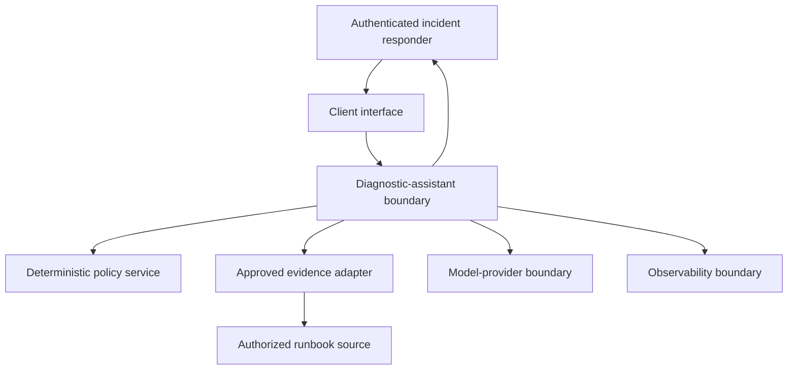

# Thin Vertical Slice System Boundaries

## Document Purpose

This document defines the system, trust, data, ownership, and authority boundaries for the Citation-Backed Incident Diagnostic Assistant.

The purpose is to prevent an apparently simple diagnostic workflow from acquiring implicit access, responsibility, or production authority as implementation progresses.

This document defines:

- What belongs inside the thin slice
- What remains outside the thin slice
- Where trust changes
- Where authorization is enforced
- How data may cross boundaries
- Which component owns each decision
- Which actors retain operational accountability
- Which capabilities remain prohibited

This document does not authorize application runtime, model-provider integration, retrieval implementation, tool execution, infrastructure mutation, or production deployment.

---

## Boundary Principles

The slice follows these principles:

1. Authentication and authorization are separate decisions.
2. Identity originates from a trusted identity system.
3. User text is always untrusted input.
4. Retrieved content is evidence, not instruction authority.
5. The model proposes; deterministic systems authorize.
6. Policy is enforced before protected data or operations are exposed.
7. The orchestrator coordinates workflow but does not invent authority.
8. Human review does not grant the AI system additional permission.
9. Chat interfaces do not constitute approval systems.
10. Production systems remain outside the mutation boundary.
11. Every cross-boundary exchange uses an explicit contract.
12. Every consequential decision retains evidence.
13. Failure to establish authority results in denial.
14. Observability records behavior but does not authorize behavior.
15. Deployment location does not determine trust.

---

## System Context

The system context is a proposed logical architecture. It does not claim that these components have been implemented.

---

## Inside the Initial Slice

The initial slice contains the logical responsibility to:

- Receive the diagnostic request
- Validate the request contract
- Receive trusted identity context
- Request deterministic authorization decisions
- Determine the authorized evidence scope
- Request approved evidence through a narrow adapter
- Validate evidence envelopes
- Assess evidence sufficiency
- Construct bounded model input
- Receive a candidate diagnostic response
- Validate the response contract
- Enforce recommendation-only behavior
- Return a recommendation, abstention, or controlled error
- Emit allowlisted trace metadata

Being inside the logical slice does not grant a component production authority.

---

## Outside the Initial Slice

The following remain outside the slice:

- Enterprise identity-provider administration
- Source entitlement administration
- Runbook authoring and approval
- Incident-management-system mutation
- Ticket creation or update
- Change-management approval
- Production shell access
- Infrastructure control planes
- Kubernetes administrative APIs
- Database administration
- Service restart mechanisms
- Deployment and rollback execution
- Firewall and network-policy mutation
- Secrets administration
- Human personnel decisions
- External stakeholder communications
- Autonomous remediation
- Model training
- Broad enterprise search
- Unrestricted log or source-code ingestion

An external system may supply information without becoming controlled by the slice.

---

## Boundary Inventory

| Boundary ID | Boundary | From | To | Primary control |
|---|---|---|---|---|
| BD-01 | User interaction | Incident responder | Client interface | Authentication binding and input validation |
| BD-02 | Request admission | Client interface | Diagnostic workflow | CT-01 validation |
| BD-03 | Identity propagation | Trusted identity adapter | Diagnostic workflow | CT-02 validation and expiration |
| BD-04 | Policy decision | Diagnostic workflow | Policy component | CT-03 and default denial |
| BD-05 | Evidence access | Diagnostic workflow | Evidence adapter | Resource-scoped authorization |
| BD-06 | Source retrieval | Evidence adapter | Approved source | Source-native access controls |
| BD-07 | Evidence delivery | Evidence adapter | Diagnostic workflow | CT-04 validation |
| BD-08 | Model invocation | Diagnostic workflow | Model provider | Data minimization and provider policy |
| BD-09 | Candidate output | Model provider | Diagnostic workflow | CT-05 validation |
| BD-10 | Response delivery | Diagnostic workflow | Client interface | Output validation and access binding |
| BD-11 | Telemetry emission | Slice components | Observability platform | CT-07 allowlist and redaction |
| BD-12 | Human action | Human reviewer | Enterprise operational systems | Existing enterprise authorization |

---

## Trust-Zone Model

| Trust zone | Examples | Trust posture |
|---|---|---|
| TZ-01 User zone | Browser, chat, client application | User input is untrusted |
| TZ-02 Interface zone | API edge, request adapter | Transport and schema validation required |
| TZ-03 Workflow zone | Orchestrator, response validator | Bounded coordination, no implicit authority |
| TZ-04 Policy zone | Authorization engine, policy store | Trusted for deterministic decisions |
| TZ-05 Evidence zone | Retrieval adapter, approved source | Access-controlled; content remains untrusted as instruction |
| TZ-06 Model zone | Hosted or managed model provider | Candidate-output producer, never authorization authority |
| TZ-07 Observability zone | Logs, metrics, traces | Sensitive-data minimized; no control authority |
| TZ-08 Human operations zone | Incident and service teams | Existing human accountability applies |
| TZ-09 Production control zone | Runtime infrastructure and control planes | Mutation prohibited to the initial slice |

Trust must be established per interaction. A component is not trusted merely because it runs inside a corporate network.

---

## Identity Boundary

The identity boundary must ensure:

- Identity is obtained from an approved issuer.
- Subject and tenant context are verifiable.
- Expiration is checked.
- Delegation is explicit.
- Identity is bound to the request or session.
- Self-asserted identity text is ignored.
- Identity claims are minimized downstream.
- Identity failures stop processing.
- Identity context cannot be rewritten by the model.
- Identity context cannot be inferred from an incident identifier.

The diagnostic assistant is not an identity provider.

---

## Authorization Boundary

Authorization is enforced through deterministic policy outside the model.

The policy decision must bind:

- Subject
- Tenant
- Request
- Operation
- Resource
- Constraints
- Policy version
- Decision time
- Expiration

The authorization boundary must reject:

- Missing decisions
- Expired decisions
- Decisions for another subject
- Decisions for another request
- Decisions for another resource
- Model-generated decisions
- Chat-based approval claims
- Unenforceable constraints
- Requests for prohibited operations

The default outcome is denial.

---

## Data Boundary

### Permitted Initial Data

The initial slice may eventually process only the minimum data required for:

- Structured incident context
- Verified identity and entitlement references
- Service metadata
- Approved runbook passages
- Authorization decisions
- Diagnostic response fields
- Allowlisted lifecycle metadata

### Excluded Initial Data

The initial slice excludes:

- Credentials and secrets
- Private keys
- Access tokens in prompts
- Unrestricted production logs
- Unrestricted ticket history
- Unrestricted chat history
- Complete source-code repositories
- Broad employee data
- Customer records
- Payment-card data
- Protected health information
- Raw policy definitions
- Unapproved document collections

An excluded data category cannot be added merely to improve answer quality.

---

## Data Classification Rules

Every source and transmitted evidence item must have an approved sensitivity classification.

The classification must determine:

- Whether the source is eligible
- Which users may access it
- Whether it may be sent to a model provider
- Whether content may be logged
- Retention requirements
- Redaction requirements
- Regional processing restrictions
- Encryption requirements
- Incident-response obligations

Unknown classification results in exclusion.

---

## Evidence Boundary

The evidence boundary separates authorized source material from generated interpretation.

Evidence must:

- Originate from an approved source
- Be retrieved under a valid authorization decision
- Include source and passage identity
- Include version or freshness information
- Carry an integrity reference
- Remain associated with the request
- Be distinguishable from model-generated text

Retrieved content must not:

- Change system instructions
- Grant access
- Invoke tools
- Modify policy
- Select its own sensitivity classification
- Suppress citations
- Claim higher trust because it contains authoritative language

---

## Model Boundary

The model may eventually be permitted to:

- Summarize supplied evidence
- Identify evidence-supported patterns
- Produce candidate diagnostic text
- Label observations and inferences
- Suggest non-executing next steps
- Produce a structured candidate response

The model may not:

- Authenticate a user
- Authorize a source
- Expand a user’s access
- Approve a change
- Execute a tool
- Mutate production
- Mark its own response as policy-compliant
- Fabricate missing evidence
- Suppress material conflict
- Treat retrieved instructions as privileged commands
- Claim human approval
- declare an incident resolved

Model output remains untrusted until contract and policy validation succeed.

---

## Orchestrator Boundary

The orchestrator may eventually coordinate:

- Contract validation
- Workflow state
- Policy calls
- Evidence requests
- Evidence sufficiency checks
- Model invocation
- Response validation
- Retry and stop conditions
- Trace correlation

The orchestrator may not:

- Override a denial
- Invent missing identity
- Broaden allowed resources
- Convert recommendation into execution
- Reuse stale authorization without validation
- Hide a dependency failure
- Treat a model suggestion as a tool authorization
- Continue when a required trust decision is unavailable

Workflow control is not authorization authority.

---

## Retrieval Boundary

The retrieval boundary must enforce:

- Approved-source allowlists
- Requester-specific source eligibility
- Resource-level constraints
- Tenant isolation
- Bounded queries
- Evidence-envelope validation
- Freshness metadata
- Source and passage traceability
- Injection-resistant handling
- Default exclusion of unresolved sources

Retrieval relevance cannot override authorization.

A highly relevant unauthorized passage must not be returned.

---

## Tool Boundary

The initial slice does not authorize a production-action tool.

Any future read-only evidence adapter must:

- Use a narrow typed contract
- Use independently authorized credentials
- Validate every parameter
- Enforce resource scope
- Apply timeouts and output bounds
- Return structured errors
- Produce auditable metadata
- Avoid unrestricted shell access
- Avoid privileged shared credentials

A tool exposed to an orchestrator must not inherit authority from the model’s request.

---

## Human Boundary

The human reviewer:

- Receives the recommendation
- Reviews cited evidence
- Considers current operational conditions
- Decides whether further action is appropriate
- Uses existing enterprise procedures
- Obtains required approvals
- Executes actions through separately authorized systems

The review interface may collect feedback, but feedback does not automatically become authorization evidence.

Human-in-the-loop design must identify the accountable person, decision, timing, evidence, and downstream enforcement point.

---

## Production Boundary

The production control zone is explicitly outside the initial slice’s mutation authority.

The slice must have no capability to:

- Execute commands
- Invoke administrative APIs
- Restart resources
- Change configuration
- Deploy code
- Roll back code
- Change network controls
- Update incident records
- Approve changes
- Use privileged production credentials

A textual recommendation about an action does not authorize or execute that action.

---

## Observability Boundary

Observability may record:

- Request and trace identifiers
- Contract versions
- Lifecycle stages
- Policy-decision references
- Source identifiers
- Evidence counts
- Latency
- Token and cost measures
- Result classification
- Bounded reason codes

Observability must not routinely record:

- Credentials
- Tokens
- Complete identity assertions
- Restricted evidence content
- Raw prompts containing sensitive data
- Unfiltered model output
- Internal policy definitions
- Private chain-of-thought

Telemetry failure does not grant permission to bypass a control.

---

## Ownership Boundaries

| Capability | Accountable owner | Slice responsibility |
|---|---|---|
| User authentication | Enterprise identity owner | Consume verified context |
| Source entitlement | Data owner | Enforce returned authorization scope |
| Policy definition | Security and governance | Request and obey decisions |
| Runbook accuracy | Service owner | Cite source; do not silently correct ownership data |
| Diagnostic workflow | AI platform owner | Coordinate bounded workflow |
| Model behavior | AI engineering | Evaluate and constrain candidate output |
| Incident decision | Incident responder or commander | Provide recommendation only |
| Production action | Existing operations authority | No slice authority |
| Telemetry platform | Platform operations | Emit allowlisted events |
| Release promotion | Designated release authority | Supply evidence; do not self-approve |

No component may assume ownership because another owner is unavailable.

---

## Responsibility Matrix

| Decision | Model | Orchestrator | Policy | Human | Source owner |
|---|---|---|---|---|---|
| Is the request structurally valid? | No | Coordinates validation | No | No | No |
| Is identity verified? | No | Consumes result | No | No | No |
| May the requester access a source? | No | Requests decision | Yes | No | Defines source rules |
| Is evidence relevant? | Assists | Coordinates | Constrains eligible scope | May review | No |
| Is evidence sufficient? | Assists | Applies defined gate | No | May review | No |
| What diagnosis is plausible? | Proposes | Validates structure | No | Reviews | No |
| May production be changed? | No | No | Not in slice | Existing process only | No |
| Was remediation executed? | Cannot claim | Cannot execute | No | Verified externally | No |
| May the slice expand its scope? | No | No | No | No single actor | Governance decision |

---

## Cross-Boundary Failure Rules

| Failure | Required boundary behavior |
|---|---|
| Identity unavailable | Stop before policy and retrieval |
| Policy unavailable | Deny or safely abstain |
| Source authorization unresolved | Exclude source |
| Evidence source unavailable | Return bounded failure or abstention |
| Evidence contract invalid | Reject evidence |
| Prompt injection detected | Ignore instruction and retain data treatment |
| Model provider unavailable | Return controlled failure |
| Model response invalid | Reject, bounded retry, or fail safely |
| Citation lineage invalid | Reject response |
| Trace emission failure | Apply approved operational failure rule |
| Production-action request | Refuse and record bounded reason |

---

## Boundary Threats

The boundary design must account for:

- Identity spoofing
- Tenant confusion
- Entitlement drift
- Authorization replay
- Cross-request evidence reuse
- Insecure direct-object reference
- Prompt injection
- Indirect prompt injection
- Source poisoning
- Citation fabrication
- Sensitive-data leakage
- Model-provider retention
- Tool-parameter manipulation
- Overprivileged credentials
- Trace tampering
- Approval spoofing
- Confused-deputy behavior
- Scope expansion through retries
- Fail-open dependency handling

These threats will be converted into explicit failure and test cases in later Phase 2 artifacts.

---

## Boundary Change Control

A proposed boundary change must document:

1. The requested change.
2. The business reason.
3. The affected contracts.
4. The affected stakeholders.
5. New data categories.
6. New permissions.
7. New failure modes.
8. New acceptance criteria.
9. New evaluation evidence.
10. Security and operational approval.
11. Rollback implications.
12. Updated maturity claims.

Adding a write-capable tool is a material scope change and cannot be treated as a minor implementation detail.

---

## Boundary-to-Contract Mapping

| Boundary | Primary contract |
|---|---|
| BD-01 | Enterprise authentication plus CT-01 transport binding |
| BD-02 | CT-01 |
| BD-03 | CT-02 |
| BD-04 | CT-03 |
| BD-05 | CT-03 |
| BD-06 | CT-03 and source-native contract |
| BD-07 | CT-04 |
| BD-08 | Provider-specific bounded request |
| BD-09 | CT-05 candidate response |
| BD-10 | CT-05 or CT-06 |
| BD-11 | CT-07 |
| BD-12 | Outside initial slice contracts |

---

## Phase 2D Interview Explanation — 60 Seconds

I make system boundaries explicit before implementation because most agentic risk comes from confused authority across components. In this slice, identity comes from a trusted identity system, authorization comes from deterministic policy, retrieval returns only permitted evidence, and the model produces an untrusted candidate recommendation. The orchestrator coordinates those steps but cannot override a denial or broaden access. Retrieved content is treated as data, so prompt injection cannot grant authority. Human reviewers retain responsibility for operational decisions, and production control systems remain entirely outside the slice’s mutation boundary. Every boundary uses an explicit contract and fails closed when identity, authorization, or evidence lineage cannot be established.

---

## Phase 2D Interview Explanation — 30 Seconds

I separate identity, policy, evidence, model, orchestration, observability, human review, and production control into explicit trust zones. The model proposes, policy authorizes, the orchestrator coordinates, and humans retain operational accountability. Production mutation remains outside the slice, and unresolved identity or authorization fails closed.

---

## Phase 2D Completion Gate

Phase 2D passes only when:

- Inside and outside responsibilities are explicit.
- All twelve logical boundaries are documented.
- Trust zones are identified.
- Identity and authorization remain separate.
- Data categories are bounded.
- Evidence is separated from generated interpretation.
- Model and orchestrator authority are constrained.
- Retrieval cannot override policy.
- Tool authority is independently bounded.
- Human accountability is explicit.
- Production mutation remains prohibited.
- Ownership is assigned.
- Cross-boundary failures have safe behavior.
- Boundary threats are identified.
- Boundary changes require governance review.
- Contracts map to boundaries.
- No runtime or deployment authority is granted.

---

## Current Evidence Status

| Evidence item | Status |
|---|---|
| System context | Documented |
| Inside-slice responsibility | Documented |
| Outside-slice responsibility | Documented |
| Twelve boundaries | Documented |
| Trust-zone model | Documented |
| Identity boundary | Documented |
| Authorization boundary | Documented |
| Data boundary | Documented |
| Evidence boundary | Documented |
| Model boundary | Documented |
| Orchestrator boundary | Documented |
| Retrieval boundary | Documented |
| Tool boundary | Documented |
| Human boundary | Documented |
| Production boundary | Documented |
| Observability boundary | Documented |
| Boundary enforcement | Planned |
| Application runtime | Not started |
| Model-provider integration | Not started |
| Retrieval implementation | Not started |
| Tool execution | Not authorized |
| Infrastructure mutation | Not authorized |
| Production deployment | Not authorized |

No boundary described here grants executable authority.
