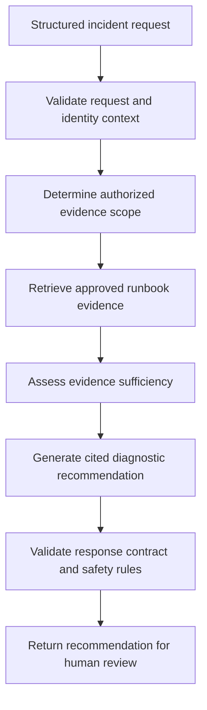

# Thin Vertical Slice Definition

## Document Purpose

This document converts the broad request for an autonomous incident-remediation agent into a bounded, measurable, and reviewable first use case.

The slice is intentionally narrow. It must prove an end-to-end business workflow without granting the system production execution authority.

This document defines:

- The problem being solved
- The target user and triggering event
- The bounded workflow
- The business outcome
- The inputs and outputs
- The permitted and prohibited capabilities
- The initial risk posture
- The dependencies and assumptions
- The completion conditions
- The evidence required to support future implementation claims

This document does not authorize application development, model-provider integration, retrieval implementation, tool execution, infrastructure deployment, or production access.

---

## Source Discovery Package

The slice is derived from the Phase 1 discovery artifacts:

- `docs/discovery/CURRENT_STATE_WORKFLOW.md`
- `docs/discovery/STAKEHOLDER_MAP.md`
- `docs/discovery/DATA_SOURCE_INVENTORY.md`
- `docs/discovery/DECISION_DECOMPOSITION.md`
- `docs/discovery/RISK_AND_AUTHORITY_MATRIX.md`
- `docs/discovery/ASSUMPTION_REGISTER.md`
- `docs/discovery/SUCCESS_MEASURES.md`

These documents remain the authoritative sources for the discovered workflow, stakeholders, data sources, decisions, risks, assumptions, and proposed measures.

The thin slice must not silently override unresolved Phase 1 assumptions.

---

## Broad Client Request

The initial client request is:

> Build an AI agent that automatically investigates and resolves production incidents.

This request is too broad for an initial implementation because it combines several distinct capabilities:

- Incident intake
- Identity validation
- Evidence retrieval
- Operational-data correlation
- Diagnosis generation
- Remediation selection
- Change authorization
- Production execution
- Ticket updates
- Human escalation
- Outcome verification
- Audit-evidence generation

Treating these capabilities as one initial release would obscure system boundaries, authority decisions, failure modes, and evaluation responsibilities.

---

## Reframed Business Problem

Incident responders spend excessive time locating approved operational guidance and producing a consistent initial assessment.

The first slice will reduce investigation friction by assembling authorized runbook evidence and generating a citation-backed diagnostic recommendation for human review.

The system will not perform remediation.

---

## Slice Name

**Citation-Backed Incident Diagnostic Assistant**

Short identifier:

```text
CBIDA
```

---

## Slice Hypothesis

If an authenticated incident responder submits a structured incident description, and the system retrieves only evidence the responder is authorized to access, then the system can produce a useful citation-backed diagnostic recommendation faster and more consistently than the current manual search process.

This hypothesis is not considered proven until the evaluation and evidence requirements defined for the slice are satisfied.

---

## Primary User

The primary user is an authenticated incident responder assigned to investigate an active operational incident.

Examples include:

- Site reliability engineer
- Platform engineer
- Application support engineer
- Incident commander
- Authorized service owner

The slice does not assume that every authenticated employee is an authorized incident responder.

Authentication alone does not establish authorization to retrieve a source or view its content.

---

## Supporting Stakeholders

The initial slice requires review from:

| Stakeholder | Slice responsibility |
|---|---|
| Incident responder | Validate workflow usefulness and diagnostic clarity |
| Incident commander | Validate operational fit and escalation expectations |
| Service owner | Confirm service context and approved runbook sources |
| Security | Review identity, access, logging, and data-handling boundaries |
| Risk and compliance | Review evidence retention and control expectations |
| Platform engineering | Review integration and operational ownership |
| Data owner | Authorize source use and access-filter behavior |
| AI engineering | Define future implementation and evaluation approach |
| Operations support | Define supportability and failure-response expectations |

Stakeholder participation does not imply that every requirement has been approved.

Approval evidence must be recorded explicitly.

---

## Triggering Event

The slice begins when an authenticated and authorized incident responder submits a structured diagnostic request for an active incident.

The request must contain, at minimum:

- Incident identifier
- Service identifier
- Environment
- Incident summary
- Observed symptoms
- Requesting-user identity context
- Request timestamp
- Correlation identifier

Optional context may include:

- Alert identifiers
- Deployment identifier
- Error codes
- Affected component
- Known start time
- Existing ticket reference

Free-form text may supplement structured fields but must not replace the required fields.

---

## Preconditions

The slice may process a request only when:

1. The request schema is valid.
2. The user identity is present and verifiable.
3. The service identifier is recognized.
4. The environment is explicitly identified.
5. The request carries a correlation identifier.
6. At least one approved evidence source exists for the service.
7. Source-level authorization can be evaluated.
8. The request does not ask the system to execute remediation.
9. The system can return a safe failure if required evidence is unavailable.

If a precondition fails, the workflow must stop or return a bounded error. It must not invent missing context.

---

## End-to-End Slice Workflow



The diagram describes the intended contract flow. It does not claim that a runtime implementation exists.

---

## Workflow Steps

| Step | Activity | Required result | Failure posture |
|---:|---|---|---|
| 1 | Accept request | Structured request received | Reject malformed request |
| 2 | Validate required fields | Required context confirmed | Return validation error |
| 3 | Validate identity context | Requester identity established | Deny processing |
| 4 | Resolve service scope | Recognized service selected | Return unknown-service error |
| 5 | Determine source permissions | Authorized source set produced | Deny retrieval if unresolved |
| 6 | Retrieve runbook evidence | Relevant authorized evidence returned | Report insufficient evidence |
| 7 | Check evidence sufficiency | Evidence quality classified | Abstain if insufficient |
| 8 | Generate diagnosis | Recommendation grounded in evidence | Do not make unsupported claim |
| 9 | Attach citations | Claims linked to retrieved evidence | Reject uncited material claims |
| 10 | Validate response | Response contract and safety checks pass | Return controlled failure |
| 11 | Record trace metadata | Correlation and decision metadata captured | Mark evidence incomplete |
| 12 | Return result | Human-reviewable output delivered | Never execute remediation |

---

## In-Scope Capability

The first slice will eventually be permitted to demonstrate the following capabilities after their implementation phases authorize them:

- Accept a structured incident-diagnostic request
- Validate required request fields
- carry identity and authorization context through the workflow
- Select only approved operational evidence sources
- Enforce source-level access restrictions
- Retrieve relevant runbook passages
- Detect insufficient or conflicting evidence
- Generate a bounded diagnostic recommendation
- Cite the evidence supporting material claims
- State confidence and known limitations
- Recommend an approved next diagnostic step
- Produce traceable workflow metadata
- Return the result for human review

Listing a capability as in scope does not mean it has been implemented.

---

## Explicitly Out of Scope

The initial slice will not:

- Restart a service
- Restart a database
- Modify infrastructure
- Modify network policy
- Change firewall rules
- Execute shell commands
- Run unrestricted scripts
- Modify application configuration
- Roll back a deployment
- Deploy application code
- Create or approve a production change
- Close an incident
- Change an incident severity
- Assign an incident owner
- Update an incident ticket
- Send external communications
- Grant or modify access
- Override source permissions
- Retrieve evidence the requester cannot access
- Treat model confidence as authorization
- Treat a chat response as human approval
- Use a privileged shared credential
- conceal missing or conflicting evidence
- Claim a root cause without adequate support
- Operate as an autonomous remediation agent

These exclusions are architectural and governance boundaries, not prompt preferences.

---

## Authority Posture

| Actor or component | Authority in the initial slice |
|---|---|
| Requesting user | Submit a diagnostic request within existing access rights |
| Model | Propose text and structured recommendations only |
| Orchestrator | Coordinate the bounded diagnostic workflow only |
| Retrieval component | Retrieve only policy-permitted evidence |
| Tool adapter | Read approved evidence through narrow contracts only |
| Policy component | Allow, deny, or constrain deterministic operations |
| Human reviewer | Assess the recommendation and independently choose next steps |
| Chat interface | Present information; never act as authorization authority |
| Production system | No mutation authority is granted |
| Lab learner | Produce documentation and future local evidence only |

The model must never determine its own permissions.

---

## Data Sources for the Initial Slice

The initial evidence scope is limited to approved operational runbooks and associated service metadata.

Candidate sources must be selected from the Phase 1 data-source inventory.

A source is not eligible merely because it is technically accessible.

A source must have:

- Identified ownership
- Defined authority status
- Known sensitivity
- An access-control mechanism
- A reviewable freshness expectation
- A citation mechanism
- A conflict-resolution rule
- Approval for use in this slice

The initial slice excludes broad ingestion of tickets, logs, chat history, source code, secrets, and unrestricted document repositories unless a later contract explicitly authorizes them.

---

## Expected Output

The result must be a structured diagnostic response containing:

| Field | Purpose |
|---|---|
| `request_id` | Identify the diagnostic request |
| `incident_id` | Associate the result with the incident |
| `service_id` | Identify the affected service |
| `diagnostic_summary` | Provide a concise assessment |
| `evidence_citations` | Link material claims to authorized evidence |
| `recommended_next_steps` | Suggest non-executing diagnostic or remediation steps |
| `confidence_classification` | Communicate bounded confidence |
| `limitations` | Disclose missing, stale, or conflicting evidence |
| `abstention_reason` | Explain why no diagnosis was produced when applicable |
| `policy_outcome` | Record relevant allow, deny, or constrain result |
| `trace_id` | Support lifecycle reconstruction |
| `generated_at` | Record response-generation time |

Exact schemas will be defined in `INTERFACE_CONTRACTS.md`.

---

## Diagnostic Recommendation Rules

A diagnostic recommendation must:

1. Be based on retrieved, authorized evidence.
2. Distinguish observation from inference.
3. Cite every material evidence-dependent claim.
4. Avoid claiming certainty when evidence is incomplete.
5. State relevant limitations.
6. Abstain when the evidence threshold is not met.
7. Avoid instructions outside the approved slice.
8. Never represent a recommendation as an executed action.
9. Never imply that human approval has already occurred.
10. Preserve the incident and trace identifiers.

---

## Abstention Conditions

The system must return an abstention or controlled failure when:

- User identity cannot be established
- Source authorization cannot be determined
- No approved evidence is available
- Retrieved evidence is insufficient
- Material sources conflict without a defined resolution
- The request is outside the supported service scope
- The request asks for production mutation
- Required request fields are missing
- Evidence is too stale for the decision
- Citations cannot be attached
- The response fails its contract
- A required policy decision cannot be obtained
- A dependency is unavailable and safe degradation is impossible

Abstention is a valid system outcome.

---

## Human Role

The human reviewer remains responsible for:

- Evaluating the recommendation
- Comparing it with current operational context
- Determining whether additional investigation is needed
- Selecting an operational response
- Following existing change and incident procedures
- Obtaining any required approval
- Executing actions through authorized enterprise systems

The initial slice must not create the impression that reviewing a recommendation delegates human accountability to the AI system.

---

## Business Outcome

The intended business outcome is:

> Reduce the time and inconsistency involved in locating approved runbook guidance and forming an initial incident diagnosis, while preserving access controls and human operational authority.

This outcome must be evaluated against an established baseline before it is claimed as achieved.

---

## Candidate Measures

The slice will eventually be evaluated using measures defined in the Phase 1 success-measure catalog.

Candidate measures include:

- Task completion rate
- Time to initial useful diagnosis
- Evidence precision
- Citation correctness
- Grounded-claim rate
- Abstention correctness
- Unauthorized-source exposure rate
- Unsupported-action recommendation rate
- Response-contract validity
- End-to-end latency
- Cost per completed diagnostic request
- Human usefulness rating
- Trace completeness
- Failure-recovery success

Targets must not be invented before baseline and stakeholder review.

---

## Nonfunctional Expectations

The future implementation must be designed for:

- Least-privilege access
- Explicit identity propagation
- Deterministic authorization
- Structured inputs and outputs
- Safe abstention
- Evidence traceability
- Reproducible evaluation
- Observable lifecycle stages
- Controlled dependency failure
- Provider portability without false equivalence
- Configuration externalization
- Secret isolation
- Testable rollback behavior
- Operational ownership

These are design expectations, not completed implementation claims.

---

## Slice Dependencies

| Dependency | Required before implementation claim |
|---|---|
| Approved request contract | Yes |
| Approved response contract | Yes |
| Selected evidence source | Yes |
| Source owner identified | Yes |
| Source access rules defined | Yes |
| Identity-context contract | Yes |
| Authorization decision contract | Yes |
| Citation contract | Yes |
| Abstention contract | Yes |
| Evaluation dataset plan | Yes |
| Threat-test plan | Yes |
| Trace-evidence contract | Yes |
| Operational owner | Before production-readiness claim |
| Release owner | Before staged-release claim |

---

## Assumption Handling

Every unresolved assumption that affects the slice must be:

1. Referenced by its assumption identifier.
2. Classified as blocking or nonblocking.
3. Assigned to an owner.
4. Given a validation method.
5. Resolved before the dependent implementation or release gate.

The slice must not convert an assumption into a fact through repetition.

---

## Initial Slice Boundary Statement

The initial thin vertical slice is a recommendation-only, permission-aware incident-diagnostic workflow.

It accepts a structured request from an authenticated incident responder, retrieves only authorized runbook evidence, and returns a citation-backed diagnostic recommendation for human review.

It does not execute remediation, modify enterprise systems, approve changes, or expand the requester’s existing access.

---

## Slice Completion Definition

The slice will not be called implemented merely because documentation exists.

Future implementation completion will require evidence that:

- The request contract is enforced
- Identity context is preserved
- Unauthorized retrieval is denied
- Approved evidence can be retrieved
- Evidence insufficiency produces abstention
- Material claims contain valid citations
- The response contract is enforced
- Prohibited actions cannot execute
- Lifecycle traces can be reconstructed
- Evaluation thresholds are satisfied
- Failure modes are exercised
- Operational ownership is defined
- Release-stage controls are verified

The appropriate maturity status during Phase 2 is **documented**, not implemented or complete.

---

## Phase 2A Interview Explanation — 60 Seconds

When a client asks for an autonomous incident-remediation agent, I do not treat that as an implementation-ready requirement. I decompose the workflow and choose a thin vertical slice that proves business value without introducing unnecessary production authority. In this lab, the first slice accepts a structured incident request, carries the responder’s identity context, retrieves only authorized runbook evidence, and returns a citation-backed diagnostic recommendation for human review. It explicitly cannot restart services, modify infrastructure, approve changes, or update enterprise systems. I define the input, output, abstention conditions, success measures, dependencies, and evidence needed before coding. That gives the client an end-to-end outcome they can evaluate while keeping authorization deterministic and operational accountability with humans.

---

## Phase 2A Interview Explanation — 30 Seconds

I turn the broad request for autonomous remediation into a recommendation-only vertical slice. An authenticated responder submits an incident, the system retrieves authorized runbook evidence, and it returns a cited diagnosis for human review. Production mutation is explicitly prohibited. Before coding, I define the contracts, abstention rules, measures, risks, and evidence needed to prove the slice works safely.

---

## Phase 2A Completion Gate

Phase 2A passes only when:

- The broad request has been decomposed.
- One primary user is identified.
- The triggering event is explicit.
- Preconditions are documented.
- The workflow is bounded end to end.
- In-scope capabilities are explicit.
- Prohibited capabilities are explicit.
- The authority posture is documented.
- Inputs and expected outputs are identified.
- Abstention conditions are explicit.
- Human responsibility is preserved.
- Business outcomes are measurable.
- Dependencies are visible.
- Assumptions remain distinguishable from facts.
- No implementation capability is claimed.
- No runtime capability has been authorized.

---

## Current Evidence Status

| Evidence item | Status |
|---|---|
| Phase 1 discovery sources identified | Documented |
| Broad request decomposed | Documented |
| Thin slice selected | Documented |
| Slice workflow defined | Documented |
| Authority boundary defined | Documented |
| Input contract | Planned in Phase 2C |
| Output contract | Planned in Phase 2C |
| Acceptance criteria | Planned in Phase 2B |
| Failure catalog | Planned in Phase 2E |
| Test and evidence plan | Planned in Phase 2F |
| Application runtime | Not started |
| Model-provider integration | Not started |
| Retrieval implementation | Not started |
| Tool execution | Not authorized |
| Infrastructure mutation | Not authorized |
| Production deployment | Not authorized |

No application runtime, model call, retrieval pipeline, tool execution, infrastructure mutation, or production deployment is authorized by this document.
